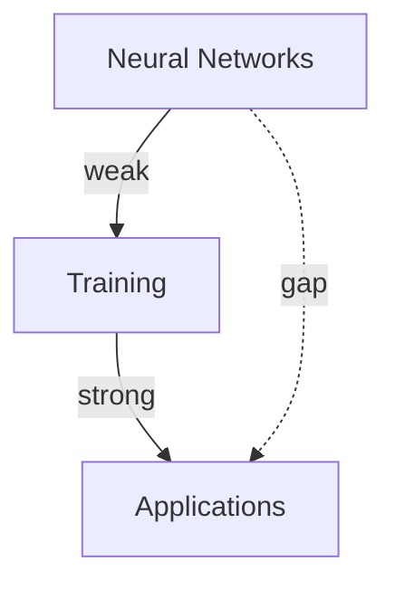

# InfraNodus MCP Tools Comprehensive Reference

Complete reference for all 21+ InfraNodus MCP tools with detailed parameters, use cases, and integration patterns.

## Core Analysis Tools

### generate_knowledge_graph

**Purpose**: Convert text into visual knowledge graphs with topical clustering and relationship mapping.

**Parameters**:
```yaml
text: string (required)
  Description: Source material for analysis
  Format: Plain text, can be multi-paragraph
  Recommended length: 500+ words for meaningful clusters
  Max length: System dependent, chunk large texts

includeStatements: boolean (optional, default: false)
  Description: Retain original text excerpts as statements
  Use when: Source attribution needed (research, citations)
  Performance: Increases response size significantly

modifyAnalyzedText: string (optional, default: "none")
  Options:
    "none": Default word-level processing
    "detectEntities": Better entity recognition, cleaner graphs (recommended)
    "extractEntitiesOnly": Pure entity extraction for ontology creation

  Best practice: Use "detectEntities" for most workflows

addNodesAndEdges: boolean (optional, default: false)
  Description: Include detailed node/edge data in response
  Warning: Significantly increases response size
  Use when: Need raw graph structure for custom processing

includeGraph: boolean (optional, default: false)
  Description: Include complete graph structure
  Use sparingly: Large responses, only when needed

includeGraphSummary: boolean (optional, default: false)
  Description: Add AI-generated graph summary
  Use for: RAG prompt augmentation, quick overviews
```

**Output Structure**:
```json
{
  "topical_clusters": [
    {
      "cluster_id": 1,
      "main_concepts": ["concept1", "concept2"],
      "cluster_name": "Theme Name",
      "size": 15
    }
  ],
  "main_concepts": {
    "concept1": {
      "centrality": 0.85,
      "cluster": 1,
      "co_occurrences": 23
    }
  },
  "graph_metrics": {
    "total_nodes": 47,
    "total_edges": 156,
    "density": 0.34,
    "modularity": 0.67
  }
}
```

**Use Cases**:
- Initial text analysis and topic identification
- Foundation for gap analysis and research questions
- Content organization and structure discovery
- Knowledge base creation

**Integration Patterns**:
```yaml
Standalone: Simple graph generation
Chained: graph → gaps → research questions
With hierarchical-reasoning: strategic decomposition → graph → validation
With knowledge-graph: graph → local conversion → persistence
```

---

### analyze_existing_graph_by_name

**Purpose**: Retrieve and analyze previously saved InfraNodus graphs from user account.

**Parameters**:
```yaml
graphName: string (required)
  Description: Unique identifier for saved graph
  Format: Username:GraphName or just GraphName
  Example: "quantum_computing_research"

includeStatements: boolean (optional, default: false)
  Description: Include original source statements

includeGraphSummary: boolean (optional, default: false)
  Description: Add AI-generated structural overview

modifyAnalyzedText: string (optional)
  Description: Same as generate_knowledge_graph
  Note: Applies to re-analysis if graph content updated
```

**Output**: Same as generate_knowledge_graph plus:
```json
{
  "graph_metadata": {
    "created_date": "2025-01-15",
    "last_modified": "2025-01-20",
    "total_statements": 45,
    "data_sources": ["document1", "document2"]
  }
}
```

**Use Cases**:
- Iterate on previous analyses
- Compare graph evolution over time
- Build on existing research
- Multi-session workflows

---

### generate_content_gaps

**Purpose**: Identify missing connections, structural holes, and underexplored areas in discourse.

**Parameters**:
```yaml
text: string (required)
  Description: Same text analyzed in generate_knowledge_graph
  Best practice: Use immediately after graph generation
  Note: Re-analyzes text, so results consistent with graph
```

**Output Structure**:
```json
{
  "content_gaps": [
    {
      "gap_id": 1,
      "between_clusters": [1, 3],
      "missing_connections": ["concept_a → concept_b"],
      "gap_description": "Theory and practice not connected",
      "priority": "high"
    }
  ],
  "structural_gaps": {
    "isolated_concepts": ["concept_x", "concept_y"],
    "weak_connections": [
      {"from": "concept_a", "to": "concept_b", "strength": 0.2}
    ],
    "underexplored_clusters": [2, 5]
  }
}
```

**Use Cases**:
- Identify research opportunities
- Find content development areas
- Discover missing perspectives
- Guide strategic expansion

**Best Practices**:
- Always run after generate_knowledge_graph
- Use same text for consistency
- Chain with generate_research_questions for actionable output

---

## Advanced Analysis Tools

### generate_topical_clusters

**Purpose**: Extract topic groups and keyword clusters using network analysis.

**Parameters**:
```yaml
text: string (required)
  Description: Content to cluster
  Optimal length: 1000+ words for distinct clusters
```

**Output**:
```json
{
  "topical_clusters": [
    {
      "cluster_id": 1,
      "theme": "Neural Network Architecture",
      "keywords": ["transformer", "attention", "layers"],
      "keyword_count": 15,
      "prominence": 0.82
    }
  ],
  "keyword_relationships": {
    "transformer": ["attention", "encoder", "decoder"],
    "attention": ["self-attention", "multi-head", "scaled"]
  }
}
```

**Use Cases**:
- SEO keyword identification
- Content organization
- Theme discovery
- Topic taxonomy creation

**Integration**:
```yaml
SEO Workflow: topical_clusters → seo_report → optimization
Content Strategy: topical_clusters → gap analysis → content calendar
```

---

### generate_research_questions

**Purpose**: Create investigation prompts based on identified content gaps.

**Parameters**:
```yaml
text: string (required)
  Description: Same text from graph generation

useSeveralGaps: boolean (optional, default: false)
  Description: Generate questions for multiple gaps
  Recommended: true for comprehensive research

gapDepth: number (optional, default: 0)
  Description: Gap hierarchy level
  Values:
    0: Primary/surface-level gaps
    1: Secondary gaps, more nuanced
    2+: Deeper structural gaps
  Recommendation: Start with 0, increase if needed

modelToUse: string (optional, default: "gpt-4o")
  Options: "gpt-4o", "gpt-4o-mini", "claude-opus-4.1", "claude-sonnet-4", etc.
  Trade-off: Quality vs speed/cost
```

**Output**:
```json
{
  "research_questions": [
    {
      "question": "How do error correction algorithms impact hardware?",
      "gap_addressed": 1,
      "cluster_bridge": [1, 3],
      "priority": "high",
      "research_type": "bridging"
    }
  ],
  "question_categories": {
    "bridging": 5,
    "exploratory": 3,
    "deepening": 2
  }
}
```

**Best Practices**:
- Use after gap detection for focused questions
- Start with useSeveralGaps: false, enable if questions too narrow
- Adjust gapDepth based on desired depth
- Chain with hierarchical-reasoning for validation

---

### generate_research_ideas

**Purpose**: Generate innovative ideas from content gaps (broader than questions).

**Parameters**: Same as generate_research_questions

**Output**: Similar structure but "ideas" instead of "questions":
```json
{
  "research_ideas": [
    {
      "idea": "Develop hybrid error correction framework bridging hardware/software",
      "innovation_type": "synthesis",
      "gap_addressed": 1,
      "feasibility": "medium"
    }
  ]
}
```

**When to Use**:
- Ideation and exploration phase
- Need broader creative prompts
- Solution development vs research
- Innovation brainstorming

---

### develop_text_tool

**Purpose**: Comprehensive workflow combining gap detection, research questions, and latent topics with progress tracking.

**Parameters**:
```yaml
text: string (required)

useSeveralGaps: boolean (optional, default: false)
  Recommended: true for thorough analysis

extendedIdeationMode: boolean (optional, default: false)
  false: Generate research questions (default)
  true: Generate research ideas instead
  When to toggle: Use ideas mode only if questions insufficient

modelToUse: string (optional, default: "gpt-4o")
```

**Progress Checkpoints** (6 stages):
1. "Initializing text analysis..." (0%)
2. "Generating knowledge graph..." (20%)
3. "Detecting content gaps..." (40%)
4. "Analyzing latent topics..." (60%)
5. "Generating research questions/ideas..." (80%)
6. "Finalizing comprehensive report..." (100%)

**Output**: Combines multiple analyses:
```json
{
  "research_questions": [...],
  "latent_topics": [...],
  "content_gaps": [...],
  "development_recommendations": "Strategic guidance text"
}
```

**Use Cases**:
- All-in-one analysis workflow
- Time-constrained comprehensive analysis
- Iterative topic development
- Research planning

---

## SEO & Search Tools

### generate_seo_report

**Purpose**: Comprehensive SEO optimization through search result comparison and gap analysis.

**Parameters**:
```yaml
text: string (required)
  Description: Content to optimize for SEO

importLanguage: string (optional, default: "EN")
  Options: "EN", "DE", "FR", "ES", "IT", "PT", "RU", "CN", "JP", "NL", "TW"
  Important: Match content language

importCountry: string (optional, default: "US")
  Options: "US", "GB", "DE", "FR", "ES", "IT", "JP", "CN", "BR", "AU", etc.
  Important: Match target market for accurate search data
```

**Progress Stages** (6 checkpoints):
1. "Analyzing content structure..." (0-15%)
2. "Fetching search landscape data..." (15-35%)
3. "Comparing with search results..." (35-55%)
4. "Analyzing user search queries..." (55-75%)
5. "Identifying optimization opportunities..." (75-90%)
6. "Generating SEO recommendations..." (90-100%)

**Output**:
```json
{
  "seo_analysis": {
    "current_ranking_potential": "medium",
    "missing_topics": ["deployment", "production", "MLOps"],
    "keyword_opportunities": [
      {
        "keyword": "machine learning deployment",
        "search_volume": "high",
        "competition": "medium",
        "opportunity_score": 0.85
      }
    ],
    "content_gaps": [
      "Practical implementation examples",
      "Production best practices"
    ]
  },
  "optimization_recommendations": [
    {
      "priority": "high",
      "action": "Add section on model deployment",
      "expected_impact": "Improved ranking for 'ML deployment' queries"
    }
  ]
}
```

**Best Practices**:
- Set language/country accurately for target audience
- Run topical_clusters first for baseline
- Chain with search_queries_vs_search_results for gaps
- Inform user about long runtime (~30-60 seconds)

---

### analyze_google_search_results

**Purpose**: Analyze search results landscape for target queries.

**Parameters**:
```yaml
queries: array of strings (required)
  Format: ["query 1", "query 2", ...]
  Recommended: 2-5 queries for manageable results

importLanguage: string (optional, default: "EN")
importCountry: string (optional, default: "US")

showGraphOnly: boolean (optional, default: false)
  true: Return only topical graph structure (recommended)
  false: Include all raw search results (very large)

includeSearchResultsOnly: boolean (optional, default: false)
  true: Return only search results, no graph (rare use)

showExtendedGraphInfo: boolean (optional, default: false)
  Description: Add detailed graph metrics
  Use when: Need graph analysis depth
```

**Output (showGraphOnly: true)**:
```json
{
  "search_results_graph": {
    "topical_clusters": [
      {
        "cluster_id": 1,
        "theme": "Tutorial Content",
        "prominence": 0.78,
        "top_results": 15
      }
    ],
    "content_patterns": {
      "common_topics": ["basics", "tutorial", "guide"],
      "content_types": ["how-to", "explanation", "reference"]
    }
  }
}
```

**Use Cases**:
- Understand search landscape
- Identify content patterns in results
- Find content gaps vs what ranks
- Competitive content analysis

---

### analyze_related_search_queries

**Purpose**: Extract topical clusters from Google's related searches and autocomplete suggestions.

**Parameters**:
```yaml
queries: array of strings (required)

keywordsSource: string (optional, default: "related")
  Options:
    "related": Google related searches (focused)
    "adwords": Google Ads keywords (broader range)
  Recommendation: Start with "related", use "adwords" for discovery

importLanguage: string (optional, default: "EN")
importCountry: string (optional, default: "US")

showGraphOnly: boolean (optional, default: true)
  Recommendation: true (raw query lists are overwhelming)

includeSearchQueriesOnly: boolean (optional, default: false)
```

**Output**:
```json
{
  "query_clusters": [
    {
      "cluster_id": 1,
      "query_intent": "learning",
      "queries": [
        "machine learning tutorial",
        "ML for beginners",
        "learn machine learning online"
      ],
      "search_volume_trend": "high"
    }
  ],
  "search_patterns": {
    "question_queries": 12,
    "how_to_queries": 8,
    "comparison_queries": 5
  }
}
```

**Use Cases**:
- Discover user search intent
- Find long-tail keyword opportunities
- Understand query variations
- Content ideation from user needs

---

### search_queries_vs_search_results

**Purpose**: Find demand-supply gaps - what users search for but results don't address.

**Parameters**:
```yaml
queries: array of strings (required)
  Description: Target search queries
  Recommendation: 3-7 queries related to content topic

importLanguage: string (optional, default: "EN")
importCountry: string (optional, default: "US")

showGraphOnly: boolean (optional, default: true)
showExtendedGraphInfo: boolean (optional, default: false)
```

**Output**:
```json
{
  "demand_supply_gaps": [
    {
      "user_searches_for": "machine learning deployment",
      "results_focus_on": "training and theory",
      "gap_type": "topic_mismatch",
      "opportunity_score": 0.92
    }
  ],
  "missing_topics_in_results": [
    "production deployment",
    "model monitoring",
    "MLOps practices"
  ],
  "keyword_combinations_with_gaps": [
    {
      "keywords": ["ML", "production", "deployment"],
      "search_demand": "high",
      "content_supply": "low"
    }
  ]
}
```

**Best Practices**:
- Use after analyzing search results and queries separately
- Identifies highest-value content opportunities
- Chain with hierarchical-reasoning for strategic content plan

---

## Comparative Analysis Tools

### overlap_between_texts

**Purpose**: Find shared concepts, common themes, and similarities across multiple documents.

**Parameters**:
```yaml
contexts: array of objects (required, minimum 2)
  Format:
    [
      {
        text: "document 1 content",
        modifyAnalyzedText: "detectEntities"
      },
      {
        text: "document 2 content",
        modifyAnalyzedText: "detectEntities"
      },
      ...
    ]
  Recommended: 2-5 texts for clear overlap patterns

includeGraph: boolean (optional, default: false)
  Description: Include structural overlap graph
  Recommended: true for visualization needs

addNodesAndEdges: boolean (optional, default: false)
includeStatements: boolean (optional, default: false)
```

**Output**:
```json
{
  "overlap_analysis": {
    "shared_concepts": [
      {
        "concept": "neural networks",
        "appears_in_texts": [1, 2, 3],
        "centrality_avg": 0.82
      }
    ],
    "common_themes": [
      {
        "theme": "Architecture Optimization",
        "texts": [1, 2],
        "strength": 0.75
      }
    ],
    "overlap_metrics": {
      "total_shared_concepts": 23,
      "overlap_percentage": 0.45,
      "unique_to_each": {
        "text1": 12,
        "text2": 8,
        "text3": 15
      }
    }
  }
}
```

**Use Cases**:
- Find common ground across documents
- Literature review synthesis
- Multi-source research analysis
- Identify consensus themes

---

### difference_between_texts

**Purpose**: Identify unique content in target text that references don't contain.

**IMPORTANT**: Order matters - FIRST text is analyzed for gaps compared to others.

**Parameters**:
```yaml
contexts: array of objects (required, minimum 2)
  Format:
    [
      {text: "TARGET TEXT"},  # Analyzed for missing content
      {text: "reference 1"},  # Comparison baseline
      {text: "reference 2"},
      ...
    ]
  Critical: First context is the target being analyzed

includeGraph: boolean (optional, default: false)
addNodesAndEdges: boolean (optional, default: false)
includeStatements: boolean (optional, default: false)
```

**Output**:
```json
{
  "difference_analysis": {
    "unique_to_target": [
      {
        "concept": "sparse attention",
        "not_in_references": true,
        "relevance_score": 0.88
      }
    ],
    "missing_from_target": [
      {
        "concept": "training efficiency",
        "in_references": [2, 3],
        "gap_priority": "high"
      }
    ],
    "conceptual_contributions": [
      "Novel sparse attention mechanism",
      "Unique architectural approach"
    ]
  }
}
```

**Use Cases**:
- Identify unique contributions in papers
- Find content gaps in your work vs competitors
- Novelty assessment
- Competitive analysis

---

## Topic Development Tools

### develop_latent_topics

**Purpose**: Identify underdeveloped topics requiring expansion.

**Parameters**:
```yaml
text: string (required)
  Description: Content to analyze for latent topics

modelToUse: string (optional, default: "gpt-4o")
  Recommendation: Use "gpt-4o" for quality analysis
```

**Output**:
```json
{
  "latent_topics": [
    {
      "topic": "failure recovery patterns",
      "current_coverage": "weak",
      "development_potential": "high",
      "expansion_suggestions": [
        "Add practical examples",
        "Compare approaches",
        "Implementation patterns"
      ]
    }
  ],
  "underdeveloped_areas": [
    {
      "area": "practical implementation",
      "gap_type": "depth",
      "priority": "medium"
    }
  ]
}
```

**Use Cases**:
- Content expansion planning
- Depth assessment
- Topic development roadmap
- Blog series planning

---

### develop_conceptual_bridges

**Purpose**: Connect specialized content to broader discourse and adjacent domains.

**Parameters**:
```yaml
text: string (required)
modelToUse: string (optional, default: "gpt-4o")
```

**Output**:
```json
{
  "conceptual_bridges": [
    {
      "from_topic": "distributed consensus",
      "to_domain": "blockchain technology",
      "bridge_concept": "Byzantine fault tolerance",
      "connection_strength": 0.85
    }
  ],
  "discourse_connections": [
    {
      "current_topic": "microservices",
      "broader_discourse": "distributed systems",
      "linking_concepts": ["service mesh", "eventual consistency"]
    }
  ],
  "expansion_opportunities": [
    "Link to cloud-native patterns",
    "Connect to data engineering",
    "Bridge to DevOps practices"
  ]
}
```

**Use Cases**:
- Interdisciplinary connections
- Audience expansion
- Topic contextualization
- Knowledge synthesis

---

## Graph Management Tools

### create_knowledge_graph

**Purpose**: Generate and SAVE graph to InfraNodus account for future retrieval.

**Parameters**:
```yaml
graphName: string (required)
  Description: Unique identifier for saved graph
  Format: Descriptive, lowercase with underscores
  Example: "quantum_computing_research_2025"
  Important: Choose meaningful names for future retrieval

text: string (required)
modifyAnalyzedText: string (optional)
includeStatements: boolean (optional)
addNodesAndEdges: boolean (optional)
includeGraph: boolean (optional)
```

**Output**: Same as generate_knowledge_graph PLUS:
```json
{
  "saved_graph_info": {
    "graph_name": "quantum_computing_research_2025",
    "graph_url": "https://infranodus.com/graph/username/quantum_computing_research_2025",
    "save_timestamp": "2025-01-20T14:30:00Z",
    "access_link": "Direct link for future retrieval"
  }
}
```

**Use Cases**:
- Multi-session research projects
- Iterative analysis workflows
- Collaboration and sharing
- Long-term knowledge management

**Best Practices**:
- Use descriptive, dated names
- Save important analyses for future reference
- Retrieve with analyze_existing_graph_by_name
- Document graph names in your knowledge base

---

### search

**Purpose**: Find concepts and topics in existing InfraNodus graphs.

**Parameters**:
```yaml
query: string (required)
  Description: Search term or concept
  Format: Natural language or keywords

contextNames: array of strings (optional, default: [])
  Description: Graph names to search within
  Empty array: Search all user graphs
  Specific graphs: ["graph1", "graph2"]
```

**Output**:
```json
{
  "search_results": [
    {
      "graph_name": "quantum_computing_research",
      "concept": "quantum entanglement",
      "context": "Found in cluster 2: Quantum Phenomena",
      "relevance": 0.92
    }
  ],
  "graphs_searched": 5,
  "total_matches": 12
}
```

---

### fetch

**Purpose**: Retrieve detailed information for specific search result.

**Parameters**:
```yaml
id: string (required)
  Format: "username:graph_name:search_query"
  Example: "user123:quantum_research:entanglement"
  Source: Get from search tool results
```

**Output**: Detailed concept information from specified graph.

---

## Tool Chaining Best Practices

### Research Workflow Chain

```yaml
Step 1: generate_knowledge_graph
  → Get initial topical structure

Step 2: generate_content_gaps
  → Identify missing connections

Step 3: generate_research_questions
  → Create actionable prompts

Alternative: Use develop_text_tool for all-in-one
```

### SEO Optimization Chain

```yaml
Step 1: generate_topical_clusters
  → Understand current content structure

Step 2: analyze_google_search_results
  → See what's ranking

Step 3: analyze_related_search_queries
  → Understand user intent

Step 4: search_queries_vs_search_results
  → Find opportunity gaps

Step 5: generate_seo_report
  → Comprehensive optimization plan
```

### Comparative Analysis Chain

```yaml
Step 1: overlap_between_texts
  → Find commonalities

Step 2: difference_between_texts
  → Identify unique contributions

Step 3: generate_knowledge_graph (for synthesis)
  → Create unified understanding
```

### Topic Development Chain

```yaml
Step 1: generate_knowledge_graph
  → Initial analysis

Step 2: develop_latent_topics
  → Find underdeveloped areas

Step 3: develop_conceptual_bridges
  → Connect to broader discourse

Step 4: generate_research_questions
  → Create expansion roadmap
```

---

## Integration with Local Skills

### knowledge-graph Integration

Convert InfraNodus output to local graph format:

```python
# Pseudo-code for transformation
infranodus_nodes = infranodus_output['topical_clusters']
local_entities = []

for cluster in infranodus_nodes:
    for concept in cluster['concepts']:
        entity = {
            'id': normalize_name(concept),
            'type': 'Concept',
            'name': concept,
            'confidence': derive_from_centrality(concept_centrality),
            'provenance': {
                'source': 'InfraNodus',
                'graph_name': graph_identifier,
                'cluster': cluster['cluster_id'],
                'extraction_date': timestamp
            },
            'properties': {
                'cluster': cluster['theme'],
                'centrality': concept_centrality,
                'co_occurrences': concept_frequency
            }
        }
        local_entities.append(entity)
```

### obsidian-markdown Integration

Format outputs as Obsidian notes:

```markdown
---
tags: [research, infranodus, knowledge-graph]
clusters: ["Neural Networks", "Training", "Applications"]
gaps: ["theory-practice", "architecture-deployment"]
date: 2025-01-20
---

# Topic: Machine Learning Research

## Topical Clusters

From InfraNodus analysis:
- [[Neural Networks]] (23 concepts, high centrality)
- [[Training Methods]] (15 concepts, medium centrality)
- [[Applications]] (18 concepts, emerging)

## Content Gaps

> [!warning] Missing Connections
> - Theory ↔ Practice bridge weak
> - Architecture ↔ Deployment gap identified

## Research Questions

- [ ] How can theoretical advances translate to practical implementations?
- [ ] What architectural patterns best support production deployment?

## Visual Map



**Note**: Analysis generated via InfraNodus on 2025-01-20
