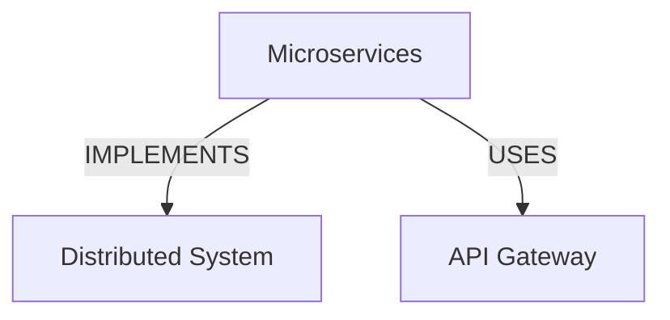

# Integration Mappings Reference

Specifications for transforming outputs between skills.

## Knowledge Graph → Obsidian-Markdown

### Entities → Wikilinks

**Transformation:**
```python
def entities_to_wikilinks(entities):
    wikilinks = []
    for entity in entities:
        # Basic wikilink
        link = f"[[{entity.name}]]"

        # With display text if alias exists
        if entity.aliases:
            link = f"[[{entity.name}|{entity.aliases[0]}]]"

        # With confidence annotation (optional)
        if include_confidence and entity.confidence < 0.8:
            link += f" (confidence: {entity.confidence:.2f})"

        wikilinks.append(link)

    return wikilinks
```

**Example:**
```json
Input (KG entity):
{
  "id": "concept_cap_theorem",
  "name": "CAP Theorem",
  "aliases": ["Brewer's Theorem"],
  "confidence": 0.95
}

Output (Obsidian wikilink):
"[[CAP Theorem|Brewer's Theorem]]"
```

### Relationships → Mermaid Diagrams

**Transformation:**
```python
def relationships_to_mermaid(entities, relationships):
    diagram = "```mermaid\ngraph TD\n"

    # Add nodes
    for entity in entities:
        node_id = sanitize_id(entity.id)
        node_label = entity.name
        diagram += f"    {node_id}[{node_label}]\n"

    # Add edges
    for rel in relationships:
        source = sanitize_id(rel.source)
        target = sanitize_id(rel.target)
        label = rel.type.replace("_", " ")
        diagram += f"    {source} -->|{label}| {target}\n"

    # Make nodes clickable (link to notes)
    node_ids = [sanitize_id(e.id) for e in entities]
    diagram += f"    class {','.join(node_ids)} internal-link;\n"

    diagram += "```"
    return diagram
```

**Example:**
```json
Input (KG relationships):
[
  {"source": "microservices", "target": "distributed_system", "type": "IMPLEMENTS"},
  {"source": "microservices", "target": "api_gateway", "type": "USES"}
]

Output (Mermaid):

```

### Confidence → Frontmatter Metadata

**Transformation:**
```yaml
frontmatter:
  extracted-entities: <entity_count>
  avg-confidence: <mean_confidence_score>
  high-confidence-count: <entities_with_confidence_gt_0.8>
  low-confidence-entities:
    - <entity_name_1>  # conf: <score>
    - <entity_name_2>  # conf: <score>
```

### Provenance → Source Attribution

**Transformation:**
```yaml
frontmatter:
  source: <source_document_path>
  extracted-from: <source_location>
  extraction-date: <ISO_8601_timestamp>
  extractor: "knowledge-graph-skill"
```

---

## Hierarchical Reasoning → Knowledge Graph

### Strategic Insights → Extraction Focus

**Transformation:**
```python
def strategic_to_extraction_focus(strategic_output):
    focus_areas = []

    # Extract key concepts from strategic goals
    for goal in strategic_output.goals:
        concepts = extract_noun_phrases(goal)
        focus_areas.extend(concepts)

    # Constraints become relationship types to look for
    relationship_hints = []
    for constraint in strategic_output.constraints:
        if "must" in constraint or "require" in constraint:
            relationship_hints.append("REQUIRES")
        elif "depend" in constraint:
            relationship_hints.append("DEPENDS_ON")

    return {
        "priority_entities": focus_areas,
        "suggested_relationships": relationship_hints
    }
```

### Operational Details → Entity Candidates

**Transformation:**
```python
def operational_to_entities(operational_output):
    entity_candidates = []

    # Detailed analysis contains concrete examples
    for detail in operational_output.computations:
        # Extract proper nouns, technical terms
        candidates = extract_technical_terms(detail)
        entity_candidates.extend(candidates)

    # Evidence contains factual statements
    for evidence in operational_output.evidence:
        entities = extract_entities_from_evidence(evidence)
        entity_candidates.extend(entities)

    return deduplicate(entity_candidates)
```

### Convergence Metrics → Validation Criteria

**Transformation:**
```python
def convergence_to_validation(convergence_metrics):
    validation_criteria = {
        "minimum_completeness": convergence_metrics.strategic_convergence,
        "coherence_threshold": convergence_metrics.tactical_convergence,
        "detail_sufficiency": convergence_metrics.operational_convergence
    }

    # If reasoning didn't converge well, relax KG validation
    if convergence_metrics.overall < 0.85:
        validation_criteria["accept_partial_graphs"] = True

    return validation_criteria
```

---

## Hierarchical Reasoning → Obsidian-Markdown

### Reasoning Levels → Heading Hierarchy

**Transformation:**
```markdown
# <Note Title>

## Strategic Overview
<strategic_output.goals>
<strategic_output.constraints>
<strategic_output.success_metrics>

### Tactical Approach 1
<tactical_output.method_1>

#### Implementation Details
<operational_output.for_method_1>

### Tactical Approach 2
<tactical_output.method_2>

#### Implementation Details
<operational_output.for_method_2>
```

**Mapping:**
- Strategic level → H2 sections (main themes)
- Tactical level → H3 subsections (approaches)
- Operational level → H4 details + body content

### Confidence Scores → Callout Annotations

**Transformation:**
```markdown
> [!tip] High Confidence Insight
> <insight_with_confidence_gt_0.9>

> [!note] Moderate Confidence
> <insight_with_confidence_0.7_to_0.9>

> [!warning] Low Confidence - Verify
> <insight_with_confidence_lt_0.7>
```

### Uncertainty → Questions Callout

**Transformation:**
```markdown
## Open Questions

> [!question] Uncertainty Identified
> <reasoning_output.uncertainty_items>
>
> **Suggested Actions:**
> - <action_1_to_resolve>
> - <action_2_to_resolve>
```

---

## Multi-Skill Integration Patterns

### Pattern: Research → Structure → Document

**Data Flow:**
```
hierarchical-reasoning.operational_output
  ↓ (extract entities)
knowledge-graph.entities + relationships
  ↓ (format)
obsidian-markdown.note

Transformations:
1. operational details → KG extraction input (full text)
2. KG entities → wikilinks
3. KG relationships → mermaid diagram
4. strategic insights → H2 headings
5. tactical approaches → H3 headings
6. combined → frontmatter metadata
```

### Pattern: Extract → Validate → Format

**Data Flow:**
```
knowledge-graph.raw_graph
  ↓ (validate)
hierarchical-reasoning.validation_assessment
  ↓ (enhance with validation results)
obsidian-markdown.note

Transformations:
1. raw graph → reasoning validation input
2. validation gaps → callout warnings
3. quality score → frontmatter
4. entities + validation → enhanced wikilinks
5. relationships → mermaid with quality annotations
```

### Pattern: Analyze → Graph → Visualize

**Data Flow:**
```
hierarchical-reasoning.system_decomposition
  ↓ (structure as graph)
knowledge-graph.system_graph
  ↓ (visualize)
obsidian-markdown.diagram

Transformations:
1. system components → KG entities
2. interaction patterns → KG relationships
3. hierarchical structure → nested mermaid sections
4. system graph → mermaid flowchart/graph
5. component details → wikilinked notes
```

---

## Transformation Utilities

### Sanitize IDs for Mermaid

```python
def sanitize_id(entity_id):
    # Remove special characters, replace with underscore
    sanitized = re.sub(r'[^a-zA-Z0-9_]', '_', entity_id)
    # Ensure starts with letter
    if sanitized[0].isdigit():
        sanitized = 'n_' + sanitized
    return sanitized
```

### Extract Technical Terms

```python
def extract_technical_terms(text):
    # CamelCase or snake_case terms
    camel_case = re.findall(r'\b[A-Z][a-z]+(?:[A-Z][a-z]+)+\b', text)
    snake_case = re.findall(r'\b[a-z]+(?:_[a-z]+)+\b', text)

    # Capitalized phrases (up to 3 words)
    proper_nouns = re.findall(r'\b[A-Z][a-z]+(?:\s+[A-Z][a-z]+){0,2}\b', text)

    return deduplicate(camel_case + snake_case + proper_nouns)
```

### Format Confidence Annotation

```python
def format_confidence(score):
    if score >= 0.9:
        return "✓ High confidence"
    elif score >= 0.7:
        return "→ Moderate confidence"
    else:
        return "⚠ Low confidence - verify"
```

---

## Integration Best Practices

1. **Preserve Provenance**: Always carry source attribution through transformations
2. **Confidence Propagation**: Lower bound confidence through transformation chain
3. **Lossy Transformations**: Document what information is lost in each transformation
4. **Bidirectional Tracing**: Enable tracing back from final output to original extraction
5. **Quality Metadata**: Include transformation quality scores in frontmatter
