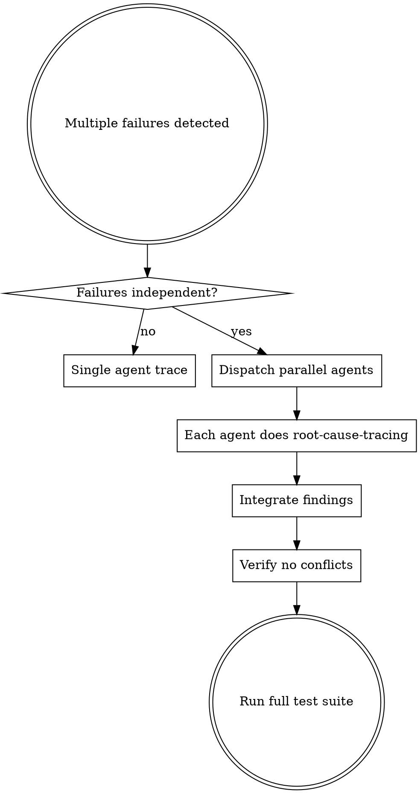

# MCP SkillSet Orchestration Workflows

Nuanced workflows combining multiple skills from `mcp-skillset` for sophisticated problem-solving.

## Workflow 1: Parallel Debugging Orchestration

**Combines:** `dispatching-parallel-agents` + `root-cause-tracing` + `systematic-debugging`

### When to Use



### Pattern Implementation

```typescript
// Phase 1: Classify failures
const failures = [
  { file: 'auth.test.ts', type: 'timing', domain: 'authentication' },
  { file: 'api.test.ts', type: 'data', domain: 'api-layer' },
  { file: 'db.test.ts', type: 'state', domain: 'persistence' }
];

// Phase 2: Check independence
const independent = failures.every((f, i) =>
  failures.every((other, j) => i === j || f.domain !== other.domain)
);

// Phase 3: Dispatch parallel agents with root-cause instructions
if (independent) {
  for (const failure of failures) {
    Task(`
      Investigate ${failure.file} using root-cause-tracing methodology:

      1. OBSERVE: What error appears?
      2. TRACE: Follow call stack backward to origin
      3. IDENTIFY: Find original trigger (not symptom)
      4. FIX: Address root cause at source
      5. DEFEND: Add validation at each layer

      Do NOT fix where error appears. Trace to source.
      Return: Root cause, fix applied, defense layers added.
    `);
  }
}
```

### Key Principles

1. **Independence Check First**: Only parallelize truly independent domains
2. **Each Agent Uses Root-Cause**: No symptom fixes, trace to origin
3. **Integration Review**: Check for conflicts before merging
4. **Defense-in-Depth**: Each agent adds layer validation

---

## Workflow 2: TDD-Driven Root Cause Resolution

**Combines:** `test-driven-development` + `root-cause-tracing` + `verification-before-completion`

### When to Use

- Bug reported in production
- Regression detected in CI
- Intermittent test failures

### The TDD Root Cause Cycle

```
┌─────────────────────────────────────────────────────────────┐
│  1. REPRODUCE: Write failing test capturing bug behavior    │
│     ↓                                                       │
│  2. TRACE: Use root-cause-tracing to find origin            │
│     ↓                                                       │
│  3. FIX: Make minimal change at root cause                  │
│     ↓                                                       │
│  4. VERIFY: Test now passes (Green)                         │
│     ↓                                                       │
│  5. REFACTOR: Add defense-in-depth (keep tests green)       │
│     ↓                                                       │
│  6. REGRESSION: Ensure no other tests broke                 │
└─────────────────────────────────────────────────────────────┘
```

### Implementation

```python
# Step 1: Reproduce with failing test (Red)
def test_should_not_create_duplicate_sessions_when_race_condition():
    """
    Bug: Two concurrent requests create duplicate sessions
    Root cause: Unknown - need to trace
    """
    # Arrange
    user = create_test_user()

    # Act: Simulate concurrent session creation
    with concurrent.futures.ThreadPoolExecutor(max_workers=2) as executor:
        futures = [executor.submit(create_session, user) for _ in range(2)]
        sessions = [f.result() for f in futures]

    # Assert: Should only create one session
    assert len(set(s.id for s in sessions)) == 1  # FAILS - creates 2

# Step 2: Trace to root cause
# Symptom: Two sessions created
#   ← create_session() called twice
#   ← no mutex/lock in session creation
#   ← ROOT CAUSE: Missing concurrency control in SessionManager.create()

# Step 3: Fix at source
class SessionManager:
    _lock = threading.Lock()

    def create(self, user):
        with self._lock:  # FIX: Add concurrency control
            existing = self.get_by_user(user)
            if existing:
                return existing
            return self._create_new_session(user)

# Step 4: Verify test passes (Green)
# Step 5: Add defense-in-depth (unique constraint on DB)
# Step 6: Run full test suite
```

### Critical Rules

1. **Test the Bug First**: Never fix without reproduction test
2. **Trace Before Fix**: Don't guess - follow call chain to origin
3. **Fix at Source**: Address root cause, not where error appears
4. **Verify Thoroughly**: Run full suite, not just new test

---

## Workflow 3: Multi-Agent Feature Development

**Combines:** `dispatching-parallel-agents` + `test-driven-development` + `writing-plans`

### When to Use

- Large feature spanning multiple domains
- Independent components with clear interfaces
- Team velocity optimization

### Orchestration Pattern

```yaml
feature: User Authentication with OAuth + MFA
domains:
  - auth-core: "Core authentication logic"
  - oauth-providers: "OAuth integration (Google, GitHub)"
  - mfa-implementation: "TOTP/SMS verification"
  - ui-components: "Login/signup forms"

orchestration:
  phase_1_design:
    action: "Write contracts and interfaces"
    agents: 1 (architect)
    output: "Interface definitions, API contracts"

  phase_2_parallel_tdd:
    action: "TDD implementation per domain"
    agents: 4 (parallel)
    each_agent:
      - "Write failing tests for domain"
      - "Implement to pass tests"
      - "Refactor with tests green"
    output: "Tested implementations"

  phase_3_integration:
    action: "Integration testing"
    agents: 1 (coordinator)
    tasks:
      - "Wire components together"
      - "Integration tests across boundaries"
      - "E2E workflow tests"
    output: "Working integrated feature"
```

### Agent Task Templates

**Auth Core Agent:**
```markdown
Implement authentication core using TDD:

Domain: auth-core
Interface: AuthService { authenticate(credentials), validate(token), refresh(token) }

1. Write tests for authenticate() - happy path, invalid creds, locked account
2. Implement authenticate() to pass tests
3. Write tests for validate() - valid token, expired, revoked
4. Implement validate() to pass tests
5. Write tests for refresh() - valid refresh, expired, used
6. Implement refresh() to pass tests

Do NOT implement OAuth or MFA - those are separate domains.
Return: Test file + implementation + coverage report
```

---

## Workflow 4: Emergency Debug Escalation

**Combines:** `root-cause-tracing` + `systematic-debugging` + `verification-before-completion`

### Escalation Levels

```
LEVEL 1: Single Failure
├── Apply root-cause-tracing directly
├── Fix at source
└── Verify with existing tests

LEVEL 2: Multiple Related Failures
├── Apply systematic-debugging Phase 1 (investigation)
├── Use root-cause-tracing per failure
├── Look for common root cause
├── Fix shared source if found
└── Verify all failures resolved

LEVEL 3: System-Wide Issues
├── Dispatch parallel agents per subsystem
├── Each agent: systematic-debugging + root-cause-tracing
├── Coordinator: Pattern detection across findings
├── Fix: Address systemic issues
└── Verify: Full regression suite

LEVEL 4: Production Emergency
├── STABILIZE: Immediate mitigation (rollback if needed)
├── ISOLATE: Identify affected components
├── TRACE: Root-cause-tracing on isolated problem
├── FIX: Minimal targeted fix at source
├── VERIFY: Extensive testing before redeploy
└── POSTMORTEM: Document and prevent recurrence
```

---

## Workflow 5: Continuous Quality Pipeline

**Combines:** `test-driven-development` + `verification-before-completion` + `condition-based-waiting`

### Quality Gates

```yaml
pre_commit:
  - lint: "Code style and formatting"
  - type_check: "Static type analysis"
  - unit_tests: "Fast unit tests (<30s)"

pre_merge:
  - integration_tests: "Cross-component tests"
  - coverage_check: "Minimum 80% coverage"
  - security_scan: "Vulnerability detection"

post_merge:
  - e2e_tests: "Full user journey tests"
  - performance_tests: "Latency and throughput"
  - smoke_tests: "Production health checks"

deployment_verification:
  skill: verification-before-completion
  checks:
    - "All tests passing"
    - "No regressions"
    - "Performance within SLA"
    - "Rollback plan ready"
```

---

## Skill Combination Matrix

| Problem Type | Primary Skill | Supporting Skills | Workflow |
|-------------|---------------|-------------------|----------|
| Single bug | root-cause-tracing | systematic-debugging | Direct trace |
| Multiple independent bugs | dispatching-parallel-agents | root-cause-tracing | Parallel trace |
| New feature | test-driven-development | writing-plans | TDD cycle |
| Large feature | dispatching-parallel-agents | TDD, writing-plans | Multi-agent TDD |
| Regression | test-driven-development | root-cause-tracing | Reproduce-trace-fix |
| Production issue | verification-before-completion | all above | Emergency escalation |

---

## Quick Reference Commands

```bash
# Search for debugging workflows
mcp-skillset search "debugging root cause" --search-mode semantic_focused

# Get skill details
mcp-skillset info "obra/superpowers/skills/dispatching-parallel-agents"

# Enrich prompt with relevant skills
mcp-skillset enrich "Fix race condition in session manager" --max-skills 3

# Build custom skill
mcp-skillset build-skill --name "Custom Workflow" --domain "development" --template base
```

---

## Integration with mcp-skillset CLI

### Discovery Phase
```bash
# Recommend skills for current project
mcp-skillset recommend --search-mode graph_focused

# Search by problem pattern
mcp-skillset search "testing TDD verification" --limit 10

# Get detailed skill info
mcp-skillset show "bobmatnyc/claude-mpm-skills/universal/testing/test-driven-development"
```

### Execution Phase
```bash
# Enrich prompt with skill context
mcp-skillset enrich "Implement feature X with TDD" --detailed --max-skills 5

# Generate skill demos
mcp-skillset demo "test-driven-development"
```

---

## Key Principles Across All Workflows

1. **Never Fix Symptoms**: Always trace to root cause
2. **Test First**: Write failing test before fixing
3. **Parallelize Independence**: Only dispatch parallel agents for independent domains
4. **Defense-in-Depth**: Add validation at each layer after fixing source
5. **Verify Completion**: Run full test suite before marking done
6. **Document Traces**: Keep record of investigation chain for future reference
