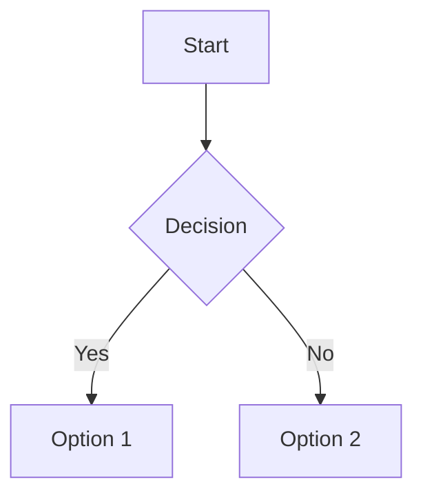
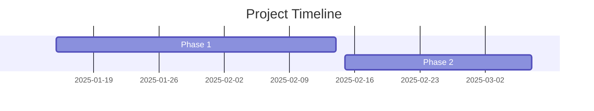

# Obsidian Markdown Syntax Skill

## Purpose

Enforce proper Obsidian-flavored Markdown syntax when creating or editing `.md` files to ensure compatibility with Obsidian's features including YAML frontmatter, wikilinks, callouts, dataview queries, mermaid diagrams, tables, citations, canvas integration, bases, and templater syntax.

## Activation

**Auto-activate** when creating ANY `.md` file unless explicitly stated otherwise by the user.

## Core Syntax Rules

### 1. YAML Frontmatter (REQUIRED)

Every `.md` file MUST start with valid YAML frontmatter:

```markdown
---
created: YYYY-MM-DD
modified: YYYY-MM-DD
tags:
  - tag1
  - tag2
---
```

**Validation checklist:**
- [ ] Starts with `---` on line 1
- [ ] Ends with `---` before content
- [ ] Valid YAML syntax (proper indentation, colons, no tabs)
- [ ] Date properties use `YYYY-MM-DD` or `YYYY-MM-DDTHH:mm:ss` format
- [ ] List properties use array format or inline `[item1, item2]`
- [ ] Multi-word properties use `kebab-case`

**Common properties:** Consult `references/frontmatter-properties.md` for complete property types and examples.

### 2. Internal Links (Wikilinks)

Use `[[double bracket]]` syntax for internal links:

```markdown
[[Note Name]]
[[Note Name|Display Text]]
[[Note Name#Heading]]
[[Note Name#Heading|Custom Text]]
```

**Rules:**
- Prefer wikilinks over Markdown links for internal notes
- Use pipe `|` for custom display text
- Use `#` for heading links
- Use `^` for block references: `[[Note^block-id]]`

### 3. Callouts

Use standardized callout syntax:

```markdown
> [!note] Optional Title
> Content with **Markdown** and [[Wikilinks]]

> [!tip]+ Expanded by default
> Foldable content

> [!warning]- Collapsed by default
> Hidden until clicked
```

**Supported types:** note, abstract, info, todo, tip, success, question, warning, failure, danger, bug, example, quote

**Reference:** See `references/callouts-reference.md` for all types and aliases.

### 4. Tables

Use proper Markdown table syntax with alignment:

```markdown
| Left | Center | Right |
|:-----|:------:|------:|
| Data | Data   | Data  |
```

**Rules:**
- Always include header row with `---` separators
- Use `:` for alignment (`:--` left, `:--:` center, `--:` right)
- Escape `|` in content with `\|` (for aliases or image sizing)
- Right-click tables in Live Preview for editing menu

### 5. Mermaid Diagrams

Use fenced code blocks with `mermaid` language:

````markdown

````

**Key features:**
- Add `class X,Y,Z internal-link;` to make nodes clickable
- Use `graph TD/LR/RL/BT` for direction
- Support: flowcharts, sequence, class, state, ER, gantt, pie, git, timeline, mindmap

**Reference:** See `references/mermaid-diagrams.md` for common patterns.

### 6. Code Blocks

Use triple backticks with language identifier:

````markdown
```python
def example():
    return "Hello World"
```

```javascript
const x = 42;
```
````

**Rules:**
- Always specify language for syntax highlighting
- Use `~~~` if code contains ` ``` `
- Inline code uses single backticks: `` `code` ``

### 7. Footnotes & Citations

```markdown
This is a statement[^1] with a footnote.

[^1]: This is the footnote text.

You can also use inline footnotes.^[Inline footnote content]
```

**Rules:**
- Footnotes can be numeric `[^1]` or named `[^note]`
- Multi-line footnotes require 2-space indentation
- Inline footnotes use `^[text]` (caret outside brackets)

### 8. Lists & Tasks

**Unordered lists:**
```markdown
- Item 1
- Item 2
  - Nested item
```

**Ordered lists:**
```markdown
1. First item
2. Second item
   1. Nested item
```

**Task lists:**
```markdown
- [x] Completed task
- [ ] Incomplete task
- [?] Custom marker
```

**Rules:**
- Use `-`, `*`, or `+` for unordered lists
- Tasks use `- [ ]` for incomplete, `- [x]` for complete
- Any character in brackets marks as complete: `[x]`, `[?]`, `[-]`
- Indent with tab or 3+ spaces for nesting

### 9. Headings & Formatting

**Headings:**
```markdown
# H1
## H2
### H3
#### H4
##### H5
###### H6
```

**Text formatting:**
```markdown
**Bold text**
*Italic text*
***Bold and italic***
==Highlighted text==
~~Strikethrough text~~
```

**Rules:**
- One H1 per note (matches note title)
- Use ATX-style headings (`#`), not underline style
- No blank line required after headings
- Escape special chars with backslash: `\*not italic\*`

### 10. Comments

```markdown
This is %%inline%% comment.

%%
Block comment
spanning multiple lines
%%
```

Comments only visible in edit mode.

## Plugin-Specific Syntax

### Dataview Queries

**Block queries:**
````markdown
```dataview
TABLE rating, author
FROM #books
WHERE rating >= 4
SORT rating DESC
```
````

**Inline queries:**
```markdown
Total: `= length(file.tasks)`
Modified: `= this.file.mtime`
```

**Reference:** See `references/dataview-syntax.md` for complete query syntax, operators, and functions.

### Templater Syntax

**Basic commands:**
```markdown
<% tp.date.now("YYYY-MM-DD") %>
<% tp.file.title %>
```

**JavaScript execution:**
```markdown
<%*
const files = app.vault.getMarkdownFiles();
tR += files.length;
%>
```

**Reference:** See `references/templater-commands.md` for all functions and examples.

### Canvas (JSONCanvas)

Canvas files use `.canvas` extension with JSON format:

```json
{
  "nodes": [
    {
      "id": "node-1",
      "type": "text",
      "x": 0,
      "y": 0,
      "width": 250,
      "height": 100,
      "text": "**Markdown** content"
    }
  ],
  "edges": [
    {
      "id": "edge-1",
      "fromNode": "node-1",
      "toNode": "node-2"
    }
  ]
}
```

**Reference:** See `references/canvas-spec.md` for complete specification.

### Bases Syntax

Bases use `.base` files with YAML configuration:

```yaml
views:
  - id: view-1
    name: "Active Tasks"
    type: table
    filter:
      property: status
      operator: equals
      value: active
    columns:
      - property: title
      - property: due-date
```

**Reference:** See `references/bases-syntax.md` for filters, formulas, and view types.

## Workflow

### When Creating a New .md File

1. **Determine note type** (standard note, daily note, MOC, meeting, etc.)
2. **Apply appropriate template** from `assets/templates/`:
   - `note-template.md` - General purpose note
   - `moc-template.md` - Map of Content / index note
   - `daily-note-template.md` - Daily journal note
3. **Validate frontmatter** against rules in Section 1
4. **Replace template variables** (Obsidian core or Templater)
5. **Verify syntax** using validation checklist below

### When Editing Existing .md File

1. **Preserve existing frontmatter** - only add/modify as needed
2. **Maintain consistent property naming** with existing notes
3. **Use established conventions** from the vault
4. **Validate new syntax** additions

### When User Specifies "Don't use Obsidian syntax"

Skip this skill entirely and use standard Markdown.

## Validation Checklist

Before finalizing any `.md` file, verify:

- [ ] Valid YAML frontmatter at top
- [ ] Frontmatter properties use correct types
- [ ] Date properties use `YYYY-MM-DD` format
- [ ] Internal links use `[[wikilink]]` syntax
- [ ] Tables have header row with `---` separators
- [ ] Code blocks specify language
- [ ] Callouts use correct `> [!type]` syntax
- [ ] Mermaid diagrams include `internal-link` class for note references
- [ ] Dataview queries use proper syntax
- [ ] Templater commands use `<% %>` delimiters
- [ ] Footnotes follow `[^id]` pattern
- [ ] Lists properly indented
- [ ] No tabs in YAML (spaces only)
- [ ] Escaped special chars in tables: `\|`

## Pattern Enforcement

### Auto-Link Detection

When creating cross-references, automatically convert to wikilinks:

```markdown
# Bad
See the note "Project Plan" for details.

# Good
See [[Project Plan]] for details.
```

### Consistent Property Naming

Use `kebab-case` for all multi-word properties:

```markdown
# Good
due-date: 2025-01-15
project-status: active
team-members: [Alice, Bob]

# Bad
dueDate: 2025-01-15
project_status: active
TeamMembers: [Alice, Bob]
```

### Callout Usage

Encourage callouts for:
- Important warnings: `> [!warning]`
- Key takeaways: `> [!tip]`
- Summaries: `> [!abstract]`
- Examples: `> [!example]`
- Questions: `> [!question]`

### Structured Data

For structured data, prefer:
1. **YAML frontmatter** - Queryable metadata
2. **Tables** - Tabular data presentation
3. **Dataview queries** - Dynamic lists from metadata
4. **Bases** - Database-style views over multiple notes

## Templates Usage

Access templates in `assets/templates/`:

- **note-template.md:** Standard note with common sections
- **moc-template.md:** Map of Content with dataview queries and structure diagram
- **daily-note-template.md:** Daily journal with tasks, metrics, and navigation

To use templates, either:
1. Copy content and replace `{{variables}}`
2. Reference when creating similar note structures
3. Adapt to specific use case needs

## Advanced Features

### Embedding

```markdown
![[Note Name]]          # Embed entire note
![[Note Name#Heading]]  # Embed section
![[image.png]]          # Embed image
![[image.png|300]]      # Embed with width
![[doc.pdf#page=3]]     # Embed PDF page
```

### Block References

```markdown
Paragraph with important content. ^block-id

Reference it elsewhere: ![[Note Name^block-id]]
```

### Math (MathJax/LaTeX)

```markdown
Inline: $e^{2i\pi} = 1$

Block:
$$
\begin{vmatrix}a & b\\c & d\end{vmatrix}=ad-bc
$$
```

### Horizontal Rules

```markdown
---
***
___
```

Use `---` on its own line for section breaks.

## Linting & Validation

### Common Errors to Catch

1. **Frontmatter:**
   - Missing opening/closing `---`
   - Tabs instead of spaces
   - Invalid YAML syntax
   - Incorrect date formats

2. **Links:**
   - Using Markdown `[text](file.md)` for internal notes
   - Broken wikilinks `[[Non-existent Note]]` (acceptable for future notes)
   - Missing `|` for custom display text

3. **Tables:**
   - Missing header separator row
   - Unescaped `|` in content
   - Inconsistent column count

4. **Code Blocks:**
   - Missing language identifier
   - Unclosed code blocks
   - Wrong delimiter (`` ` `` vs ` ``` `)

5. **Callouts:**
   - Wrong syntax: `[!NOTE]` instead of `[!note]`
   - Missing `>` on continuation lines
   - Incorrect type identifiers

### Validation Process

1. Check frontmatter structure and validity
2. Verify all wikilinks use `[[]]` syntax
3. Validate callout types against supported list
4. Check table formatting
5. Ensure code blocks have language tags
6. Verify dataview query syntax
7. Validate mermaid diagram structure
8. Check templater command delimiters

## Quick Reference by Feature

| Feature | Syntax | Reference File |
|---------|--------|---------------|
| Frontmatter | `---\nkey: value\n---` | `frontmatter-properties.md` |
| Wikilinks | `[[Note]]` or `[[Note\|Text]]` | Core syntax (above) |
| Callouts | `> [!type] Title` | `callouts-reference.md` |
| Tables | `\| Col \| Col \|` | Core syntax (above) |
| Mermaid | ` ```mermaid\ngraph TD\n``` ` | `mermaid-diagrams.md` |
| Dataview | ` ```dataview\nLIST\n``` ` | `dataview-syntax.md` |
| Templater | `<% tp.function() %>` | `templater-commands.md` |
| Canvas | JSON with nodes/edges | `canvas-spec.md` |
| Bases | YAML with views/filters | `bases-syntax.md` |

## Examples by Note Type

### Standard Note
```markdown
---
created: 2025-01-15
tags: [concept, learning]
aliases: []
---

# Topic Name

## Overview

> [!abstract] Summary
> Key points about this topic.

## Details

Content with [[Wikilinks]] and **formatting**.

### Subsection

| Feature | Description |
|---------|-------------|
| Item 1  | Details     |

## Related

- [[Related Note 1]]
- [[Related Note 2]]
```

### Project Note with Dataview
```markdown
---
type: project
status: active
priority: high
due-date: 2025-02-15
---

# Project Name

## Active Tasks

```dataview
TASK
WHERE file.path = this.file.path
AND !completed
```

## Timeline


```

### Meeting Note with Templater
```markdown
---
type: meeting
date: <% tp.date.now("YYYY-MM-DD") %>
attendees: <% await tp.system.prompt("Attendees") %>
---

# Meeting: <% tp.file.title %>

**Date:** <% tp.date.now("YYYY-MM-DD HH:mm") %>

## Agenda

## Notes

## Action Items
- [ ]
```

## File-Specific Handling

### .canvas Files

Canvas files are JSON, not Markdown. When creating/editing `.canvas` files:
1. Use proper JSON syntax
2. Include `nodes` and `edges` arrays
3. Validate node types: text, file, link, group
4. Ensure unique IDs for all nodes and edges
5. Reference `references/canvas-spec.md` for structure

### .base Files

Bases files use YAML syntax. When creating/editing `.base` files:
1. Use valid YAML structure
2. Define views with id, name, type
3. Include filters using proper operators
4. Define formulas with valid expressions
5. Reference `references/bases-syntax.md` for syntax

## Integration with Other Features

### With Knowledge Graph Skill

When this skill is active alongside knowledge-graph skill:
- Use frontmatter properties for entity metadata
- Create wikilinks for entity relationships
- Structure notes to be graph-compatible

### With Template Systems

Compatible with:
- **Core Templates:** `{{date}}`, `{{time}}`, `{{title}}`
- **Templater:** Full `tp.*` function library
- **Daily Notes:** Date-based template insertion

### With Dataview

Ensure frontmatter properties are:
- Consistently named across similar notes
- Properly typed (dates as dates, numbers as numbers)
- Well-structured for queries

## Snippets by Context

### Creating a Concept Note
```markdown
---
type: concept
created: {{date:YYYY-MM-DD}}
tags: [concept]
related-concepts: []
---

# Concept Name

## Definition

> [!note] Core Idea
> One-sentence definition

## Explanation

## Examples

> [!example] Example 1
> Concrete example

## Related Concepts

- [[Related Concept 1]]
- [[Related Concept 2]]
```

### Creating a Person Note
```markdown
---
type: person
name: Full Name
email: email@example.com
tags: [people]
---

# Full Name

## Contact

- **Email:** email@example.com
- **LinkedIn:** [Profile](url)

## Notes

## Interactions

```dataview
LIST
WHERE contains(file.outlinks, this.file.link)
SORT file.mtime DESC
```
```

### Creating a Source/Reference Note
```markdown
---
type: source
title: Source Title
author: Author Name
url: https://example.com
date-accessed: {{date:YYYY-MM-DD}}
tags: [source, reference]
---

# Source Title

**Author:** Author Name
**URL:** [Link](https://example.com)
**Accessed:** {{date:YYYY-MM-DD}}

## Summary

## Key Points

- Point 1
- Point 2

## Quotes

> [!quote]
> "Significant quote from source"
> — Author Name

## My Notes

## References

[^1]: Full citation details
```

## Error Prevention

### Common Mistakes

1. **Tabs in YAML** - Use spaces only
2. **Incorrect date format** - Must be `YYYY-MM-DD`
3. **Unescaped pipes in tables** - Escape with `\|`
4. **Wrong callout syntax** - Must be `[!type]` not `[!TYPE]`
5. **Missing code block language** - Always specify
6. **Mixing link types** - Prefer wikilinks for internal notes
7. **Invalid YAML values** - Quote strings with special chars

### Pre-Flight Check

Before completing file creation:
1. Validate YAML frontmatter parses correctly
2. Check all wikilinks are properly formatted
3. Verify table structure is complete
4. Confirm code blocks are properly closed
5. Validate callout types are supported
6. Ensure proper nesting in lists
7. Check for unescaped special characters

## Resources

This skill includes comprehensive reference documentation and templates:

### references/
- `frontmatter-properties.md` - Complete property types, formats, and examples
- `callouts-reference.md` - All callout types with syntax and aliases
- `dataview-syntax.md` - Query types, operators, functions, and examples
- `templater-commands.md` - Templater function library and syntax
- `canvas-spec.md` - JSON Canvas format specification
- `bases-syntax.md` - Bases query, filter, and formula syntax
- `mermaid-diagrams.md` - Diagram types, patterns, and linking

### assets/templates/
- `note-template.md` - Standard note template
- `moc-template.md` - Map of Content template with dataview and diagrams
- `daily-note-template.md` - Daily journal template with metrics

**Loading strategy:** Reference files should be read on-demand when working with specific features. For example, read `callouts-reference.md` when creating callouts, or `dataview-syntax.md` when writing dataview queries.

## Special Considerations

### Obsidian Publish

If notes are for Obsidian Publish:
- Set `publish: true` in frontmatter
- Use `permalink` for custom URLs
- Embedded queries may not render (document this)

### Mobile Compatibility

- Avoid complex formatting that's hard to edit on mobile
- Test dataview queries for mobile performance
- Use simpler table structures for mobile viewing

### Performance

- Large dataview queries can slow note rendering
- Complex mermaid diagrams may affect performance
- Limit embedded notes to essential references

### Vault Conventions

Adapt to existing vault conventions:
- Match existing tag structure
- Follow established folder organization
- Use consistent property names
- Maintain existing callout preferences

## Activation Summary

**Activate this skill when:**
- Creating any new `.md` file
- User requests "create a note"
- User specifies Obsidian-specific features
- Editing existing Obsidian vault files

**Do NOT activate when:**
- User explicitly says "don't use Obsidian syntax"
- Creating non-Obsidian markdown (e.g., GitHub README)
- User specifies standard/generic Markdown
- Working outside Obsidian vault context
