# Mermaid Diagrams Reference for Obsidian

Obsidian supports Mermaid diagrams using fenced code blocks.

## Basic Syntax

````markdown
```mermaid
<diagram-type>
  <diagram-content>
```
````

## Flowcharts

### Basic Flowchart
````markdown
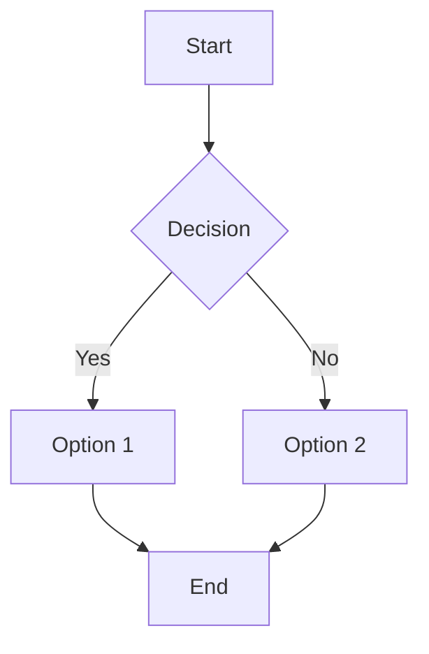
````

### Direction Options
- `graph TD` - Top to bottom
- `graph LR` - Left to right
- `graph RL` - Right to left
- `graph BT` - Bottom to top

### Node Shapes
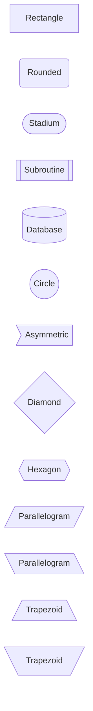

## Sequence Diagrams

````markdown
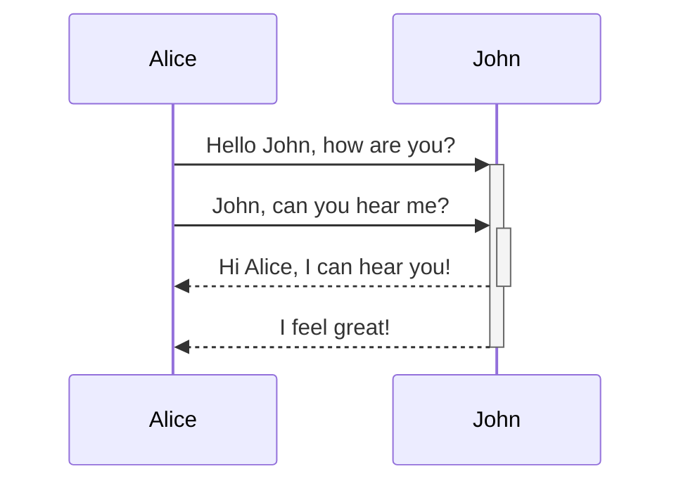
````

### Arrow Types
- `->` - Solid line without arrow
- `-->` - Dotted line without arrow
- `->>` - Solid line with arrow
- `-->>` - Dotted line with arrow
- `-x` - Solid line with cross
- `--x` - Dotted line with cross

## Class Diagrams

````markdown
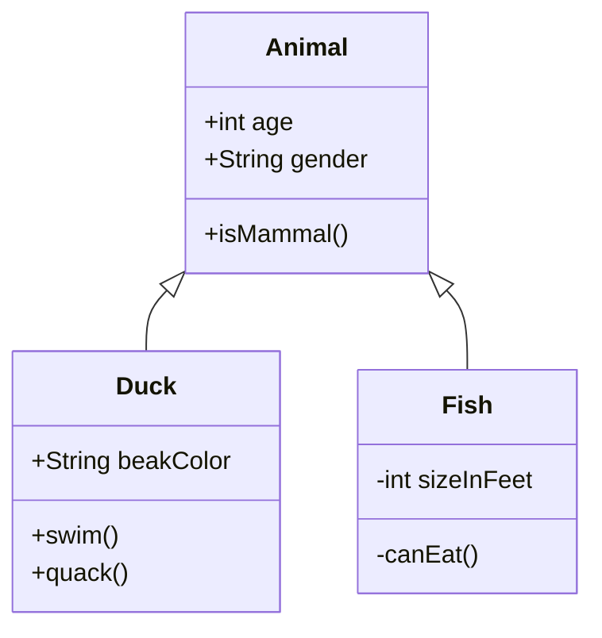
````

## State Diagrams

````markdown
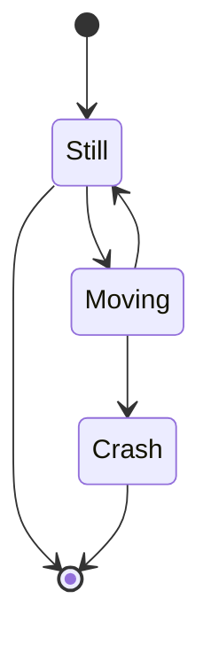
````

## Entity Relationship Diagrams

````markdown
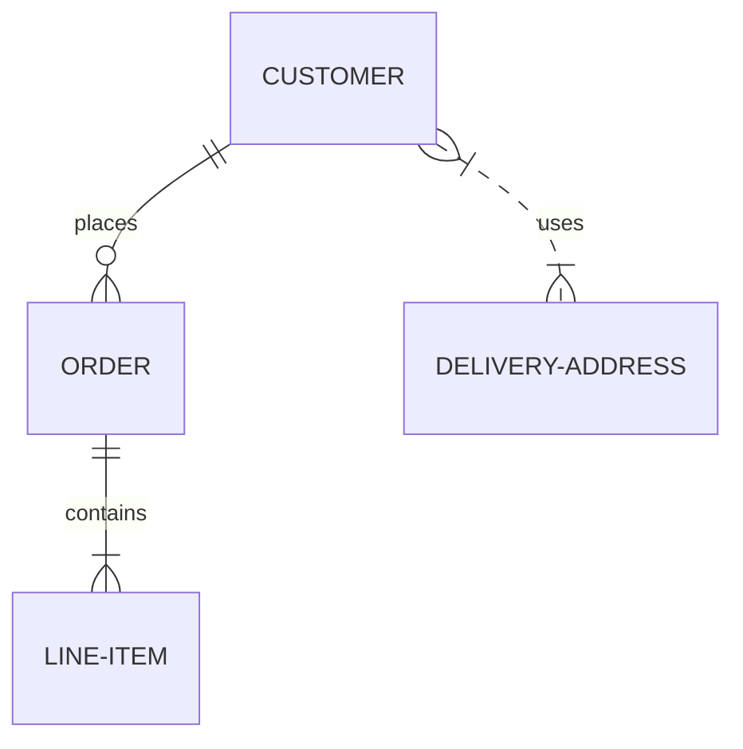
````

### Relationship Types
- `||--||` - One to one
- `||--o{` - One to many
- `}o--o{` - Many to many
- `||--|{` - One to one or many
- `}|--|{` - Many to many (strict)

## Gantt Charts

````markdown
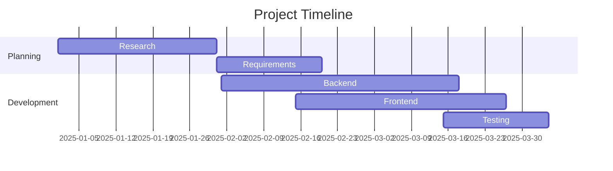
````

## Pie Charts

````markdown
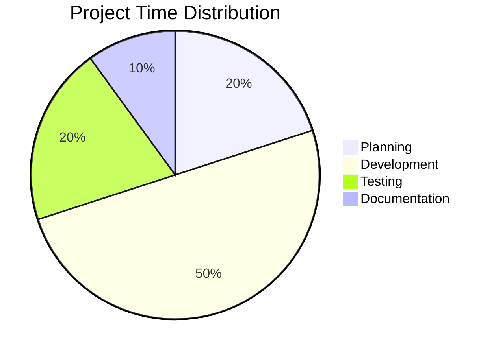
````

## Git Graphs

````markdown
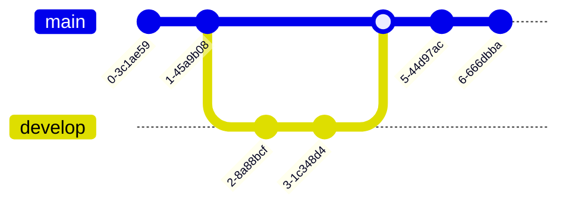
````

## Timeline

````markdown
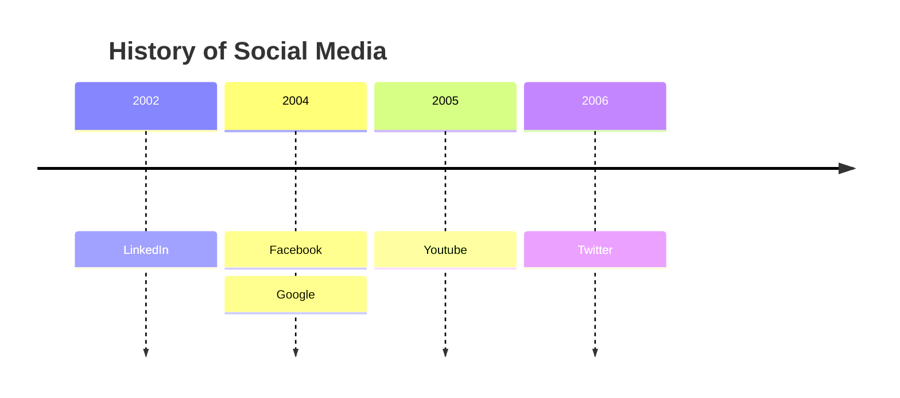
````

## Mindmaps

````markdown
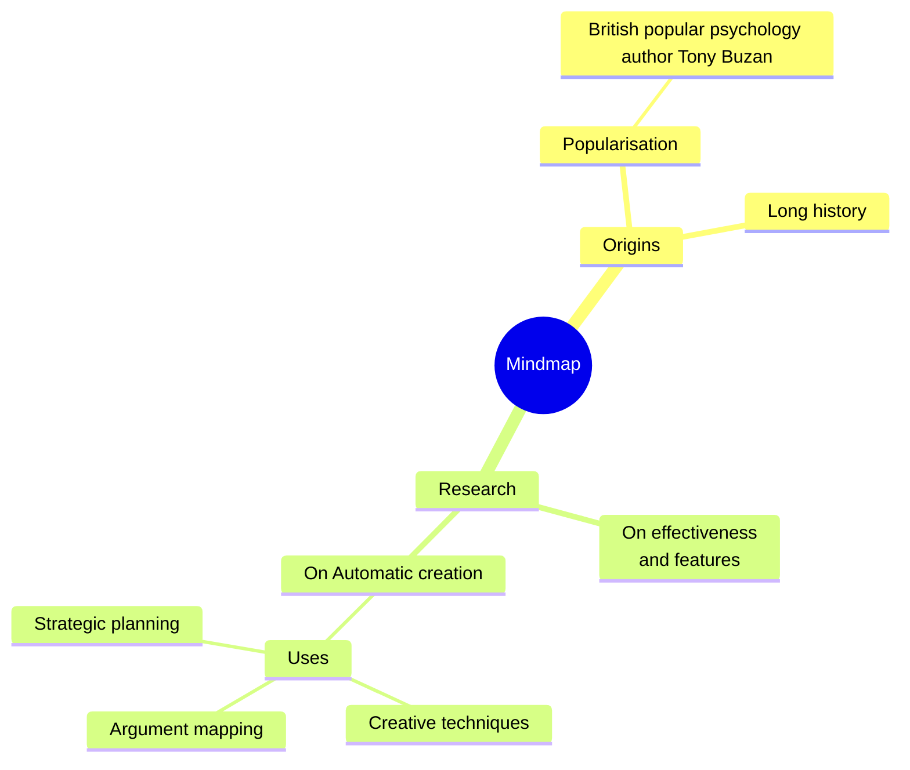
````

## Linking to Obsidian Notes

Add `internal-link` class to nodes to create clickable links:

````markdown
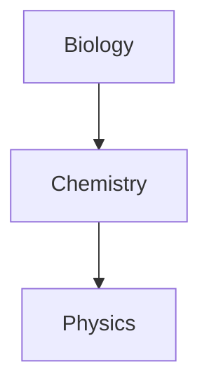
````

### With Special Characters in Note Names

````markdown
```mermaid
graph TD
    A["⨳ Special Character Note"]
    B[Regular Note]
    A --> B

    class A,B internal-link;
```
````

## Styling

### Node Styling
````markdown
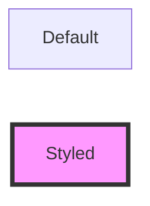
````

### Custom CSS Classes
````markdown
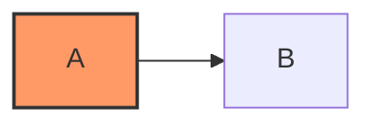
````

## Common Patterns

### Process Flow
````markdown
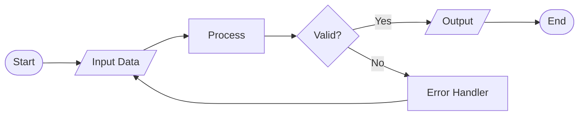
````

### System Architecture
````markdown
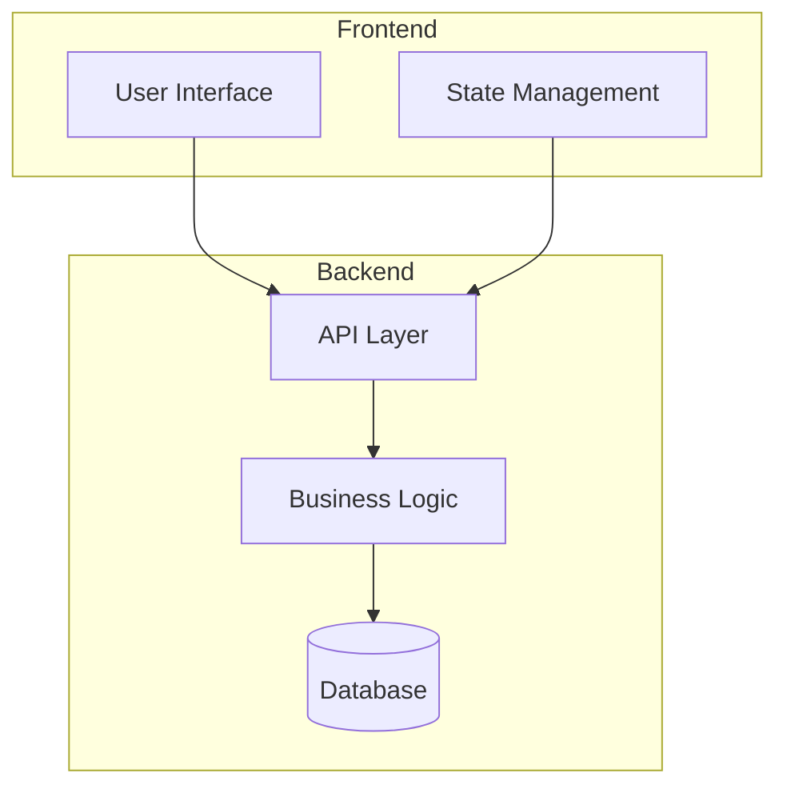
````

### User Journey
````markdown
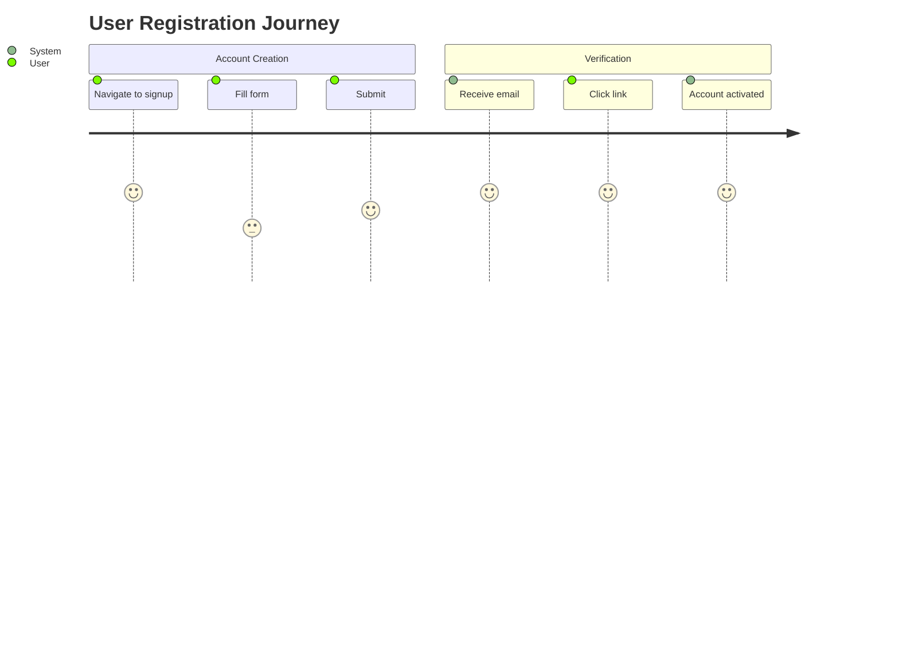
````

## Tips

1. Use Live Editor for complex diagrams: https://mermaid-js.github.io/mermaid-live-editor
2. Mermaid version in Obsidian: 11.4.1 (as of latest)
3. Internal links don't appear in Graph view
4. Use subgraphs for logical grouping
5. Add comments with `%%` in mermaid code
6. Use meaningful IDs for nodes when creating internal links

## References

- Mermaid docs: https://mermaid.js.org/intro/
- Flowchart syntax: https://mermaid.js.org/syntax/flowchart.html
- Sequence diagrams: https://mermaid.js.org/syntax/sequenceDiagram.html
- Live editor: https://mermaid-js.github.io/mermaid-live-editor
