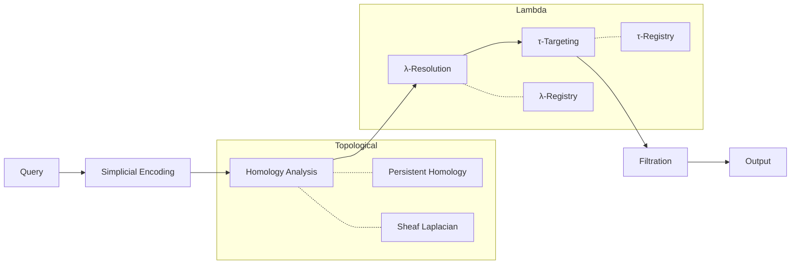

# OntoLog

<purpose>
Universal reasoning over holarchic structures where every part is simultaneously a whole. Implements symbolic λ-calculus primitives (ο, λ, τ) over simplicial complexes with persistent homology for multi-scale analysis and Lex axioms for formal constraint satisfaction.
</purpose>

<lambda_calculus_core>

```
PRIMITIVES
──────────
ο (omicron) : Base      — The grounded entity, input variable
τ (tau)     : Terminal  — The target purpose, output variable  
λ (lambda)  : Operation — The transformation, abstraction

UNIVERSAL FORM
──────────────
λο.τ : Base → Terminal

COMPOSITION
───────────
(λ₁ ∘ λ₂)ο = λ₁(λ₂(ο))   — Sequential composition
λ₁ ⊗ λ₂ = λο.(λ₁ο, λ₂ο)  — Parallel composition
λ* = fix(λ)               — Recursive fixpoint
```

</lambda_calculus_core>

<execution_dag>



</execution_dag>

<routing>

| Pattern | Reference | Function |
|---------|-----------|----------|
| Type definitions | [references/primitives.md](references/primitives.md) | ο, λ, τ, Σ types |
| Topology operations | [references/topology.md](references/topology.md) | Homology, filtration |
| Axiom systems | [references/axioms.md](references/axioms.md) | Lex constraints |
| Holonic structure | [references/holons.md](references/holons.md) | Scale-invariance |
| Agent execution | [agents/](agents/) | DSPy modules |

</routing>

<holarchic_principle>

```
HOLON DEFINITION
────────────────
A holon H is simultaneously:
  • A WHOLE containing sub-holons: H = {h₁, h₂, ..., hₙ}
  • A PART within super-holons: H ∈ H' for some H'

SELF-SIMILARITY
───────────────
structure(H) ≅ structure(hᵢ) ≅ structure(H')

The same λ-operations apply at every scale:
  λᵢ : οᵢ → τᵢ  (micro)
  λⱼ : οⱼ → τⱼ  (meso)  
  λₖ : οₖ → τₖ  (macro)

HOMOICONICITY
─────────────
The representation IS the thing represented.
A holon's structure encodes its own semantics.
```

</holarchic_principle>

<topological_foundation>

```
SIMPLICIAL COMPLEX Σ
────────────────────
Σ = (V, S) where:
  • V = vertices (ο-bases)
  • S = simplices (λ-operations)
  • σ ∈ S ⟹ all faces of σ ∈ S

k-SIMPLEX
─────────
σₖ = [v₀, v₁, ..., vₖ]
  0-simplex: vertex (ο)
  1-simplex: edge (λ binary)
  2-simplex: triangle (λ ternary)
  k-simplex: k+1 vertices in relation

PERSISTENT HOMOLOGY
───────────────────
Track topological features across scales:
  H₀: Connected components (ο-clusters)
  H₁: Loops/cycles (λ-feedback)
  H₂: Voids/cavities (τ-gaps)

PERSISTENCE DIAGRAM
───────────────────
{(bᵢ, dᵢ)} where:
  bᵢ = birth (feature appears)
  dᵢ = death (feature disappears)
  |dᵢ - bᵢ| = persistence (significance)
```

</topological_foundation>

<lex_axiom_system>

```
TYPE SYSTEM
───────────
ο : NodeType        — Base entities
λ : EdgeType        — Operations/relations
τ : TerminalType    — Target purposes
π : PropertyType    — Attributes

STRUCTURAL AXIOMS
─────────────────
transitivity(λ):    λ(a,b) ∧ λ(b,c) ⟹ λ(a,c)
symmetry(λ):        λ(a,b) ⟹ λ(b,a)
reflexivity(λ):     ∀a. λ(a,a)
acyclicity(λ):      ¬∃path. λ*(a,a)

PROPERTY AXIOMS
───────────────
propagation(π,λ):   λ(a,b) ∧ π(a,v) ⟹ π(b,v)
inheritance(π,λ):   λ(a,b) ⟹ π(b) ⊇ π(a)
constraint(π,C):    ∀x. π(x) ∈ C

PATH LOGIC
──────────
reach(a,b,n):       ∃λ₁...λₙ. λₙ(...λ₁(a)...) = b
shortest(a,b):      min{n : reach(a,b,n)}
all_paths(a,b):     {p : p connects a to b}
```

</lex_axiom_system>

<workflow>

```python
def execute(query: str) -> Holon:
    """
    Universal execution: Query → Holon
    
    λ-calculus over simplicial complexes with Lex validation.
    """
    
    # Phase 1: ENCODE — Query → Simplicial Complex
    Σ = agents.encoder.encode(query)
    # Σ.vertices: Set[ο]
    # Σ.simplices: Set[σₖ]
    
    # Phase 2: ANALYZE — Compute Persistent Homology
    dgm = agents.topologist.homology(Σ)
    # dgm: PersistenceDiagram with birth-death pairs
    
    # Phase 3: RESOLVE — Find λ-operations
    Λ = agents.resolver.lambdas(Σ, dgm)
    # Λ: Set[λ] filtered by persistence
    
    # Phase 4: TARGET — Identify τ-terminals
    T = agents.targeter.terminals(Σ, Λ)
    # T: Set[τ] reachable from query bases
    
    # Phase 5: VALIDATE — Check Lex axioms
    valid = agents.validator.check(Σ, Λ, T)
    # valid: ValidationResult with axiom compliance
    
    # Phase 6: SYNTHESIZE — Generate holon
    H = agents.synthesizer.holon(Σ, Λ, T, dgm)
    # H: Holon with self-similar structure
    
    return H
```

</workflow>

<validation>

| Invariant | Check | Target |
|-----------|-------|--------|
| Acyclicity | `¬∃cycle in λ-graph` | True |
| Groundedness | `∀ο. ∃λ. λ(ο) defined` | 100% |
| Connectivity | `H₀(Σ) = 1` | Single component |
| Density | `|simplices|/|vertices| ≥ 4` | Emergent capacity |
| Persistence | `max(dᵢ - bᵢ) > θ` | Significant features |

</validation>

<integration>

| System | Mapping |
|--------|---------|
| hierarchical-reasoning | Strategic=τ, Tactical=λ, Operational=ο |
| knowledge-graph | Vertices=ο, Hyperedges=λ, Terminals=τ |
| graph | k-bisimulation on Σ |
| abduct | Decomposition into simplices |
| persistent-homology | Filtration → Barcodes |

</integration>

<file_structure>

```
ontolog/
├── SKILL.md                    # This file
├── references/
│   ├── primitives.md           # ο, λ, τ, Σ type definitions
│   ├── topology.md             # Homology, Laplacians, filtration
│   ├── axioms.md               # Lex constraint system
│   └── holons.md               # Holarchic structure theory
├── agents/
│   ├── __init__.py             # Module exports
│   ├── types.py                # Type definitions
│   ├── encoder.py              # Query → Σ
│   ├── topologist.py           # Σ → Persistence diagram
│   ├── resolver.py             # λ-operation resolution
│   ├── targeter.py             # τ-terminal identification
│   ├── validator.py            # Lex axiom checking
│   ├── synthesizer.py          # Holon generation
│   └── orchestrator.py         # Pipeline coordination
└── scripts/
    ├── validate.py             # Axiom validation
    └── reason.py               # Query execution
```

</file_structure>
