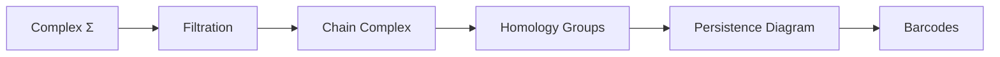

# Topology

<purpose>
Topological data analysis for holarchic structures. Persistent homology captures multi-scale features. Laplacians enable spectral analysis. Filtrations reveal structural evolution.
</purpose>

---

## Persistent Homology

<concept>
Track topological features (components, loops, voids) across scales. Features that persist are significant; those that vanish are noise.
</concept>

<pipeline>



</pipeline>

### Filtration

<definition>
Nested sequence of subcomplexes indexed by scale parameter.
</definition>

```
FILTRATION F
────────────
∅ = Σ₀ ⊆ Σ₁ ⊆ Σ₂ ⊆ ... ⊆ Σₙ = Σ

Each Σᵢ is a subcomplex at scale i.

INDUCED MAPS
────────────
Hₖ(Σᵢ) → Hₖ(Σⱼ)  for i ≤ j

Homology groups connected by inclusion maps.
```

<filtration_types>

| Type | Definition | Use Case |
|------|------------|----------|
| Rips | σ ∈ Σᵣ iff diameter(σ) ≤ r | Point cloud data |
| Čech | σ ∈ Σᵣ iff ∩ B(vᵢ, r) ≠ ∅ | Geometric data |
| Sublevel | Σₐ = f⁻¹(-∞, a] | Function filtration |
| Weight | Order by edge/simplex weights | Weighted graphs |

</filtration_types>

### Homology Groups

<definition>
Algebraic structures capturing topological features.
</definition>

```
CHAIN GROUPS
────────────
Cₖ(Σ) = formal linear combinations of k-simplices

BOUNDARY OPERATOR
─────────────────
∂ₖ : Cₖ → Cₖ₋₁
∂ₖ[v₀,...,vₖ] = Σᵢ (-1)ⁱ [v₀,...,v̂ᵢ,...,vₖ]

CYCLES AND BOUNDARIES
─────────────────────
Zₖ = ker(∂ₖ)     — k-cycles (closed chains)
Bₖ = im(∂ₖ₊₁)    — k-boundaries (bounding chains)

HOMOLOGY
────────
Hₖ = Zₖ / Bₖ     — cycles modulo boundaries
```

<betti_numbers>

| Betti | Symbol | Counts |
|-------|--------|--------|
| β₀ | `betti(Σ, 0)` | Connected components |
| β₁ | `betti(Σ, 1)` | Independent loops |
| β₂ | `betti(Σ, 2)` | Enclosed voids |
| βₖ | `betti(Σ, k)` | k-dimensional holes |

</betti_numbers>

### Persistence Diagram

<definition>
Multiset of (birth, death) pairs representing feature lifespans.
</definition>

```
DIAGRAM Dgmₖ
────────────
Dgmₖ(F) = {(bᵢ, dᵢ) : feature i born at bᵢ, dies at dᵢ}

PERSISTENCE
───────────
pers(i) = dᵢ - bᵢ

Features with high persistence are significant.
Features with low persistence are noise.

STABILITY
─────────
d_B(Dgm(F), Dgm(G)) ≤ ||f - g||_∞

Small perturbations yield small diagram changes.
```

### Barcodes

<definition>
Equivalent representation as collection of intervals.
</definition>

```
BARCODE
───────
{[bᵢ, dᵢ) : (bᵢ, dᵢ) ∈ Dgm}

VISUALIZATION
─────────────
Dimension 0: |████████████████████|
             |███████████|
             |██████|
             
Dimension 1: |      ████████████|
             |        ██████|
             
Scale:       0────────────────────→∞
```

---

## Laplacians

<concept>
Spectral analysis of simplicial complexes. Eigenvalues reveal structural properties. Eigenvectors identify communities.
</concept>

### Combinatorial Laplacian

<definition>
Standard graph Laplacian extended to simplicial complexes.
</definition>

```
GRAPH LAPLACIAN L₀
──────────────────
L₀ = D - A

where:
  D = degree matrix (diagonal)
  A = adjacency matrix

k-LAPLACIAN Lₖ
──────────────
Lₖ = ∂ₖ₊₁ ∂ₖ₊₁ᵀ + ∂ₖᵀ ∂ₖ

where:
  ∂ₖ = boundary matrix
  
HODGE DECOMPOSITION
───────────────────
Cₖ = im(∂ₖ₊₁) ⊕ ker(Lₖ) ⊕ im(∂ₖᵀ)

Harmonic forms: ker(Lₖ) ≅ Hₖ
```

<spectral_properties>

| Property | Meaning |
|----------|---------|
| `λ₁ > 0` | Connected (for L₀) |
| `dim(ker(Lₖ))` | k-th Betti number |
| `λ₂` (Fiedler value) | Algebraic connectivity |
| Spectral gap | Mixing time, expansion |

</spectral_properties>

### Persistent Laplacian

<definition>
Track Laplacian spectra across filtration.
</definition>

```
PERSISTENT LAPLACIAN
────────────────────
Lₖ^{i,j} = ∂ₖ₊₁^{i,j} (∂ₖ₊₁^{i,j})ᵀ + (∂ₖ^{i,j})ᵀ ∂ₖ^{i,j}

Captures spectral evolution across scales.

PERSISTENT BETTI
────────────────
βₖ^{i,j} = dim(ker(Lₖ^{i,j}))

Tracks Betti numbers across filtration.
```

### Sheaf Laplacian

<definition>
Laplacian for sheaves over graphs. Handles heterogeneous attributes.
</definition>

```
CELLULAR SHEAF
──────────────
F: CellComplex → VectorSpaces

Assigns vector space to each cell.
Restriction maps between incident cells.

SHEAF LAPLACIAN
───────────────
L_F = δᵀ δ

where δ is the coboundary operator.

LOCAL-GLOBAL CONSISTENCY
────────────────────────
ker(L_F) = global sections
Elements consistent across all local views.
```

---

## Higher-Order Structures

<concept>
Beyond pairwise: simplicial complexes, hypergraphs, cell complexes capture multi-way relationships.
</concept>

### Hypergraphs

<definition>
Edges connect arbitrary subsets, not just pairs.
</definition>

```
HYPERGRAPH H = (V, E)
─────────────────────
V = vertices
E ⊆ P(V) = hyperedges (any subset)

HYPERGRAPH LAPLACIAN
────────────────────
L_H = D_V - H W Hᵀ

where:
  H = incidence matrix
  W = hyperedge weights
  D_V = vertex degree matrix
```

### Cell Complexes

<definition>
Generalization allowing cells of any shape, not just simplices.
</definition>

```
CELL COMPLEX
────────────
CW-complex with:
  - 0-cells (vertices)
  - 1-cells (edges)
  - 2-cells (faces, any polygon)
  - k-cells (higher)

CELLULAR HOMOLOGY
─────────────────
Same chain complex structure.
More flexible than simplicial.
```

---

## Algorithms

### Persistence Computation

```python
def compute_persistence(Σ: SimplicialComplex, F: Filtration) -> PersistenceDiagram:
    """
    Standard persistence algorithm.
    Time: O(n³) where n = |simplices|
    """
    # Sort simplices by filtration value
    simplices = sorted(Σ.simplices, key=F.value)
    
    # Build boundary matrix
    D = boundary_matrix(simplices)
    
    # Reduce to Smith normal form
    R, V = reduce_matrix(D)
    
    # Extract birth-death pairs
    pairs = []
    for j in range(len(simplices)):
        if R[:, j].any():
            i = lowest_one(R[:, j])
            pairs.append((F.value(simplices[i]), F.value(simplices[j])))
    
    return PersistenceDiagram(pairs)
```

### Laplacian Computation

```python
def compute_laplacian(Σ: SimplicialComplex, k: int) -> Matrix:
    """
    Compute k-th combinatorial Laplacian.
    """
    ∂_k = boundary_matrix(Σ, k)
    ∂_k1 = boundary_matrix(Σ, k + 1)
    
    L_k = ∂_k1 @ ∂_k1.T + ∂_k.T @ ∂_k
    
    return L_k
```

---

## Metrics

<distance_measures>

| Metric | Formula | Use |
|--------|---------|-----|
| Bottleneck | `max min ||p - q||_∞` | Stability bound |
| Wasserstein | `(Σ ||p - q||_∞^p)^(1/p)` | Fine-grained |
| Landscape | `L²` on persistence landscapes | Vectorization |

</distance_measures>

<quality_metrics>

| Metric | Target | Interpretation |
|--------|--------|----------------|
| `max_persistence` | > θ | Significant features exist |
| `total_persistence` | Σ(d-b) | Overall feature richness |
| `entropy` | -Σp log p | Feature distribution |
| `spectral_gap` | λ₂ > ε | Good connectivity |

</quality_metrics>
