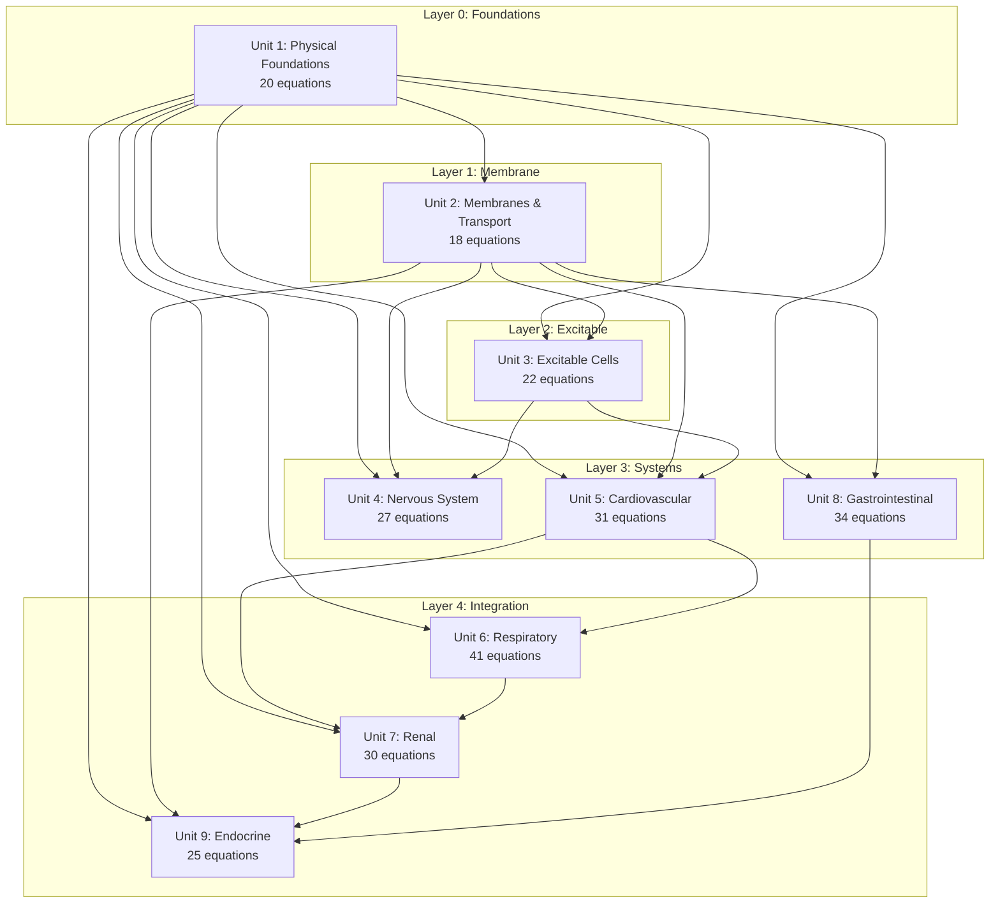
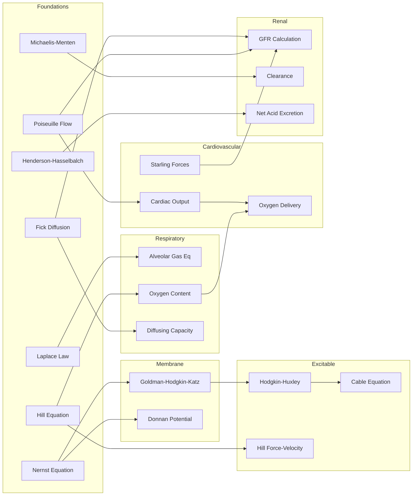
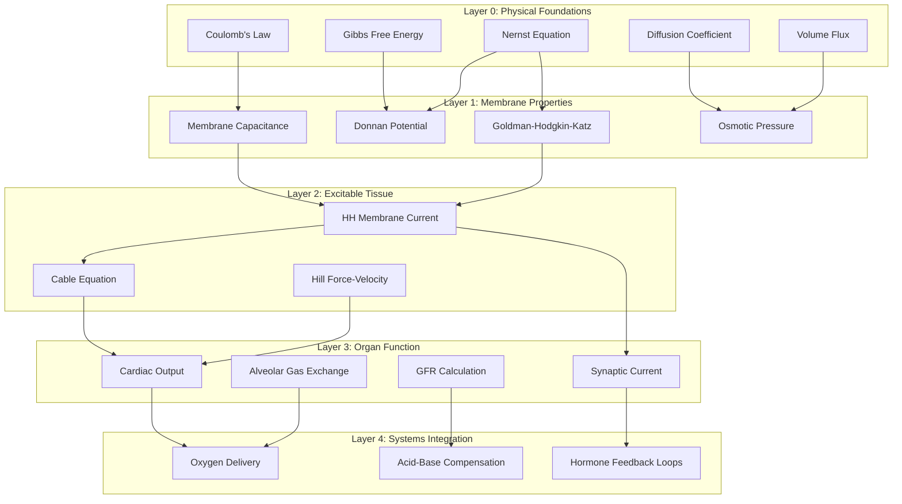
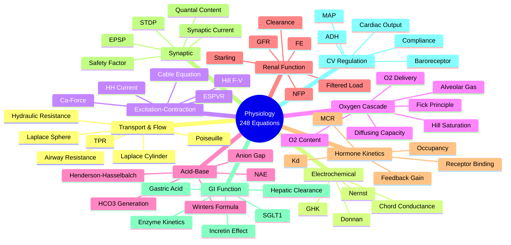
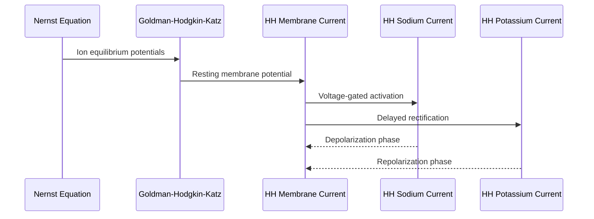
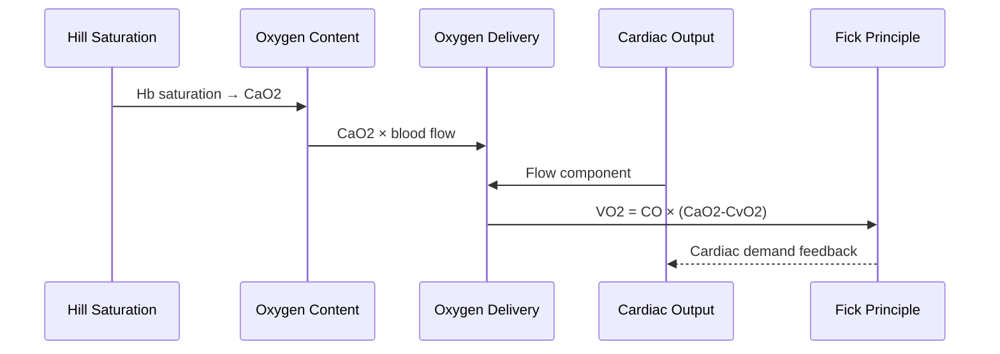
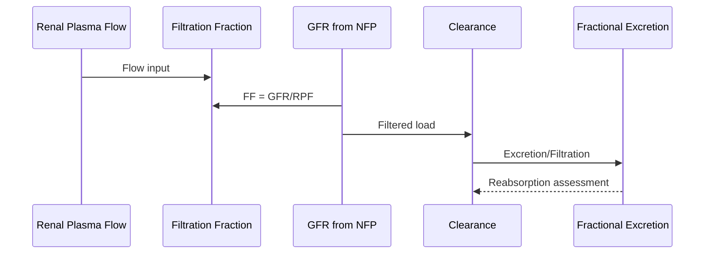

# Equation Dependency Visualization

## Unit Dependency DAG

## Cross-Domain Equation Flow

## Topological Layers

## Functional Clusters

## Dependency Chain Details

### Membrane to Action Potential Chain

### Cardiovascular Oxygen Cascade

### Renal Clearance Chain

## Summary Statistics

| Metric | Count |
|--------|-------|
| Total Equations | 248 |
| Physiological Units | 9 |
| Functional Clusters | 10 |
| Cross-Domain Equations | 10 |
| Dependency Chains | 5 |
| Topological Layers | 5 |

## Navigation

- **By Unit**: Use `dependency-graph.json` → `units` section
- **By Cluster**: Use `clusters.json` → `clusters` section
- **By Dependency**: Use `dependency-graph.json` → `cross_domain_equations`
- **By Chain**: Use `dependency-graph.json` → `dependency_chains`
