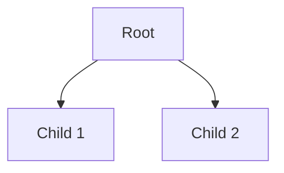

# Schema: Knowledge Ontology Generator

Transform any input into structured knowledge schemas with rich semantic metadata.

## Overview

Generate ontologies from:
- Plain text and natural language
- Structured data (JSON, YAML, CSV, XML)
- Markdown files with metadata
- Code repositories

Output formats:
- **Primary**: Obsidian markdown (YAML frontmatter, wikilinks, tags, callouts, mermaid)
- **Secondary**: JSON-LD, RDF/OWL, Neo4j Cypher, GraphQL schemas

## Modes

### Fractal Mode
Strict hierarchical constraints for self-similar structures:
- 2-3 children per non-leaf node
- Homonymic inheritance (child labels contain parent stem)
- Uniform relation types per parent
- Topology score ≥4.0

### Free Mode
Flexible generation optimized for semantic coherence:
- Variable branching factor
- Relaxed naming constraints
- Focus on meaningful relationships

## Installation

**Quick Install** (recommended):
```bash
cd ~/.claude/skills/hm-skills/schema
./install.sh
```

This will:
- Install Python dependencies (jinja2, pyyaml)
- Download spaCy language model (en_core_web_sm)
- Create global `schema-gen` wrapper in ~/bin
- Configure PATH in your shell rc file

**Manual Setup**:
```bash
pip3 install --user jinja2 pyyaml
python3 -m spacy download en_core_web_sm
```

## Architecture

Four-layer pipeline with graceful degradation:

1. **Layer 1: Structural Extraction** - AST parsing (markdown-oxide, tree-sitter, pandas)
2. **Layer 2: Semantic Analysis** - NLP (spaCy, networkx)
3. **Layer 3: LLM Enrichment** - Optional deep analysis (Claude API, MCP tools)
4. **Layer 4: Output Generation** - Template-based formatting (Jinja2)

## Usage

**Recommended**: Use the global wrapper `schema-gen` (automatically installed to `~/bin/schema-gen`)

```bash
# Basic usage - text to Obsidian markdown
schema-gen --input "text content" --output schema.md

# Fractal mode with deep analysis
schema-gen --input data.json --mode fractal --deep

# Export to multiple formats
schema-gen --input code/ --format obsidian,jsonld,cypher
```

**Alternative**: Direct invocation from skill directory

```bash
cd /Users/mikhail/.claude/skills/hm-skills/schema
python3 -m scripts.schema_cli --input "text content" --output schema.md
```

## Usage Examples

### Input Formats

#### Text to Schema
```bash
# Simple text input
schema-gen --input "AI analyzes data" --output ai-schema.md

# From text file
schema-gen --input document.txt --output schema.md --mode fractal
```

#### JSON to Schema
```bash
# Structured data
schema-gen --input data.json --output schema.md
```

#### Markdown to Schema
```bash
# Extract hierarchy from markdown headings
schema-gen --input notes.md --output schema.md --verbose
```

#### Code to Schema
```bash
# Parse Python code structure (classes, functions, methods)
schema-gen --input mymodule.py --output code-schema.md --verbose
```

### Output Formats

#### Single Format
```bash
# Obsidian markdown (default)
schema-gen --input data.json --output schema.md
```

#### Multiple Formats
```bash
# Export to all formats
schema-gen \
  --input document.txt \
  --format obsidian,jsonld,cypher,graphql \
  --output output/schema.md \
  --verbose

# Generates:
# - output/schema.md (Obsidian markdown)
# - output/schema.jsonld (JSON-LD linked data)
# - output/schema.cypher (Neo4j graph database)
# - output/schema.graphql (GraphQL schema)
```

### Advanced Usage

#### Fractal Mode with Deep Analysis
```bash
schema-gen \
  --input complex.txt \
  --mode fractal \
  --deep \
  --verbose
```

#### Custom Output Directory
```bash
schema-gen \
  --input data.json \
  --output custom/path/schema.md \
  --format obsidian,cypher
```

## Output Example

Generated Obsidian markdown includes:

```markdown
---
created: 2025-01-05T12:00:00
tags: [knowledge, schema]
ontology_type: free
node_count: 10
edge_count: 15
topology_score: 2.50
---

# Schema Title

> [!info] Schema Overview
> Description of the schema

## Structure



## Entities

### Root

**Properties:**
- `category`: example
- `weight`: 0.8

**Relationships:**
- parent of → [[Child 1]]
- parent of → [[Child 2]]
```

## Configuration

Edit mode configuration files:
- [[config/fractal-mode.yaml]] - Strict hierarchical constraints
- [[config/free-mode.yaml]] - Flexible generation settings

Customize output templates:
- [[config/templates/obsidian.md.j2]] - Obsidian markdown
- [[config/templates/jsonld.json.j2]] - JSON-LD
- [[config/templates/cypher.cypher.j2]] - Neo4j Cypher

## Features

### Property Inheritance
Child nodes automatically inherit properties from ancestors, following breadcrumb-plugin patterns.

### Multi-Dimensional Navigation
Generate alternate navigation paths:
- Temporal (creation order, lifecycle)
- Conceptual (domain hierarchies, abstraction)
- Spatial (containment, proximity)
- Functional (purpose-based, process flows)

### Implicit Relationship Inference
Automatically detect relationships based on:
- Co-occurrence in context
- Tag overlap (>50% shared)
- Structural proximity
- Semantic similarity

## Error Handling

Graceful degradation ensures output even on failures:
- Layer 1 fails → Plain text fallback
- Layer 2 fails → Heuristic relationships
- Layer 3 fails → Skip enrichment
- Template fails → Raw JSON output

## References

- [[references/ast-parsing-guide|AST Parsing Guide]]
- [[references/semantic-patterns|Semantic Pattern Reference]]
- [[references/template-syntax|Template Variable Reference]]
- [[references/mcp-integration|MCP Tool Integration]]

## Examples

- [[examples/text-to-schema|Text to Schema]]
- [[examples/json-to-schema|JSON to Schema]]
- [[examples/markdown-to-schema|Markdown to Schema]]
- [[examples/code-to-schema|Code to Schema]]
