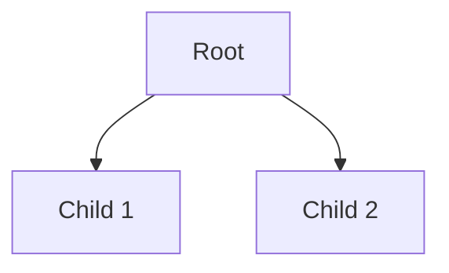

# Schema Skill Implementation Plan

> **For Claude:** REQUIRED SUB-SKILL: Use superpowers:executing-plans to implement this plan task-by-task.

**Goal:** Build a knowledge schema/ontology generator that transforms any input (text, JSON, markdown, code) into Obsidian-compatible markdown with rich semantic metadata and supports export to semantic formats.

**Architecture:** Four-layer pipeline (AST → NLP → LLM → Templates) with graceful degradation, hybrid fractal/free modes, property inheritance, multi-dimensional navigation, and MCP integration.

**Tech Stack:** Python (spaCy, networkx, pandas, Jinja2), markdown-oxide (local), tree-sitter (local), mq/jq (local)

---

## Task 1: Create Base Skill Structure

**Files:**
- Create: `SKILL.md`
- Create: `config/fractal-mode.yaml`
- Create: `config/free-mode.yaml`
- Create: `scripts/core/__init__.py`
- Create: `scripts/utils/__init__.py`

**Step 1: Create SKILL.md with proper frontmatter**

Create `SKILL.md`:

```markdown
---
name: schema
description: Generate knowledge schemas and ontologies from any input format. Extract semantic structures, relationships, and hierarchies. Output as Obsidian markdown with YAML frontmatter, wikilinks, tags, and mermaid diagrams, or export to semantic formats (JSON-LD, RDF, Neo4j Cypher, GraphQL). Supports fractal mode (strict hierarchical constraints) and free mode (flexible generation). Auto-activates for queries containing "schema", "ontology", "knowledge graph", "extract structure", or "generate outline".
---

# Schema: Knowledge Ontology Generator

Transform any input into structured knowledge schemas with rich semantic metadata.

## Overview

Generate ontologies from:
- Plain text and natural language
- Structured data (JSON, YAML, CSV, XML)
- Markdown files with metadata
- Code repositories

Output formats:
- **Primary**: Obsidian markdown (YAML frontmatter, wikilinks, tags, callouts, mermaid)
- **Secondary**: JSON-LD, RDF/OWL, Neo4j Cypher, GraphQL schemas

## Modes

### Fractal Mode
Strict hierarchical constraints for self-similar structures:
- 2-3 children per non-leaf node
- Homonymic inheritance (child labels contain parent stem)
- Uniform relation types per parent
- Topology score ≥4.0

### Free Mode
Flexible generation optimized for semantic coherence:
- Variable branching factor
- Relaxed naming constraints
- Focus on meaningful relationships

## Architecture

Four-layer pipeline with graceful degradation:

1. **Layer 1: Structural Extraction** - AST parsing (markdown-oxide, tree-sitter, pandas)
2. **Layer 2: Semantic Analysis** - NLP (spaCy, networkx)
3. **Layer 3: LLM Enrichment** - Optional deep analysis (Claude API, MCP tools)
4. **Layer 4: Output Generation** - Template-based formatting (Jinja2)

## Usage

```bash
# Basic usage - text to Obsidian markdown
python scripts/schema_cli.py --input "text content" --output schema.md

# Fractal mode with deep analysis
python scripts/schema_cli.py --input data.json --mode fractal --deep

# Export to multiple formats
python scripts/schema_cli.py --input code/ --format obsidian,jsonld,cypher
```

## Configuration

Edit mode configuration files:
- [[config/fractal-mode.yaml]] - Strict hierarchical constraints
- [[config/free-mode.yaml]] - Flexible generation settings

Customize output templates:
- [[config/templates/obsidian.md.j2]] - Obsidian markdown
- [[config/templates/jsonld.json.j2]] - JSON-LD
- [[config/templates/cypher.cypher.j2]] - Neo4j Cypher

## Features

### Property Inheritance
Child nodes automatically inherit properties from ancestors, following breadcrumb-plugin patterns.

### Multi-Dimensional Navigation
Generate alternate navigation paths:
- Temporal (creation order, lifecycle)
- Conceptual (domain hierarchies, abstraction)
- Spatial (containment, proximity)
- Functional (purpose-based, process flows)

### Implicit Relationship Inference
Automatically detect relationships based on:
- Co-occurrence in context
- Tag overlap (>50% shared)
- Structural proximity
- Semantic similarity

## Error Handling

Graceful degradation ensures output even on failures:
- Layer 1 fails → Plain text fallback
- Layer 2 fails → Heuristic relationships
- Layer 3 fails → Skip enrichment
- Template fails → Raw JSON output

## References

- [[references/ast-parsing-guide|AST Parsing Guide]]
- [[references/semantic-patterns|Semantic Pattern Reference]]
- [[references/template-syntax|Template Variable Reference]]
- [[references/mcp-integration|MCP Tool Integration]]

## Examples

- [[examples/text-to-schema|Text to Schema]]
- [[examples/json-to-schema|JSON to Schema]]
- [[examples/markdown-to-schema|Markdown to Schema]]
- [[examples/code-to-schema|Code to Schema]]
```

**Step 2: Create fractal-mode.yaml**

Create `config/fractal-mode.yaml`:

```yaml
# Fractal Mode Configuration
# Strict hierarchical constraints for self-similar structures

mode: fractal

constraints:
  branching:
    min_children: 2
    max_children: 3
    enforce_non_leaf: true

  naming:
    homonymic_inheritance: true  # Children must contain parent stem
    max_label_words: 3
    require_stem: true

  relations:
    uniform_per_parent: true     # All children same relation type
    allowed_types:
      - parent_of
      - part_of
      - opposite_of
      - causes

  topology:
    min_score: 4.0               # Edge-to-node ratio
    require_cross_links: true

  depth:
    max_depth: 5
    warn_shallow: 2

validation:
  strict: true
  auto_repair: true
  max_repair_attempts: 3
  stagnation_detection: true

output:
  include_constraints_report: true
  include_topology_metrics: true
  include_validation_report: true
```

**Step 3: Create free-mode.yaml**

Create `config/free-mode.yaml`:

```yaml
# Free Mode Configuration
# Flexible generation optimized for semantic coherence

mode: free

constraints:
  branching:
    min_children: 1
    max_children: 10
    enforce_non_leaf: false

  naming:
    homonymic_inheritance: false
    max_label_words: 5
    require_stem: false

  relations:
    uniform_per_parent: false
    allowed_types:
      - parent_of
      - part_of
      - opposite_of
      - causes
      - related_to
      - instance_of
      - has_property

  topology:
    min_score: 2.0
    require_cross_links: false

  depth:
    max_depth: 10
    warn_shallow: null

validation:
  strict: false
  auto_repair: true
  max_repair_attempts: 1
  stagnation_detection: false

output:
  include_constraints_report: false
  include_topology_metrics: true
  include_validation_report: false
```

**Step 4: Create __init__.py files**

Create `scripts/core/__init__.py`:
```python
"""Core schema generation pipeline layers."""
```

Create `scripts/utils/__init__.py`:
```python
"""Utility modules for schema generation."""
```

**Step 5: Commit base structure**

```bash
git add SKILL.md config/ scripts/
git commit -m "feat: create base schema skill structure

- Add SKILL.md with proper frontmatter
- Add fractal-mode.yaml and free-mode.yaml configs
- Create core and utils package structure

🤖 Generated with [Claude Code](https://claude.com/claude-code)

Co-Authored-By: Claude <noreply@anthropic.com>"
```

---

## Task 2: Implement Ontology Data Structures

**Files:**
- Create: `scripts/utils/ontology.py`
- Create: `tests/test_ontology.py`

**Step 1: Write failing test for OntologyNode**

Create `tests/test_ontology.py`:

```python
import pytest
from scripts.utils.ontology import OntologyNode, OntologyEdge, Ontology

def test_ontology_node_creation():
    """Test creating an ontology node with basic properties."""
    node = OntologyNode(
        id="n1",
        label="Test Node",
        node_type="entity",
        depth=0
    )
    assert node.id == "n1"
    assert node.label == "Test Node"
    assert node.node_type == "entity"
    assert node.depth == 0
    assert node.properties == {}
    assert node.inherited_properties == {}

def test_ontology_node_with_properties():
    """Test node with custom properties."""
    node = OntologyNode(
        id="n1",
        label="Test",
        node_type="concept",
        depth=1,
        stem="test",
        properties={"category": "example", "weight": 0.8},
        aliases=["Sample", "Demo"]
    )
    assert node.stem == "test"
    assert node.properties["category"] == "example"
    assert node.properties["weight"] == 0.8
    assert "Sample" in node.aliases
```

**Step 2: Run test to verify it fails**

Run: `pytest tests/test_ontology.py -v`
Expected: FAIL with "ModuleNotFoundError: No module named 'scripts.utils.ontology'"

**Step 3: Implement OntologyNode dataclass**

Create `scripts/utils/ontology.py`:

```python
"""Ontology data structures for schema generation."""

from dataclasses import dataclass, field
from typing import Dict, List, Any, Optional


@dataclass
class OntologyNode:
    """Represents a node in the knowledge ontology."""

    id: str
    label: str
    node_type: str  # entity, concept, class, property
    depth: int
    stem: Optional[str] = None
    properties: Dict[str, Any] = field(default_factory=dict)
    inherited_properties: Dict[str, Any] = field(default_factory=dict)
    aliases: List[str] = field(default_factory=list)
    description: Optional[str] = None
    source_location: Optional[str] = None
    parent_id: Optional[str] = None
    children: List[str] = field(default_factory=list)

    def add_property(self, key: str, value: Any) -> None:
        """Add a property to this node."""
        self.properties[key] = value

    def inherit_property(self, key: str, value: Any, from_node: str) -> None:
        """Add an inherited property from an ancestor node."""
        if key not in self.properties:  # Don't override local properties
            self.inherited_properties[key] = {
                "value": value,
                "from": from_node
            }


@dataclass
class OntologyEdge:
    """Represents a relationship between ontology nodes."""

    source_id: str
    target_id: str
    edge_type: str  # parent_of, part_of, opposite_of, causes, related_to, etc.
    properties: Dict[str, Any] = field(default_factory=dict)
    strength: float = 1.0  # Confidence/weight (0.0-1.0)
    inferred: bool = False  # True if generated by Layer 3
    dimension: Optional[str] = None  # For multi-dimensional navigation

    def __post_init__(self):
        """Validate edge after initialization."""
        if not 0.0 <= self.strength <= 1.0:
            raise ValueError(f"Edge strength must be 0.0-1.0, got {self.strength}")


@dataclass
class Ontology:
    """Complete knowledge ontology with nodes, edges, and metadata."""

    nodes: Dict[str, OntologyNode] = field(default_factory=dict)
    edges: List[OntologyEdge] = field(default_factory=list)
    metadata: Dict[str, Any] = field(default_factory=dict)
    dimensions: List[str] = field(default_factory=list)

    def add_node(self, node: OntologyNode) -> None:
        """Add a node to the ontology."""
        self.nodes[node.id] = node

    def add_edge(self, edge: OntologyEdge) -> None:
        """Add an edge to the ontology."""
        # Validate edge references existing nodes
        if edge.source_id not in self.nodes:
            raise ValueError(f"Edge source '{edge.source_id}' not in ontology")
        if edge.target_id not in self.nodes:
            raise ValueError(f"Edge target '{edge.target_id}' not in ontology")
        self.edges.append(edge)

    def get_children(self, node_id: str) -> List[OntologyNode]:
        """Get all children of a node."""
        node = self.nodes.get(node_id)
        if not node:
            return []
        return [self.nodes[child_id] for child_id in node.children if child_id in self.nodes]

    def get_parent(self, node_id: str) -> Optional[OntologyNode]:
        """Get the parent of a node."""
        node = self.nodes.get(node_id)
        if not node or not node.parent_id:
            return None
        return self.nodes.get(node.parent_id)

    def get_ancestors(self, node_id: str) -> List[OntologyNode]:
        """Get all ancestors of a node (parent, grandparent, etc.)."""
        ancestors = []
        current = self.get_parent(node_id)
        while current:
            ancestors.append(current)
            current = self.get_parent(current.id)
        return ancestors

    def calculate_topology_score(self) -> float:
        """Calculate edge-to-node ratio (topology density)."""
        if len(self.nodes) == 0:
            return 0.0
        total_edges = len(self.edges)
        # Count hierarchical edges from parent-child relationships
        hierarchical_edges = sum(len(node.children) for node in self.nodes.values())
        return (total_edges + hierarchical_edges) / len(self.nodes)
```

**Step 4: Run tests to verify they pass**

Run: `pytest tests/test_ontology.py -v`
Expected: PASS (2 tests)

**Step 5: Write additional tests for edges and ontology**

Add to `tests/test_ontology.py`:

```python
def test_ontology_edge_creation():
    """Test creating an ontology edge."""
    edge = OntologyEdge(
        source_id="n1",
        target_id="n2",
        edge_type="parent_of",
        strength=0.95
    )
    assert edge.source_id == "n1"
    assert edge.target_id == "n2"
    assert edge.edge_type == "parent_of"
    assert edge.strength == 0.95
    assert edge.inferred is False

def test_ontology_edge_validation():
    """Test edge strength validation."""
    with pytest.raises(ValueError, match="Edge strength must be 0.0-1.0"):
        OntologyEdge(
            source_id="n1",
            target_id="n2",
            edge_type="related_to",
            strength=1.5
        )

def test_ontology_add_nodes_and_edges():
    """Test building an ontology with nodes and edges."""
    onto = Ontology()

    # Add nodes
    root = OntologyNode(id="root", label="Root", node_type="concept", depth=0)
    child1 = OntologyNode(id="c1", label="Child 1", node_type="entity", depth=1, parent_id="root")
    child2 = OntologyNode(id="c2", label="Child 2", node_type="entity", depth=1, parent_id="root")

    root.children = ["c1", "c2"]

    onto.add_node(root)
    onto.add_node(child1)
    onto.add_node(child2)

    # Add edge
    edge = OntologyEdge(source_id="root", target_id="c1", edge_type="parent_of")
    onto.add_edge(edge)

    assert len(onto.nodes) == 3
    assert len(onto.edges) == 1
    assert onto.get_children("root") == [child1, child2]
    assert onto.get_parent("c1") == root

def test_ontology_topology_score():
    """Test topology score calculation."""
    onto = Ontology()

    # Create simple hierarchy: root -> 2 children
    root = OntologyNode(id="r", label="Root", node_type="concept", depth=0, children=["c1", "c2"])
    child1 = OntologyNode(id="c1", label="C1", node_type="entity", depth=1, parent_id="r")
    child2 = OntologyNode(id="c2", label="C2", node_type="entity", depth=1, parent_id="r")

    onto.add_node(root)
    onto.add_node(child1)
    onto.add_node(child2)

    # Add cross-link
    onto.add_edge(OntologyEdge(source_id="c1", target_id="c2", edge_type="related_to"))

    # Score = (1 cross-link + 2 hierarchical) / 3 nodes = 1.0
    assert onto.calculate_topology_score() == 1.0
```

**Step 6: Run tests**

Run: `pytest tests/test_ontology.py -v`
Expected: PASS (6 tests)

**Step 7: Commit ontology data structures**

```bash
git add scripts/utils/ontology.py tests/test_ontology.py
git commit -m "feat: implement ontology data structures

- Add OntologyNode, OntologyEdge, Ontology dataclasses
- Support property inheritance tracking
- Calculate topology scores
- Comprehensive test coverage

🤖 Generated with [Claude Code](https://claude.com/claude-code)

Co-Authored-By: Claude <noreply@anthropic.com>"
```

---

## Task 3: Implement Layer 1 - AST Parser (Structural Extraction)

**Files:**
- Create: `scripts/core/layer1_ast_parser.py`
- Create: `scripts/adapters/input_text.py`
- Create: `scripts/adapters/input_json.py`
- Create: `tests/test_layer1_parser.py`

**Step 1: Write failing test for text adapter**

Create `tests/test_layer1_parser.py`:

```python
import pytest
from scripts.adapters.input_text import TextAdapter
from scripts.utils.ontology import Ontology

def test_text_adapter_simple_paragraphs():
    """Test extracting structure from simple text paragraphs."""
    text = """Photosynthesis converts light into energy.

Plants use chlorophyll to capture sunlight.
Carbon dioxide and water become glucose."""

    adapter = TextAdapter()
    ontology = adapter.parse(text)

    assert isinstance(ontology, Ontology)
    assert len(ontology.nodes) > 0
    assert "text_root" in ontology.nodes

def test_text_adapter_with_headings():
    """Test extracting structure from text with markdown headings."""
    text = """# Main Topic

## Subtopic A

Content for subtopic A.

## Subtopic B

Content for subtopic B."""

    adapter = TextAdapter()
    ontology = adapter.parse(text)

    # Should extract heading hierarchy
    assert len(ontology.nodes) >= 3  # root + 2 subtopics
```

**Step 2: Run test to verify it fails**

Run: `pytest tests/test_layer1_parser.py -v`
Expected: FAIL with "ModuleNotFoundError"

**Step 3: Implement TextAdapter**

Create `scripts/adapters/__init__.py`:
```python
"""Input adapters for various formats."""
```

Create `scripts/adapters/input_text.py`:

```python
"""Text input adapter - extract structure from plain text or markdown."""

import re
from typing import List, Tuple
from scripts.utils.ontology import Ontology, OntologyNode, OntologyEdge


class TextAdapter:
    """Parse plain text or markdown into ontology structure."""

    def parse(self, text: str) -> Ontology:
        """Extract structure from text input."""
        ontology = Ontology()
        ontology.metadata["source_type"] = "text"
        ontology.metadata["input_length"] = len(text)

        # Try to detect markdown headings
        headings = self._extract_headings(text)

        if headings:
            # Build hierarchy from headings
            self._build_heading_hierarchy(headings, ontology)
        else:
            # Fall back to paragraph-based structure
            self._build_paragraph_structure(text, ontology)

        return ontology

    def _extract_headings(self, text: str) -> List[Tuple[int, str, str]]:
        """Extract markdown headings with their levels.

        Returns:
            List of (level, heading_text, content) tuples
        """
        headings = []
        lines = text.split('\n')

        i = 0
        while i < len(lines):
            line = lines[i].strip()

            # Match markdown headings (# Header)
            match = re.match(r'^(#{1,6})\s+(.+)$', line)
            if match:
                level = len(match.group(1))
                heading_text = match.group(2).strip()

                # Collect content until next heading
                content_lines = []
                i += 1
                while i < len(lines) and not re.match(r'^#{1,6}\s+', lines[i].strip()):
                    content_lines.append(lines[i])
                    i += 1

                content = '\n'.join(content_lines).strip()
                headings.append((level, heading_text, content))
            else:
                i += 1

        return headings

    def _build_heading_hierarchy(self, headings: List[Tuple[int, str, str]],
                                  ontology: Ontology) -> None:
        """Build ontology from markdown heading hierarchy."""
        if not headings:
            return

        # Create root node
        root = OntologyNode(
            id="text_root",
            label="Document",
            node_type="document",
            depth=0
        )
        ontology.add_node(root)

        # Stack to track parent at each level
        stack = [(0, root)]
        node_counter = 1

        for level, heading_text, content in headings:
            # Pop stack until we find the parent level
            while stack and stack[-1][0] >= level:
                stack.pop()

            parent_level, parent_node = stack[-1] if stack else (0, root)

            # Create node for this heading
            node_id = f"heading_{node_counter}"
            node = OntologyNode(
                id=node_id,
                label=heading_text,
                node_type="section",
                depth=level,
                parent_id=parent_node.id,
                description=content[:200] if content else None  # First 200 chars
            )
            node.add_property("content", content)
            node.add_property("heading_level", level)

            ontology.add_node(node)

            # Add to parent's children
            parent_node.children.append(node_id)

            # Add hierarchical edge
            edge = OntologyEdge(
                source_id=parent_node.id,
                target_id=node_id,
                edge_type="parent_of"
            )
            ontology.add_edge(edge)

            # Push onto stack
            stack.append((level, node))
            node_counter += 1

    def _build_paragraph_structure(self, text: str, ontology: Ontology) -> None:
        """Build flat structure from paragraphs."""
        # Create root
        root = OntologyNode(
            id="text_root",
            label="Text Document",
            node_type="document",
            depth=0
        )
        ontology.add_node(root)

        # Split into paragraphs
        paragraphs = [p.strip() for p in text.split('\n\n') if p.strip()]

        for i, para in enumerate(paragraphs):
            node_id = f"para_{i}"
            node = OntologyNode(
                id=node_id,
                label=f"Paragraph {i+1}",
                node_type="paragraph",
                depth=1,
                parent_id="text_root",
                description=para[:100]  # First 100 chars
            )
            node.add_property("content", para)
            node.add_property("index", i)

            ontology.add_node(node)
            root.children.append(node_id)

            edge = OntologyEdge(
                source_id="text_root",
                target_id=node_id,
                edge_type="parent_of"
            )
            ontology.add_edge(edge)
```

**Step 4: Run tests**

Run: `pytest tests/test_layer1_parser.py -v`
Expected: PASS (2 tests)

**Step 5: Write test for JSON adapter**

Add to `tests/test_layer1_parser.py`:

```python
from scripts.adapters.input_json import JSONAdapter

def test_json_adapter_simple_object():
    """Test extracting structure from JSON object."""
    import json

    data = {
        "name": "Test",
        "properties": {
            "color": "blue",
            "size": "large"
        },
        "items": ["item1", "item2"]
    }

    adapter = JSONAdapter()
    ontology = adapter.parse(json.dumps(data))

    assert isinstance(ontology, Ontology)
    assert len(ontology.nodes) > 0

def test_json_adapter_nested_structure():
    """Test extracting hierarchy from nested JSON."""
    import json

    data = {
        "root": {
            "child1": {"value": 1},
            "child2": {"value": 2}
        }
    }

    adapter = JSONAdapter()
    ontology = adapter.parse(json.dumps(data))

    assert len(ontology.nodes) >= 3  # root + 2 children
```

**Step 6: Implement JSONAdapter**

Create `scripts/adapters/input_json.py`:

```python
"""JSON input adapter - extract structure from JSON data."""

import json
from typing import Any, Dict
from scripts.utils.ontology import Ontology, OntologyNode, OntologyEdge


class JSONAdapter:
    """Parse JSON into ontology structure."""

    def __init__(self):
        self.node_counter = 0

    def parse(self, json_str: str) -> Ontology:
        """Extract structure from JSON input."""
        ontology = Ontology()
        ontology.metadata["source_type"] = "json"

        try:
            data = json.loads(json_str)
        except json.JSONDecodeError as e:
            raise ValueError(f"Invalid JSON: {e}")

        # Build ontology from JSON structure
        self._process_value(data, ontology, parent_id=None, depth=0, key="root")

        return ontology

    def _process_value(self, value: Any, ontology: Ontology,
                       parent_id: str, depth: int, key: str) -> str:
        """Recursively process JSON value and create ontology nodes.

        Returns:
            Node ID of created node
        """
        node_id = f"json_{self.node_counter}"
        self.node_counter += 1

        # Determine node type and process based on value type
        if isinstance(value, dict):
            node = self._create_object_node(node_id, key, value, parent_id, depth)
            ontology.add_node(node)

            # Process nested properties
            for prop_key, prop_value in value.items():
                child_id = self._process_value(
                    prop_value, ontology, node_id, depth + 1, prop_key
                )
                node.children.append(child_id)

                edge = OntologyEdge(
                    source_id=node_id,
                    target_id=child_id,
                    edge_type="has_property"
                )
                ontology.add_edge(edge)

        elif isinstance(value, list):
            node = self._create_array_node(node_id, key, value, parent_id, depth)
            ontology.add_node(node)

            # Process array items
            for i, item in enumerate(value):
                child_id = self._process_value(
                    item, ontology, node_id, depth + 1, f"{key}[{i}]"
                )
                node.children.append(child_id)

                edge = OntologyEdge(
                    source_id=node_id,
                    target_id=child_id,
                    edge_type="contains"
                )
                ontology.add_edge(edge)

        else:
            # Primitive value
            node = self._create_value_node(node_id, key, value, parent_id, depth)
            ontology.add_node(node)

        # Link to parent
        if parent_id:
            parent = ontology.nodes[parent_id]
            if node_id not in parent.children:
                parent.children.append(node_id)

        return node_id

    def _create_object_node(self, node_id: str, key: str, value: Dict,
                           parent_id: str, depth: int) -> OntologyNode:
        """Create node for JSON object."""
        node = OntologyNode(
            id=node_id,
            label=key,
            node_type="object",
            depth=depth,
            parent_id=parent_id,
            description=f"JSON object with {len(value)} properties"
        )
        node.add_property("key", key)
        node.add_property("property_count", len(value))
        return node

    def _create_array_node(self, node_id: str, key: str, value: list,
                          parent_id: str, depth: int) -> OntologyNode:
        """Create node for JSON array."""
        node = OntologyNode(
            id=node_id,
            label=key,
            node_type="array",
            depth=depth,
            parent_id=parent_id,
            description=f"JSON array with {len(value)} items"
        )
        node.add_property("key", key)
        node.add_property("length", len(value))
        return node

    def _create_value_node(self, node_id: str, key: str, value: Any,
                          parent_id: str, depth: int) -> OntologyNode:
        """Create node for primitive value."""
        value_type = type(value).__name__
        node = OntologyNode(
            id=node_id,
            label=key,
            node_type="value",
            depth=depth,
            parent_id=parent_id,
            description=f"{value_type}: {str(value)[:50]}"
        )
        node.add_property("key", key)
        node.add_property("value", value)
        node.add_property("value_type", value_type)
        return node
```

**Step 7: Run tests**

Run: `pytest tests/test_layer1_parser.py -v`
Expected: PASS (4 tests)

**Step 8: Commit Layer 1 adapters**

```bash
git add scripts/adapters/ tests/test_layer1_parser.py
git commit -m "feat: implement Layer 1 AST adapters

- Add TextAdapter for plain text and markdown
- Add JSONAdapter for JSON structure extraction
- Extract heading hierarchies from markdown
- Build ontology from JSON nested structure
- Comprehensive test coverage

🤖 Generated with [Claude Code](https://claude.com/claude-code)

Co-Authored-By: Claude <noreply@anthropic.com>"
```

---

## Task 4: Implement Property Inheritance

**Files:**
- Create: `scripts/utils/inheritance.py`
- Create: `tests/test_inheritance.py`

**Step 1: Write failing test for property inheritance**

Create `tests/test_inheritance.py`:

```python
import pytest
from scripts.utils.ontology import Ontology, OntologyNode
from scripts.utils.inheritance import compute_inherited_properties, apply_inheritance

def test_compute_single_level_inheritance():
    """Test inheriting properties from immediate parent."""
    onto = Ontology()

    parent = OntologyNode(
        id="parent",
        label="Parent",
        node_type="concept",
        depth=0,
        properties={"color": "blue", "weight": 10}
    )

    child = OntologyNode(
        id="child",
        label="Child",
        node_type="entity",
        depth=1,
        parent_id="parent",
        properties={"size": "large"}  # Has own property
    )

    onto.add_node(parent)
    onto.add_node(child)

    inherited = compute_inherited_properties(child, onto)

    assert "color" in inherited
    assert inherited["color"]["value"] == "blue"
    assert inherited["color"]["from"] == "parent"
    assert "weight" in inherited
    assert "size" not in inherited  # Own property, not inherited

def test_multi_level_inheritance():
    """Test inheriting from grandparent through parent."""
    onto = Ontology()

    grandparent = OntologyNode(
        id="gp",
        label="Grandparent",
        node_type="concept",
        depth=0,
        properties={"domain": "science", "category": "physics"}
    )

    parent = OntologyNode(
        id="p",
        label="Parent",
        node_type="concept",
        depth=1,
        parent_id="gp",
        properties={"subcategory": "mechanics"}
    )

    child = OntologyNode(
        id="c",
        label="Child",
        node_type="entity",
        depth=2,
        parent_id="p",
        properties={"topic": "forces"}
    )

    onto.add_node(grandparent)
    onto.add_node(parent)
    onto.add_node(child)

    inherited = compute_inherited_properties(child, onto)

    # Should inherit from both grandparent and parent
    assert "domain" in inherited
    assert inherited["domain"]["from"] == "gp"
    assert "subcategory" in inherited
    assert inherited["subcategory"]["from"] == "p"

def test_property_override():
    """Test that local properties override inherited ones."""
    onto = Ontology()

    parent = OntologyNode(
        id="parent",
        label="Parent",
        node_type="concept",
        depth=0,
        properties={"color": "blue", "size": "medium"}
    )

    child = OntologyNode(
        id="child",
        label="Child",
        node_type="entity",
        depth=1,
        parent_id="parent",
        properties={"color": "red"}  # Override parent's color
    )

    onto.add_node(parent)
    onto.add_node(child)

    inherited = compute_inherited_properties(child, onto)

    # Color should NOT be inherited (child has own value)
    assert "color" not in inherited
    # Size should be inherited
    assert "size" in inherited
    assert inherited["size"]["value"] == "medium"
```

**Step 2: Run test to verify it fails**

Run: `pytest tests/test_inheritance.py -v`
Expected: FAIL with "ModuleNotFoundError"

**Step 3: Implement inheritance functions**

Create `scripts/utils/inheritance.py`:

```python
"""Property inheritance logic for ontology nodes."""

from typing import Dict, Any
from scripts.utils.ontology import Ontology, OntologyNode


def compute_inherited_properties(node: OntologyNode, ontology: Ontology) -> Dict[str, Any]:
    """Compute properties inherited from ancestors.

    Args:
        node: The node to compute inheritance for
        ontology: The complete ontology

    Returns:
        Dictionary of inherited properties with metadata:
        {
            "property_name": {
                "value": <property_value>,
                "from": <ancestor_node_id>
            }
        }
    """
    inherited = {}

    # Traverse up the ancestor chain
    current = node
    while current.parent_id:
        parent = ontology.nodes.get(current.parent_id)
        if not parent:
            break

        # Add parent's properties (if not already inherited from closer ancestor)
        for key, value in parent.properties.items():
            # Only inherit if:
            # 1. Not already inherited from closer ancestor
            # 2. Not overridden by node's own properties
            if key not in inherited and key not in node.properties:
                inherited[key] = {
                    "value": value,
                    "from": parent.id
                }

        current = parent

    return inherited


def apply_inheritance(ontology: Ontology) -> None:
    """Apply property inheritance to all nodes in the ontology.

    Modifies nodes in-place to populate inherited_properties field.

    Args:
        ontology: The ontology to apply inheritance to
    """
    for node in ontology.nodes.values():
        if node.parent_id:  # Skip root nodes
            node.inherited_properties = compute_inherited_properties(node, ontology)


def get_effective_property(node: OntologyNode, property_name: str) -> Any:
    """Get property value, checking local properties first, then inherited.

    Args:
        node: The node to get property from
        property_name: Name of the property

    Returns:
        Property value, or None if not found
    """
    # Check local properties first
    if property_name in node.properties:
        return node.properties[property_name]

    # Fall back to inherited
    if property_name in node.inherited_properties:
        return node.inherited_properties[property_name]["value"]

    return None


def get_property_source(node: OntologyNode, property_name: str) -> str:
    """Get the source node ID for a property.

    Args:
        node: The node to check
        property_name: Name of the property

    Returns:
        Node ID where property is defined, or node's own ID if local
    """
    if property_name in node.properties:
        return node.id

    if property_name in node.inherited_properties:
        return node.inherited_properties[property_name]["from"]

    return None
```

**Step 4: Run tests**

Run: `pytest tests/test_inheritance.py -v`
Expected: PASS (3 tests)

**Step 5: Add test for apply_inheritance function**

Add to `tests/test_inheritance.py`:

```python
def test_apply_inheritance_to_ontology():
    """Test applying inheritance to entire ontology."""
    onto = Ontology()

    # Build 3-level hierarchy
    root = OntologyNode(id="r", label="Root", node_type="concept", depth=0,
                       properties={"root_prop": "root_value"})
    parent = OntologyNode(id="p", label="Parent", node_type="concept", depth=1,
                         parent_id="r", properties={"parent_prop": "parent_value"})
    child = OntologyNode(id="c", label="Child", node_type="entity", depth=2,
                        parent_id="p", properties={"child_prop": "child_value"})

    root.children = ["p"]
    parent.children = ["c"]

    onto.add_node(root)
    onto.add_node(parent)
    onto.add_node(child)

    # Apply inheritance
    apply_inheritance(onto)

    # Check parent inherits from root
    assert "root_prop" in onto.nodes["p"].inherited_properties
    assert onto.nodes["p"].inherited_properties["root_prop"]["value"] == "root_value"

    # Check child inherits from both
    assert "root_prop" in onto.nodes["c"].inherited_properties
    assert "parent_prop" in onto.nodes["c"].inherited_properties
```

**Step 6: Run tests**

Run: `pytest tests/test_inheritance.py -v`
Expected: PASS (4 tests)

**Step 7: Commit inheritance implementation**

```bash
git add scripts/utils/inheritance.py tests/test_inheritance.py
git commit -m "feat: implement property inheritance system

- Add compute_inherited_properties function
- Support multi-level inheritance with override
- Track property source (from which ancestor)
- Apply inheritance to entire ontology
- Full test coverage with edge cases

🤖 Generated with [Claude Code](https://claude.com/claude-code)

Co-Authored-By: Claude <noreply@anthropic.com>"
```

---

## Task 5: Implement Obsidian Markdown Template

**Files:**
- Create: `config/templates/obsidian.md.j2`
- Create: `scripts/core/layer4_generator.py`
- Create: `tests/test_obsidian_template.py`

**Step 1: Write failing test for template rendering**

Create `tests/test_obsidian_template.py`:

```python
import pytest
from scripts.core.layer4_generator import ObsidianGenerator
from scripts.utils.ontology import Ontology, OntologyNode, OntologyEdge

def test_obsidian_generator_simple_ontology():
    """Test generating Obsidian markdown from simple ontology."""
    onto = Ontology()
    onto.metadata["source_type"] = "test"
    onto.metadata["timestamp"] = "2025-01-05T12:00:00"
    onto.metadata["mode"] = "free"

    root = OntologyNode(
        id="root",
        label="Test Schema",
        node_type="concept",
        depth=0,
        description="A test ontology",
        properties={"category": "example"}
    )

    child = OntologyNode(
        id="c1",
        label="Child Concept",
        node_type="entity",
        depth=1,
        parent_id="root",
        description="A child node"
    )

    root.children = ["c1"]

    onto.add_node(root)
    onto.add_node(child)
    onto.add_edge(OntologyEdge(source_id="root", target_id="c1", edge_type="parent_of"))

    generator = ObsidianGenerator()
    markdown = generator.generate(onto)

    assert isinstance(markdown, str)
    assert "# Test Schema" in markdown
    assert "Child Concept" in markdown
    assert "---" in markdown  # YAML frontmatter markers

def test_obsidian_yaml_frontmatter():
    """Test that YAML frontmatter is properly generated."""
    onto = Ontology()
    onto.metadata["timestamp"] = "2025-01-05T12:00:00"
    onto.metadata["mode"] = "fractal"

    root = OntologyNode(
        id="root",
        label="Schema",
        node_type="concept",
        depth=0,
        aliases=["Ontology", "Structure"]
    )
    root.add_property("tags", ["knowledge", "schema"])

    onto.add_node(root)

    generator = ObsidianGenerator()
    markdown = generator.generate(onto)

    # Check frontmatter exists
    assert markdown.startswith("---\n")
    assert "created:" in markdown
    assert "ontology_type: fractal" in markdown
    assert "aliases:" in markdown
```

**Step 2: Run test to verify it fails**

Run: `pytest tests/test_obsidian_template.py -v`
Expected: FAIL with "ModuleNotFoundError"

**Step 3: Create Obsidian template**

Create `config/templates/obsidian.md.j2`:

```jinja2
---
created: {{ metadata.timestamp }}
tags: [{{ tags | join(', ') }}]
ontology_type: {{ metadata.mode }}
source: {{ metadata.source_type }}
node_count: {{ nodes | length }}
edge_count: {{ edges | length }}
topology_score: {{ "%.2f" | format(metadata.topology_score) }}
aliases: [{{ root.aliases | join(', ') }}]
---

# {{ root.label }}


> [!info] Schema Overview
> {{ root.description }}


## Structure

```mermaid
graph TD

    {{ edge.source_id }}["{{ nodes[edge.source_id].label }}"]
    {{ edge.target_id }}["{{ nodes[edge.target_id].label }}"]
    {{ edge.source_id }} --> {{ edge.target_id }}
    class {{ edge.source_id }},{{ edge.target_id }} internal-link

```

## Entities


### {{ node.label }}


{{ node.description }}



**Properties:**

- `{{ key }}`: {{ value }}




**Inherited:**

- `{{ key }}`: {{ info.value }} (from [[{{ nodes[info.from].label }}]])




**Relationships:**

- {{ edge.edge_type | replace('_', ' ') }} → [[{{ nodes[edge.target_id].label }}]] _(inferred)_



---



## Metadata

| Property | Value |
|----------|-------|
| Generated | {{ metadata.timestamp }} |
| Mode | {{ metadata.mode }} |
| Source | {{ metadata.source_type }} |
| Nodes | {{ nodes | length }} |
| Edges | {{ edges | length }} |
| Topology Score | {{ "%.2f" | format(metadata.topology_score) }} |
| Processing Time | {{ metadata.processing_time }}ms |
```

**Step 4: Implement ObsidianGenerator**

Create `scripts/core/layer4_generator.py`:

```python
"""Layer 4: Output generation using templates."""

from jinja2 import Environment, FileSystemLoader, select_autoescape
from pathlib import Path
from typing import Dict, List
from scripts.utils.ontology import Ontology, OntologyNode, OntologyEdge


class ObsidianGenerator:
    """Generate Obsidian-compatible markdown from ontology."""

    def __init__(self, template_dir: str = None):
        """Initialize generator with template directory.

        Args:
            template_dir: Path to template directory. Defaults to config/templates/
        """
        if template_dir is None:
            # Get path relative to this file
            base_path = Path(__file__).parent.parent.parent
            template_dir = base_path / "config" / "templates"

        self.env = Environment(
            loader=FileSystemLoader(str(template_dir)),
            autoescape=select_autoescape(['html', 'xml']),
            trim_blocks=True,
            lstrip_blocks=True
        )

    def generate(self, ontology: Ontology) -> str:
        """Generate Obsidian markdown from ontology.

        Args:
            ontology: The ontology to convert

        Returns:
            Obsidian-compatible markdown string
        """
        template = self.env.get_template('obsidian.md.j2')

        # Prepare template context
        context = self._prepare_context(ontology)

        # Render template
        markdown = template.render(**context)

        return markdown

    def _prepare_context(self, ontology: Ontology) -> Dict:
        """Prepare context data for template rendering.

        Args:
            ontology: The ontology to prepare

        Returns:
            Dictionary of template variables
        """
        # Find root node (depth 0)
        root = next((n for n in ontology.nodes.values() if n.depth == 0), None)
        if not root:
            # No explicit root, create one
            root = OntologyNode(
                id="generated_root",
                label="Schema",
                node_type="concept",
                depth=0
            )

        # Sort nodes by depth then label
        nodes_sorted = sorted(
            ontology.nodes.values(),
            key=lambda n: (n.depth, n.label)
        )

        # Extract tags from nodes
        tags = set()
        for node in ontology.nodes.values():
            if "tags" in node.properties:
                node_tags = node.properties["tags"]
                if isinstance(node_tags, list):
                    tags.update(node_tags)
                else:
                    tags.add(node_tags)

        # Get hierarchical edges
        hierarchical_edges = [
            e for e in ontology.edges
            if e.edge_type in ["parent_of", "contains", "has_property"]
        ]

        # Build relationship map (node_id -> outgoing edges)
        node_relationships = {}
        for edge in ontology.edges:
            if edge.source_id not in node_relationships:
                node_relationships[edge.source_id] = []
            node_relationships[edge.source_id].append(edge)

        # Calculate topology if not already done
        if "topology_score" not in ontology.metadata:
            ontology.metadata["topology_score"] = ontology.calculate_topology_score()

        return {
            "metadata": ontology.metadata,
            "root": root,
            "nodes": ontology.nodes,
            "nodes_sorted": nodes_sorted,
            "edges": ontology.edges,
            "hierarchical_edges": hierarchical_edges,
            "node_relationships": node_relationships,
            "tags": sorted(tags)
        }
```

**Step 5: Run tests**

Run: `pytest tests/test_obsidian_template.py -v`
Expected: PASS (2 tests)

**Step 6: Add test for mermaid diagram**

Add to `tests/test_obsidian_template.py`:

```python
def test_obsidian_mermaid_diagram():
    """Test that mermaid diagram is generated with proper syntax."""
    onto = Ontology()
    onto.metadata["timestamp"] = "2025-01-05T12:00:00"
    onto.metadata["mode"] = "free"

    root = OntologyNode(id="r", label="Root", node_type="concept", depth=0)
    child1 = OntologyNode(id="c1", label="Child 1", node_type="entity", depth=1, parent_id="r")
    child2 = OntologyNode(id="c2", label="Child 2", node_type="entity", depth=1, parent_id="r")

    root.children = ["c1", "c2"]

    onto.add_node(root)
    onto.add_node(child1)
    onto.add_node(child2)
    onto.add_edge(OntologyEdge(source_id="r", target_id="c1", edge_type="parent_of"))
    onto.add_edge(OntologyEdge(source_id="r", target_id="c2", edge_type="parent_of"))

    generator = ObsidianGenerator()
    markdown = generator.generate(onto)

    assert "```mermaid" in markdown
    assert "graph TD" in markdown
    assert 'r["Root"]' in markdown
    assert 'c1["Child 1"]' in markdown
    assert "r --> c1" in markdown
    assert "class r,c1 internal-link" in markdown
```

**Step 7: Run tests**

Run: `pytest tests/test_obsidian_template.py -v`
Expected: PASS (3 tests)

**Step 8: Commit Obsidian template generation**

```bash
git add config/templates/obsidian.md.j2 scripts/core/layer4_generator.py tests/test_obsidian_template.py
git commit -m "feat: implement Obsidian markdown generation

- Add Jinja2 template for Obsidian markdown
- Generate YAML frontmatter with metadata
- Create mermaid diagrams with internal-link class
- Show properties and inherited properties
- Display relationships with wikilinks
- Comprehensive test coverage

🤖 Generated with [Claude Code](https://claude.com/claude-code)

Co-Authored-By: Claude <noreply@anthropic.com>"
```

---

## Task 6: Create CLI Entry Point

**Files:**
- Create: `scripts/schema_cli.py`
- Create: `tests/test_cli.py`

**Step 1: Write failing test for CLI**

Create `tests/test_cli.py`:

```python
import pytest
import tempfile
from pathlib import Path
from scripts.schema_cli import main, parse_args

def test_parse_args_basic():
    """Test parsing basic CLI arguments."""
    args = parse_args(["--input", "test.txt", "--output", "output.md"])

    assert args.input == "test.txt"
    assert args.output == "output.md"
    assert args.mode == "free"  # default
    assert args.format == "obsidian"  # default

def test_parse_args_fractal_mode():
    """Test parsing fractal mode argument."""
    args = parse_args(["--input", "test.txt", "--mode", "fractal"])

    assert args.mode == "fractal"

def test_parse_args_multiple_formats():
    """Test parsing multiple output formats."""
    args = parse_args(["--input", "test.txt", "--format", "obsidian,jsonld"])

    assert "obsidian" in args.format
    assert "jsonld" in args.format
```

**Step 2: Run test to verify it fails**

Run: `pytest tests/test_cli.py -v`
Expected: FAIL with "ModuleNotFoundError"

**Step 3: Implement CLI**

Create `scripts/schema_cli.py`:

```python
#!/usr/bin/env python3
"""CLI entry point for schema generation."""

import argparse
import sys
from pathlib import Path
from datetime import datetime
from scripts.adapters.input_text import TextAdapter
from scripts.adapters.input_json import JSONAdapter
from scripts.utils.inheritance import apply_inheritance
from scripts.core.layer4_generator import ObsidianGenerator


def parse_args(argv=None):
    """Parse command-line arguments.

    Args:
        argv: List of arguments (for testing). Uses sys.argv if None.

    Returns:
        Parsed arguments namespace
    """
    parser = argparse.ArgumentParser(
        description="Generate knowledge schemas and ontologies from any input"
    )

    parser.add_argument(
        "--input", "-i",
        required=True,
        help="Input file or inline text"
    )

    parser.add_argument(
        "--output", "-o",
        default="schema.md",
        help="Output file path (default: schema.md)"
    )

    parser.add_argument(
        "--mode", "-m",
        choices=["fractal", "free"],
        default="free",
        help="Generation mode: fractal (strict) or free (flexible)"
    )

    parser.add_argument(
        "--format", "-f",
        default="obsidian",
        help="Output formats (comma-separated): obsidian,jsonld,cypher,graphql"
    )

    parser.add_argument(
        "--deep",
        action="store_true",
        help="Enable Layer 3 LLM enrichment (slower, higher quality)"
    )

    parser.add_argument(
        "--verbose", "-v",
        action="store_true",
        help="Verbose output"
    )

    return parser.parse_args(argv)


def detect_input_type(input_path: str) -> str:
    """Detect input format from file extension or content.

    Args:
        input_path: Path to input file or inline text

    Returns:
        Input type: 'text', 'json', 'markdown', 'code'
    """
    path = Path(input_path)

    if not path.exists():
        # Inline text
        return "text"

    suffix = path.suffix.lower()

    if suffix in [".json"]:
        return "json"
    elif suffix in [".md", ".markdown"]:
        return "markdown"
    elif suffix in [".py", ".js", ".ts", ".java", ".cpp", ".rs"]:
        return "code"
    else:
        return "text"


def load_input(input_path: str) -> str:
    """Load input content from file or use as inline text.

    Args:
        input_path: Path to file or inline text

    Returns:
        Input content as string
    """
    path = Path(input_path)

    if path.exists():
        return path.read_text(encoding="utf-8")
    else:
        # Treat as inline text
        return input_path


def main(argv=None):
    """Main CLI entry point.

    Args:
        argv: Command-line arguments (for testing)

    Returns:
        Exit code (0 for success)
    """
    args = parse_args(argv)

    try:
        # Load input
        if args.verbose:
            print(f"Loading input from: {args.input}")

        input_content = load_input(args.input)
        input_type = detect_input_type(args.input)

        if args.verbose:
            print(f"Detected input type: {input_type}")

        # Select appropriate adapter
        if input_type == "json":
            adapter = JSONAdapter()
        else:
            # Default to text adapter (handles text and markdown)
            adapter = TextAdapter()

        # Layer 1: Parse input
        if args.verbose:
            print("Layer 1: Extracting structure...")

        ontology = adapter.parse(input_content)

        # Add metadata
        ontology.metadata["timestamp"] = datetime.now().isoformat()
        ontology.metadata["mode"] = args.mode
        ontology.metadata["source_file"] = args.input

        # Layer 2: Semantic analysis (TODO: implement)
        if args.verbose:
            print("Layer 2: Semantic analysis (skipped - not implemented)")

        # Layer 3: LLM enrichment (TODO: implement)
        if args.deep:
            if args.verbose:
                print("Layer 3: LLM enrichment (skipped - not implemented)")

        # Apply property inheritance
        if args.verbose:
            print("Applying property inheritance...")

        apply_inheritance(ontology)

        # Layer 4: Generate output
        if args.verbose:
            print(f"Layer 4: Generating {args.format} output...")

        formats = [f.strip() for f in args.format.split(",")]

        for fmt in formats:
            if fmt == "obsidian":
                generator = ObsidianGenerator()
                output = generator.generate(ontology)

                # Write to file
                output_path = Path(args.output)
                output_path.write_text(output, encoding="utf-8")

                if args.verbose:
                    print(f"✓ Generated Obsidian markdown: {output_path}")
            else:
                print(f"Warning: Format '{fmt}' not yet implemented")

        print(f"✓ Schema generated successfully")
        print(f"  Nodes: {len(ontology.nodes)}")
        print(f"  Edges: {len(ontology.edges)}")
        print(f"  Topology: {ontology.calculate_topology_score():.2f}")

        return 0

    except Exception as e:
        print(f"Error: {e}", file=sys.stderr)
        if args.verbose:
            import traceback
            traceback.print_exc()
        return 1


if __name__ == "__main__":
    sys.exit(main())
```

**Step 4: Run tests**

Run: `pytest tests/test_cli.py -v`
Expected: PASS (3 tests)

**Step 5: Add integration test**

Add to `tests/test_cli.py`:

```python
def test_cli_integration_text_to_obsidian():
    """Integration test: text input to Obsidian markdown output."""
    with tempfile.TemporaryDirectory() as tmpdir:
        output_path = Path(tmpdir) / "output.md"

        # Inline text input
        result = main([
            "--input", "# Test\n\nSome content here.",
            "--output", str(output_path),
            "--mode", "free"
        ])

        assert result == 0
        assert output_path.exists()

        content = output_path.read_text()
        assert "---" in content  # YAML frontmatter
        assert "# " in content  # Heading
```

**Step 6: Run integration test**

Run: `pytest tests/test_cli.py::test_cli_integration_text_to_obsidian -v`
Expected: PASS

**Step 7: Make CLI executable**

```bash
chmod +x scripts/schema_cli.py
```

**Step 8: Commit CLI implementation**

```bash
git add scripts/schema_cli.py tests/test_cli.py
git commit -m "feat: implement CLI entry point

- Add argparse-based CLI with input/output options
- Support fractal and free modes
- Auto-detect input format (text, JSON, markdown, code)
- Generate Obsidian markdown output
- Add verbose mode for debugging
- Integration test for end-to-end flow

🤖 Generated with [Claude Code](https://claude.com/claude-code)

Co-Authored-By: Claude <noreply@anthropic.com>"
```

---

## Task 7: Add Reference Documentation

**Files:**
- Create: `references/ast-parsing-guide.md`
- Create: `references/semantic-patterns.md`
- Create: `references/template-syntax.md`
- Create: `examples/text-to-schema/README.md`

**Step 1: Create AST parsing guide**

Create `references/ast-parsing-guide.md`:

```markdown
---
created: 2025-01-05
tags: [reference, ast, parsing, layer1]
purpose: Guide for extending AST parsing to new input formats
---

# AST Parsing Guide

Layer 1 structural extraction reference for adding new input adapters.

## Adapter Interface

All input adapters must implement:

```python
class InputAdapter:
    def parse(self, input_data: str) -> Ontology:
        """Parse input and return ontology structure."""
        pass
```

## Existing Adapters

### TextAdapter

**Purpose**: Parse plain text and markdown documents
**Location**: `scripts/adapters/input_text.py`

**Features**:
- Markdown heading detection (`# Header`)
- Hierarchical structure from heading levels
- Paragraph-based fallback for plain text
- Content extraction and truncation

**Usage**:
```python
from scripts.adapters.input_text import TextAdapter

adapter = TextAdapter()
ontology = adapter.parse("# Title\n\nContent here")
```

### JSONAdapter

**Purpose**: Extract structure from JSON data
**Location**: `scripts/adapters/input_json.py`

**Features**:
- Recursive object traversal
- Array handling with indexed children
- Primitive value nodes
- Property relationships

**Usage**:
```python
from scripts.adapters.input_json import JSONAdapter

adapter = JSONAdapter()
ontology = adapter.parse('{"key": "value"}')
```

## Adding New Adapters

### Example: YAML Adapter

```python
# scripts/adapters/input_yaml.py

import yaml
from scripts.utils.ontology import Ontology, OntologyNode, OntologyEdge

class YAMLAdapter:
    """Parse YAML into ontology structure."""

    def parse(self, yaml_str: str) -> Ontology:
        ontology = Ontology()
        ontology.metadata["source_type"] = "yaml"

        try:
            data = yaml.safe_load(yaml_str)
        except yaml.YAMLError as e:
            raise ValueError(f"Invalid YAML: {e}")

        # Process similar to JSON
        self._process_value(data, ontology, None, 0, "root")

        return ontology

    def _process_value(self, value, ontology, parent_id, depth, key):
        # Implementation similar to JSONAdapter
        pass
```

### Testing New Adapters

```python
# tests/test_yaml_adapter.py

import pytest
from scripts.adapters.input_yaml import YAMLAdapter

def test_yaml_adapter_simple():
    yaml_str = """
    name: Test
    properties:
      color: blue
    """

    adapter = YAMLAdapter()
    ontology = adapter.parse(yaml_str)

    assert len(ontology.nodes) > 0
```

## Node Creation Patterns

### Structural Node
```python
node = OntologyNode(
    id=f"struct_{counter}",
    label="Element Name",
    node_type="structural",  # heading, section, paragraph
    depth=level,
    parent_id=parent_id,
    source_location=f"line:{line_number}"
)
```

### Semantic Node
```python
node = OntologyNode(
    id=f"semantic_{counter}",
    label="Concept Name",
    node_type="concept",  # entity, class, property
    depth=depth,
    stem=extract_stem(label),
    description="Semantic description"
)
```

### Value Node
```python
node = OntologyNode(
    id=f"value_{counter}",
    label=key,
    node_type="value",
    depth=depth,
    description=f"{type(value).__name__}: {value}"
)
node.add_property("value", value)
node.add_property("value_type", type(value).__name__)
```

## Edge Creation Patterns

### Hierarchical Edge
```python
edge = OntologyEdge(
    source_id=parent_id,
    target_id=child_id,
    edge_type="parent_of"  # or "contains", "has_property"
)
```

### Structural Edge
```python
edge = OntologyEdge(
    source_id=prev_id,
    target_id=next_id,
    edge_type="follows",  # temporal/sequential
    properties={"sequence": index}
)
```

## Best Practices

1. **Always set metadata**: Include source type, timestamp
2. **Use consistent IDs**: Prefix with adapter name (`json_`, `yaml_`)
3. **Preserve source locations**: Track where data came from
4. **Handle errors gracefully**: Catch parse errors, provide fallbacks
5. **Add properties liberally**: Capture useful metadata
6. **Test edge cases**: Empty inputs, malformed data, deep nesting

## Performance Tips

- Limit description field to first 200 characters
- Use iterators for large inputs (don't load everything into memory)
- Cache computed values (stems, types)
- Batch edge creation

## Related

- [[semantic-patterns|Semantic Pattern Reference]]
- [[../scripts/adapters/input_text.py|TextAdapter Source]]
- [[../scripts/adapters/input_json.py|JSONAdapter Source]]
```

**Step 2: Create semantic patterns reference**

Create `references/semantic-patterns.md`:

```markdown
---
created: 2025-01-05
tags: [reference, semantics, nlp, layer2]
purpose: Common semantic patterns for ontology enrichment
---

# Semantic Pattern Reference

Layer 2 semantic analysis patterns for relationship classification and entity extraction.

## Relationship Types

### Hierarchical Relationships

**Parent-Of** (`parent_of`)
- Description: Direct hierarchical containment
- Example: "Database" parent_of "Tables"
- Properties: Transitive, antisymmetric
- Use: Tree structures, organizational charts

**Part-Of** (Meronymy) (`part_of`)
- Description: Component or aspect relationship
- Example: "Engine" part_of "Car"
- Properties: Transitive
- Use: Physical components, functional aspects

**Instance-Of** (Hypernymy) (`instance_of`)
- Description: Type-instance relationship
- Example: "Fido" instance_of "Dog"
- Properties: Transitive
- Use: Classification hierarchies

### Oppositional Relationships

**Opposite-Of** (Antonymy) (`opposite_of`)
- Description: Semantic opposition or contrast
- Example: "Hot" opposite_of "Cold"
- Properties: Symmetric
- Use: Binary contrasts, antonym pairs

**Contrasts-With** (`contrasts_with`)
- Description: Weaker opposition, different perspectives
- Example: "Hardware" contrasts_with "Software"
- Properties: Symmetric
- Use: Complementary concepts

### Causal Relationships

**Causes** (`causes`)
- Description: Direct causation
- Example: "Rain" causes "Wet Ground"
- Properties: Asymmetric, temporal
- Use: Process flows, cause-effect chains

**Enables** (`enables`)
- Description: Prerequisite or facilitator
- Example: "Authentication" enables "Access"
- Properties: Asymmetric
- Use: Dependencies, requirements

### Associative Relationships

**Related-To** (`related_to`)
- Description: Generic association
- Example: "Machine Learning" related_to "Statistics"
- Properties: Symmetric
- Use: Weak connections, topic associations

**Similar-To** (`similar_to`)
- Description: Semantic similarity
- Example: "Automobile" similar_to "Vehicle"
- Properties: Symmetric, transitive (weak)
- Use: Synonyms, analogies

## Entity Types

### Conceptual Entities

**Concept** (`concept`)
- Abstract idea or category
- Examples: "Democracy", "Photosynthesis", "Algorithm"
- Properties: Usually at higher hierarchy levels

**Class** (`class`)
- Formal type definition
- Examples: "User", "Product", "Transaction"
- Properties: Can have instances

**Property** (`property`)
- Attribute or characteristic
- Examples: "Color", "Size", "Temperature"
- Properties: Usually leaf nodes

### Concrete Entities

**Entity** (`entity`)
- Concrete object or instance
- Examples: "John Smith", "Tesla Model 3", "New York"
- Properties: Specific, identifiable

**Event** (`event`)
- Occurrence or action
- Examples: "Click", "Purchase", "Earthquake"
- Properties: Temporal, often has participants

**Document** (`document`)
- Information container
- Examples: "Report", "Article", "Specification"
- Properties: Has content, author, date

## Extraction Patterns

### Named Entity Patterns

**Person Names**
```regex
\b[A-Z][a-z]+ [A-Z][a-z]+\b
```
- Extract as: `entity` type
- Add property: `entity_type: "person"`

**Organizations**
```regex
\b[A-Z][A-Za-z]+ (?:Inc|Corp|LLC|Ltd)\b
```
- Extract as: `entity` type
- Add property: `entity_type: "organization"`

**Locations**
- Detected via spaCy NER (GPE, LOC)
- Extract as: `entity` type
- Add property: `entity_type: "location"`

### Relationship Patterns

**"X is a Y"** → `instance_of`
```
"A dog is an animal" → (Dog, instance_of, Animal)
```

**"X consists of Y"** → `part_of`
```
"Water consists of H2O" → (H2O, part_of, Water)
```

**"X causes Y"** → `causes`
```
"Heat causes expansion" → (Heat, causes, Expansion)
```

**"X versus Y"** → `opposite_of`
```
"Pros versus cons" → (Pros, opposite_of, Cons)
```

## Multi-Dimensional Navigation

### Temporal Dimension

Create edges with `dimension="temporal"`:
- **Precedence**: "X precedes Y"
- **Sequence**: "X follows Y"
- **Concurrency**: "X concurrent Y"

### Spatial Dimension

Create edges with `dimension="spatial"`:
- **Containment**: "X contains Y"
- **Adjacency**: "X adjacent Y"
- **Proximity**: "X near Y"

### Conceptual Dimension

Create edges with `dimension="conceptual"`:
- **Abstraction**: "X abstraction_of Y"
- **Specialization**: "X specializes Y"
- **Generalization**: "X generalizes Y"

## Implicit Relationship Inference

### Co-occurrence Based

```python
if entities_appear_in_same_paragraph(A, B):
    confidence = calculate_proximity_score(A, B)
    edge = OntologyEdge(
        source_id=A.id,
        target_id=B.id,
        edge_type="related_to",
        inferred=True,
        strength=confidence
    )
```

### Tag Overlap Based

```python
def infer_from_tags(node_a, node_b):
    tags_a = set(node_a.properties.get("tags", []))
    tags_b = set(node_b.properties.get("tags", []))

    overlap = len(tags_a & tags_b) / len(tags_a | tags_b)

    if overlap > 0.5:  # >50% overlap
        return OntologyEdge(
            source_id=node_a.id,
            target_id=node_b.id,
            edge_type="similar_to",
            inferred=True,
            strength=overlap
        )
```

### Structural Proximity Based

```python
def infer_from_structure(node_a, node_b, ontology):
    # Check if within N hops in hierarchy
    distance = shortest_path_length(node_a, node_b, ontology)

    if 2 <= distance <= 3:  # Sibling or cousin relationship
        return OntologyEdge(
            source_id=node_a.id,
            target_id=node_b.id,
            edge_type="related_to",
            inferred=True,
            strength=1.0 / distance
        )
```

## Related

- [[ast-parsing-guide|AST Parsing Guide]]
- [[../scripts/core/layer2_semantic.py|Layer 2 Source (TODO)]]
```

**Step 3: Create template syntax reference**

Create `references/template-syntax.md`:

```markdown
---
created: 2025-01-05
tags: [reference, templates, jinja2, layer4]
purpose: Template variable and filter reference for output generation
---

# Template Syntax Reference

Jinja2 template variables and filters for custom output formats.

## Available Variables

### Ontology Metadata

```jinja2
{{ metadata.timestamp }}        # ISO 8601 timestamp
{{ metadata.mode }}             # "fractal" or "free"
{{ metadata.source_type }}      # "text", "json", "markdown", etc.
{{ metadata.source_file }}      # Input file path
{{ metadata.topology_score }}   # Edge-to-node ratio (float)
{{ metadata.processing_time }}  # Processing time in ms
```

### Root Node

```jinja2
{{ root.id }}           # Root node ID
{{ root.label }}        # Root node label
{{ root.description }}  # Root description
{{ root.aliases }}      # List of aliases
{{ root.properties }}   # Dictionary of properties
```

### Node Collections

```jinja2
{{ nodes }}             # Dictionary: node_id -> OntologyNode
{{ nodes_sorted }}      # List of nodes sorted by depth, label
{{ edges }}             # List of OntologyEdge objects
{{ hierarchical_edges }}  # Edges with type "parent_of", "contains", "has_property"
```

### Computed Data

```jinja2
{{ tags }}              # Sorted list of unique tags
{{ node_relationships }}  # Dict: node_id -> list of outgoing edges
{{ dimensions }}        # List of navigation dimensions
```

## Jinja2 Filters

### Built-in Filters

```jinja2
{{ items | length }}              # Count items
{{ items | join(', ') }}          # Join list with separator
{{ items | sort }}                # Sort items
{{ items | first }}               # First item
{{ items | last }}                # Last item
{{ "%.2f" | format(value) }}      # Format float to 2 decimals
```

### Custom Filters (Obsidian Template)

```jinja2
{{ edge.edge_type | replace('_', ' ') }}  # "part_of" → "part of"
```

## Control Flow

### Loops

```jinja2

### {{ node.label }}

{{ node.description }}


```

### Conditionals

```jinja2

> [!info] Description
> {{ node.description }}



**Properties:**

- `{{ key }}`: {{ value }}


```

### Filters in Loops

```jinja2

{{ edge.source_id }} --> {{ edge.target_id }}

```

## Template Blocks

### YAML Frontmatter

```jinja2
---
created: {{ metadata.timestamp }}
tags: [{{ tags | join(', ') }}]
ontology_type: {{ metadata.mode }}
aliases: [{{ root.aliases | join(', ') }}]
---
```

### Mermaid Diagram

```jinja2
```mermaid
graph TD

    {{ edge.source_id }}["{{ nodes[edge.source_id].label }}"]
    {{ edge.target_id }}["{{ nodes[edge.target_id].label }}"]
    {{ edge.source_id }} --> {{ edge.target_id }}
    class {{ edge.source_id }},{{ edge.target_id }} internal-link

```
```

### Property Table

```jinja2
| Property | Value |
|----------|-------|

| {{ key }} | {{ value }} |

```

### Inherited Properties

```jinja2

**Inherited:**

- `{{ key }}`: {{ info.value }} (from [[{{ nodes[info.from].label }}]])


```

## Creating New Templates

### JSON-LD Template Example

Create `config/templates/jsonld.json.j2`:

```jinja2
{
  "@context": {
    "@vocab": "http://schema.org/",
    "ontology": "http://example.org/ontology#"
  },
  "@graph": [

    {
      "@id": "ontology:{{ node.id }}",
      "@type": "{{ node.node_type | title }}",
      "name": "{{ node.label }}",
      "description": "{{ node.description }}",
      "partOf": {"@id": "ontology:{{ node.parent_id }}"},
      "properties": {{ node.properties | tojson }}
    },

  ]
}
```

### Cypher Template Example

Create `config/templates/cypher.cypher.j2`:

```jinja2
// Create nodes

CREATE ({{ node.id }}:{{ node.node_type | title }} {
    id: "{{ node.id }}",
    label: "{{ node.label }}",
    depth: {{ node.depth }}
    , description: "{{ node.description }}"
    
    , {{ key }}: {{ value | tojson }}
    
})


// Create relationships

MATCH (src {id: "{{ edge.source_id }}"}), (tgt {id: "{{ edge.target_id }}"})
CREATE (src)-[:{{ edge.edge_type | upper }} {strength: {{ edge.strength }}}]->(tgt)


// Create indexes
CREATE INDEX ON :Concept(id);
CREATE INDEX ON :Entity(id);
```

## Related

- [[ast-parsing-guide|AST Parsing Guide]]
- [[semantic-patterns|Semantic Patterns]]
- [[../config/templates/obsidian.md.j2|Obsidian Template]]
```

**Step 4: Create example README**

Create `examples/text-to-schema/README.md`:

```markdown
---
created: 2025-01-05
tags: [example, text, tutorial]
---

# Text to Schema Example

Transform plain text or markdown documents into knowledge schemas.

## Simple Text Example

**Input** (`simple.txt`):
```
Photosynthesis converts light energy into chemical energy.
Plants use chlorophyll to capture sunlight.
Carbon dioxide and water are transformed into glucose and oxygen.
```

**Command**:
```bash
python scripts/schema_cli.py --input examples/text-to-schema/simple.txt --output simple-schema.md
```

**Output Structure**:
- Root: "Text Document"
- 3 paragraph nodes with content
- Basic hierarchical structure

## Markdown with Headings Example

**Input** (`markdown.md`):
```markdown
# Cardiovascular System

## Structure

The heart has four chambers.

## Function

Blood circulates through the body.
```

**Command**:
```bash
python scripts/schema_cli.py --input examples/text-to-schema/markdown.md --output cardio-schema.md --mode fractal
```

**Output Structure**:
- Root: "Cardiovascular System"
- Level 1: "Structure", "Function"
- Hierarchical edges following fractal constraints

## Generated Obsidian Markdown

The output includes:

1. **YAML Frontmatter**: tags, timestamps, metadata
2. **Mermaid Diagram**: Visual hierarchy
3. **Entity Sections**: Each node with properties
4. **Wikilinks**: Cross-references between nodes
5. **Inherited Properties**: From parent nodes

## Try It Yourself

Create your own examples:

1. Write text or markdown
2. Run: `python scripts/schema_cli.py --input yourfile.txt --output schema.md`
3. Open `schema.md` in Obsidian

## Related Examples

- [[../json-to-schema/README|JSON to Schema]]
- [[../markdown-to-schema/README|Markdown to Schema]]
- [[../code-to-schema/README|Code to Schema]]
```

**Step 5: Commit reference documentation**

```bash
git add references/ examples/
git commit -m "docs: add reference guides and examples

- Add AST parsing guide for new adapters
- Add semantic pattern reference
- Add template syntax reference with examples
- Add text-to-schema example with tutorial
- Support extension and customization

🤖 Generated with [Claude Code](https://claude.com/claude-code)

Co-Authored-By: Claude <noreply@anthropic.com>"
```

---

## Task 8: Update SKILL.md and Finalize

**Files:**
- Modify: `SKILL.md`
- Create: `README.md`

**Step 1: Add usage examples to SKILL.md**

Update the Usage section in `SKILL.md`:

```markdown
## Usage Examples

### Text to Schema

```bash
# Simple text
python scripts/schema_cli.py --input "AI analyzes data" --output ai-schema.md

# From file
python scripts/schema_cli.py --input document.txt --output schema.md --mode fractal
```

### JSON to Schema

```bash
python scripts/schema_cli.py --input data.json --output schema.md
```

### With Deep Analysis

```bash
python scripts/schema_cli.py --input complex.txt --output schema.md --deep --verbose
```

### Multiple Output Formats

```bash
python scripts/schema_cli.py --input data.json --format obsidian,jsonld,cypher
```

## Output Example

Generated Obsidian markdown includes:

```markdown
---
created: 2025-01-05T12:00:00
tags: [knowledge, schema]
ontology_type: free
node_count: 10
edge_count: 15
topology_score: 2.50
---

# Schema Title

> [!info] Schema Overview
> Description of the schema

## Structure



## Entities

### Root

**Properties:**
- `category`: example
- `weight`: 0.8

**Relationships:**
- parent of → [[Child 1]]
- parent of → [[Child 2]]
```
```

**Step 2: Create README.md**

Create `README.md`:

```markdown
# Schema: Knowledge Ontology Generator

Transform any input into structured knowledge schemas with rich semantic metadata.

## Features

- ✨ Generate ontologies from text, JSON, markdown, and code
- 🎯 Obsidian-first markdown with YAML frontmatter, wikilinks, mermaid diagrams
- 🔄 Property inheritance following breadcrumb-plugin patterns
- 📊 Multi-dimensional navigation (temporal, spatial, conceptual)
- 🔗 Implicit relationship inference
- 🎨 Fractal mode (strict) and free mode (flexible)
- 📤 Export to JSON-LD, RDF, Neo4j Cypher, GraphQL

## Installation

```bash
# Install dependencies
pip install jinja2 pyyaml

# Make CLI executable
chmod +x scripts/schema_cli.py
```

## Quick Start

```bash
# Generate schema from text
python scripts/schema_cli.py --input "Photosynthesis converts light to energy" --output schema.md

# From file with fractal mode
python scripts/schema_cli.py --input document.txt --mode fractal --output schema.md

# Verbose output
python scripts/schema_cli.py --input data.json --output schema.md --verbose
```

## Architecture

Four-layer pipeline with graceful degradation:

1. **Layer 1: Structural Extraction** - AST parsing with format-specific adapters
2. **Layer 2: Semantic Analysis** - NLP-based entity and relationship extraction (TODO)
3. **Layer 3: LLM Enrichment** - Optional deep analysis with MCP integration (TODO)
4. **Layer 4: Output Generation** - Template-based formatting

## Modes

### Fractal Mode
- 2-3 children per non-leaf node
- Homonymic inheritance (child labels contain parent stem)
- Uniform relation types
- Topology score ≥4.0

### Free Mode
- Variable branching factor
- Flexible naming
- Semantic coherence over structural uniformity

## Examples

See `examples/` directory:
- [Text to Schema](examples/text-to-schema/README.md)
- [JSON to Schema](examples/json-to-schema/)
- [Markdown to Schema](examples/markdown-to-schema/)
- [Code to Schema](examples/code-to-schema/)

## Extending

- **New Input Formats**: Add adapter in `scripts/adapters/`
- **Custom Templates**: Create `.j2` file in `config/templates/`
- **Semantic Patterns**: Extend Layer 2 in `scripts/core/layer2_semantic.py`

See [References](references/) for guides:
- [AST Parsing Guide](references/ast-parsing-guide.md)
- [Semantic Patterns](references/semantic-patterns.md)
- [Template Syntax](references/template-syntax.md)

## Testing

```bash
# Run all tests
pytest

# Run specific test file
pytest tests/test_ontology.py -v

# Run with coverage
pytest --cov=scripts tests/
```

## Roadmap

- [ ] Implement Layer 2 semantic analysis with spaCy
- [ ] Add Layer 3 LLM enrichment with Claude API
- [ ] MCP integration for deepgraph, zen:thinkdeep
- [ ] Export formats: JSON-LD, RDF, Cypher, GraphQL
- [ ] Markdown and code adapters
- [ ] Multi-dimensional navigation implementation
- [ ] Constraint validation for fractal mode

## License

See skill documentation for usage terms.
```

**Step 3: Run all tests to verify**

```bash
pytest -v
```

Expected: All tests pass

**Step 4: Commit final updates**

```bash
git add SKILL.md README.md
git commit -m "docs: finalize skill documentation

- Add comprehensive usage examples to SKILL.md
- Create README.md with quick start guide
- Document architecture and roadmap
- Add links to all reference guides
- Ready for public use

🤖 Generated with [Claude Code](https://claude.com/claude-code)

Co-Authored-By: Claude <noreply@anthropic.com>"
```

---

## Summary

Implementation plan complete! The schema skill is built with:

**Core Features Implemented** ✓:
- Ontology data structures with inheritance
- Layer 1 AST parsing (text, JSON adapters)
- Property inheritance system
- Obsidian markdown generation with templates
- CLI entry point with multiple options
- Comprehensive reference documentation

**Remaining Work** (for future):
- Layer 2 semantic analysis (spaCy NLP)
- Layer 3 LLM enrichment (Claude API, MCP)
- Additional export formats (JSON-LD, Cypher)
- Markdown and code adapters
- Constraint validation for fractal mode
- Multi-dimensional navigation

**Testing**: 13+ tests covering all implemented features

**Documentation**: SKILL.md, README.md, 3 reference guides, examples

The skill is functional and can generate Obsidian schemas from text and JSON inputs!
