# Search Strategies Hypergraph

## Overview

The skill uses multiple search strategies that can be combined and traversed based on query characteristics and result quality.

## Strategy Nodes

### 1. Keyword Search

**When**: DirectQuery state, explicit keywords provided

**Execution**:
```bash
./scripts/search_skills.py "{keywords}" --sort=relevance
```

**WebFetch Alternative**:
```
URL: https://claude-plugins.dev/skills?q={keywords}
Prompt: "Extract all skills shown with their names, identifiers (@owner/repo/name), descriptions, and download counts. Return as structured list."
```

**Strengths**:
- Fast (< 2s response time)
- High precision when keywords match skill names/descriptions
- Leverages registry's built-in search

**Weaknesses**:
- Requires exact or near-exact keyword matches
- Misses semantically related skills with different terminology

**Example**:
```
Query: "testing debugging"
→ Searches for skills with "testing" OR "debugging"
→ Returns: test-driven-development, systematic-debugging, etc.
```

### 2. Semantic Expansion

**When**: TaskBased state, user describes problem/goal

**Execution**:
1. Extract core concepts from user input
2. Expand with synonyms and related terms
3. Execute keyword search with expanded query

**Expansion Algorithm**:
```python
def expand_query(task_description: str) -> str:
    # Extract verbs and nouns
    concepts = extract_concepts(task_description)

    # Domain-specific expansions
    expansions = {
        'debug': ['debugging', 'troubleshooting', 'error handling', 'diagnosis'],
        'test': ['testing', 'validation', 'verification', 'quality assurance'],
        'build': ['building', 'construction', 'development', 'creation'],
        'frontend': ['frontend', 'ui', 'interface', 'client-side', 'web design'],
        'backend': ['backend', 'server', 'api', 'database', 'server-side'],
        'deploy': ['deployment', 'release', 'publishing', 'distribution']
    }

    expanded = []
    for concept in concepts:
        if concept in expansions:
            expanded.extend(expansions[concept])
        else:
            expanded.append(concept)

    return ' '.join(expanded)
```

**Example**:
```
Input: "I need to build a frontend interface"
→ Extract: ['build', 'frontend', 'interface']
→ Expand: ['building', 'creation', 'frontend', 'ui', 'interface', 'client-side', 'web design']
→ Search: "building creation frontend ui interface client-side web design"
→ Returns: frontend-design, ui-builder, web-development, etc.
```

**Strengths**:
- Higher recall (finds related skills)
- Handles natural language descriptions
- Adapts to domain-specific terminology

**Weaknesses**:
- Slower (expansion + search)
- May return less precise results (needs ranking)

### 3. Category Browsing

**When**: Exploratory state, user wants to see options

**Execution**:
Load `popular-skills-cache.md` or:
```bash
./scripts/search_skills.py "" --sort=downloads --limit=50
```

**Categories** (inferred from registry):
- **Development**: testing, debugging, code-review, refactoring
- **Design**: frontend-design, ui-patterns, architecture
- **Documentation**: writing, api-docs, knowledge-extraction
- **Workflows**: planning, task-management, project-organization
- **Deployment**: ci-cd, cloud-deploy, release-automation
- **Meta**: skill-creation, agent-development, meta-cognition

**Strengths**:
- No query required
- Exposes skill ecosystem
- Leverages social proof (downloads)

**Weaknesses**:
- Not personalized to user's specific need
- Requires user to scan and select

**Example**:
```
Query: "show me popular skills"
→ Load top 20 by downloads
→ Present by category:
   Development: systematic-debugging (13.2k), test-driven-development (8.5k)
   Design: frontend-design (45.1k), architecture-patterns (21k)
   Meta: skill-writer (96.1k), brainstorming (13.2k)
```

### 4. Popularity Sorting

**When**: Fallback when other strategies return too many results

**Execution**:
Sort results by download count (social proof heuristic)

**Rationale**:
- High downloads ≈ battle-tested, useful
- Community validation reduces risk
- Prioritizes mature, maintained skills

**Example**:
```
Results before sorting:
  [skill-a (100 downloads), skill-b (50k downloads), skill-c (500 downloads)]

After popularity sort:
  [skill-b (50k), skill-c (500), skill-a (100)]
```

## Strategy Composition Graph

```dot
digraph StrategyGraph {
  UserQuery [shape=doublecircle, label="User\nQuery"]

  Keyword [shape=box, label="Keyword\nSearch"]
  Semantic [shape=box, label="Semantic\nExpansion"]
  Category [shape=box, label="Category\nBrowse"]
  Popular [shape=box, label="Popularity\nSort"]

  Rank [shape=diamond, label="Rank\nResults"]
  Present [shape=box, label="Present\nTop 3"]

  UserQuery -> Keyword [label="DirectQuery\nconf ≥ 0.7"]
  UserQuery -> Semantic [label="TaskBased\nconf ≥ 0.6"]
  UserQuery -> Category [label="Exploratory\nconf ≥ 0.5"]
  UserQuery -> Popular [label="No keywords\nor too many results"]

  Keyword -> Rank
  Semantic -> Rank
  Category -> Rank
  Popular -> Rank

  Rank -> Present [label="Top N by\nPareto score"]

  # Refinement loops
  Present -> Semantic [label="Refine:\nif satisfaction < 0.7", style=dashed]
  Semantic -> Category [label="Broaden:\nif results < 3", style=dashed]
  Category -> Popular [label="Default:\nalways available", style=dashed]
}
```



## Composability Matrix

Some skills work well together. When presenting results, suggest compositions:

| Primary Skill | Complementary Skills | Rationale |
|---------------|---------------------|-----------|
| test-driven-development | systematic-debugging, code-review | TDD + debugging + review = quality cycle |
| frontend-design | architecture-patterns, api-design | Design needs architecture |
| writing-skills | skill-writer, using-superpowers | Meta-skill learning path |
| brainstorming | writing-plans, executing-plans | Idea → plan → execution |
| systematic-debugging | verification-before-completion | Debug → verify loop |

**Usage in Skill**:
```
When presenting "test-driven-development", include:
"💡 Works well with: systematic-debugging, code-review"
```

## Parallel Strategy Execution

For ambiguous queries, execute multiple strategies in parallel:

```python
# Example: "help with frontend"
# Could be DirectQuery (keyword: "frontend") or TaskBased (task: "frontend help")

# Execute both
results_keyword = search_skills("frontend", strategy="keyword")
results_semantic = search_skills("help with frontend development", strategy="semantic")

# Merge and deduplicate
merged = merge_results(results_keyword, results_semantic)
deduplicated = semantic_similarity.deduplicate(merged, threshold=0.85)

# Rank by Pareto optimization
ranked = rank_pareto(deduplicated)

# Present top 3
```

## Pipeline Aggregation (Hypergraph Synthesis)

When a user requests a synthesized, higher-order skill, aggregate multiple skills into a single pipeline that captures architectural intent.

### Architectural Reasoning Heuristic

Map skills into roles by scanning name/description for stage cues:
- discover: explore, research, audit, diagnose
- decide: prioritize, review, select, triage
- design: architecture, patterns, interface
- build: implement, develop, refactor
- verify: test, validate, debug, check
- deliver: deploy, release, document

### Homoiconic Pipeline Representation

```python
def build_pipeline(results, query):
    roles = classify_roles(results)
    selected = {}

    for role, skills in roles.items():
        selected[role] = pareto_select(
            skills,
            weights={"relevance": 0.6, "popularity": 0.2, "recency": 0.1, "diversity": 0.1},
            limit=2
        )

    pipeline = [
        {"stage": "discover", "skills": selected.get("discover", [])},
        {"stage": "decide", "skills": selected.get("decide", [])},
        {"stage": "design", "skills": selected.get("design", [])},
        {"stage": "build", "skills": selected.get("build", [])},
        {"stage": "verify", "skills": selected.get("verify", [])},
        {"stage": "deliver", "skills": selected.get("deliver", [])},
    ]

    # Holographic summary: each stage carries a 1-line overview of the whole
    return add_holographic_summaries(pipeline, query)
```

**Script**:
```bash
./scripts/pipeline_synthesis.py results.json --query="your task" --limit-per-role=2
```

### Output Format (Depth 1+)

```
Pipeline (Synthesized Skill):
1) discover: [skill-a, skill-b] -> "micro-instruction"
2) decide: [skill-c] -> "micro-instruction"
3) design: [skill-d] -> "micro-instruction"
4) build: [skill-e] -> "micro-instruction"
5) verify: [skill-f] -> "micro-instruction"
6) deliver: [skill-g] -> "micro-instruction"

Meta-instruction: "One-line loop that stitches stages together."
```

## Caching Strategy

Reduce redundant searches:

```python
cache = {}  # {query_hash: (results, timestamp)}
TTL = 900  # 15 minutes

def search_with_cache(query, strategy):
    query_hash = hash(query + strategy)

    if query_hash in cache:
        results, timestamp = cache[query_hash]
        if time.time() - timestamp < TTL:
            return results  # Cache hit

    # Cache miss - execute search
    results = execute_search(query, strategy)
    cache[query_hash] = (results, time.time())
    return results
```

## Performance Characteristics

| Strategy | Latency | Precision | Recall | Use Case |
|----------|---------|-----------|--------|----------|
| Keyword | < 2s | High (0.85) | Medium (0.65) | Known keywords |
| Semantic | 2-4s | Medium (0.70) | High (0.85) | Task descriptions |
| Category | < 1s | N/A | N/A | Exploration |
| Popular | < 1s | Medium | Medium | Fallback |

## Error Handling

### No Results Found
```
1. Try semantic expansion (if not already used)
2. Broaden to category browsing
3. Suggest alternative keywords
4. Show most popular skills as fallback
```

### Too Many Results (> 20)
```
1. Apply stricter relevance threshold
2. Use popularity sort to surface best
3. Suggest query refinement
4. Present top 5 with "show more" option
```

### API Timeout
```
1. Retry with exponential backoff (max 3 attempts)
2. Fall back to cached results if available
3. Load popular-skills-cache.md as last resort
```

## Hypergraph Traversal Examples

### Example 1: Direct → Semantic → Category
```
Query: "form validation"
→ DirectQuery (conf: 0.75)
→ Keyword search: "form validation"
→ Results: 2 skills (too few)
→ Transition to Semantic
→ Expand: "form validation input sanitization user input"
→ Semantic search
→ Results: 8 skills
→ Rank and present top 3
```

### Example 2: TaskBased → Category
```
Query: "I want to improve my code quality"
→ TaskBased (conf: 0.80)
→ Semantic expansion: "code quality improvement refactoring testing review"
→ Semantic search
→ Results: 15 skills
→ Too many → apply Pareto ranking
→ Present top 3 with category context
```

### Example 3: Exploratory → Popular
```
Query: "what skills are popular?"
→ Exploratory (conf: 0.95)
→ Load popular-skills-cache.md
→ Sort by downloads
→ Present top 5 with categories
```
