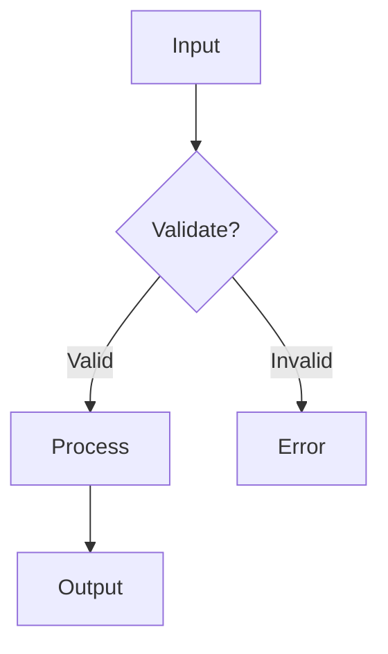

# Specification Writer

This skill provides guidance for writing high-quality technical specifications that communicate complex systems, design decisions, and implementation strategies effectively.

## Core Capabilities

This skill supports:

1. **System Architecture Specs** - Document system design, component interactions, data flow
2. **Feature Specifications** - Define requirements, user stories, acceptance criteria
3. **Technical Proposals** - Present solutions, trade-offs, implementation strategies
4. **Design Documents** - Capture design decisions, rationale, alternatives considered
5. **Process Documentation** - Describe workflows, procedures, automation pipelines
6. **Mapping Specifications** - Document conversion strategies between systems

## When to Use This Skill

Use this skill when:
- Writing architectural decision records (ADRs)
- Creating system design documents
- Proposing new features or enhancements
- Documenting complex integrations or migrations
- Explaining technical trade-offs to stakeholders
- Creating implementation roadmaps
- Mapping between different systems or frameworks

## Specification Structure Template

### Frontmatter (YAML/Metadata)

Every specification should begin with structured metadata:

```yaml
---
title: Descriptive Title
version: 1.0.0
date: YYYY-MM-DD
status: draft | review | approved | deprecated
authors:
  - Name/Entity
categories:
  - category1
  - category2
related:
  - path/to/related/doc1
  - path/to/related/doc2
---
```

**Purpose**: Makes specs discoverable, trackable, and navigable.

### Document Sections

#### 1. Executive Summary

**Length**: 2-4 paragraphs
**Purpose**: High-level overview for decision-makers

Include:
- What is being proposed/documented
- Why it matters (business/technical value)
- Key outcomes or decisions
- Critical success factors

#### 2. Problem Statement / Context

**Length**: 1-3 sections
**Purpose**: Establish shared understanding of the problem

Include:
- Current state analysis
- Pain points or limitations
- User impact or business drivers
- Constraints or requirements

#### 3. Proposed Solution / Design

**Length**: Variable (main body of spec)
**Purpose**: Detailed technical approach

Include:
- High-level architecture diagram (mermaid/ASCII)
- Component breakdown with responsibilities
- Data flow and interactions
- Key design decisions with rationale
- Technology choices (with alternatives considered)

#### 4. Implementation Plan

**Length**: 1-2 sections
**Purpose**: Actionable roadmap

Include:
- Phased approach (Phase 1, 2, 3...)
- Dependencies and prerequisites
- Timeline estimates
- Risk mitigation strategies
- Success metrics

#### 5. Trade-offs and Limitations

**Length**: 1 section
**Purpose**: Honest assessment of constraints

Include:
- What this solution doesn't address
- Known limitations or caveats
- Performance/scalability considerations
- Security implications
- Cost analysis (time, resources, complexity)

#### 6. Alternatives Considered

**Length**: 1 section
**Purpose**: Show due diligence

Include:
- Alternative approaches (2-3)
- Why each was rejected
- Comparative analysis when relevant

#### 7. Open Questions / Future Work

**Length**: Short list
**Purpose**: Surface unknowns and next steps

Include:
- Unresolved technical questions
- Areas requiring more research
- Future enhancements out of scope
- Follow-up specifications needed

#### 8. References

**Length**: List
**Purpose**: Citations and further reading

Include:
- Related documentation
- External resources
- API documentation
- Research papers or blog posts

## Writing Style Guidelines

### Use Imperative/Infinitive Form

**Good**: "To accomplish X, configure Y"
**Bad**: "You should configure Y to accomplish X"

**Good**: "Process files in batches"
**Bad**: "The system will process files in batches"

Rationale: Direct, action-oriented language is clearer for both humans and AI agents.

### Be Specific and Concrete

**Vague**: "The system should be fast"
**Specific**: "Process 1000 requests/sec with <100ms p99 latency"

**Vague**: "Use appropriate error handling"
**Specific**: "Retry with exponential backoff (3 attempts, 2x multiplier)"

### Show, Don't Just Tell

Include:
- Code examples for key interfaces
- Diagram for complex flows
- Sample input/output for transformations
- Before/after comparisons for changes

### Layer Information Progressively

Structure from high-level to low-level:
1. Abstract overview
2. Component-level design
3. Implementation details
4. Edge cases and optimizations

Readers can stop at appropriate depth for their needs.

## Diagrams and Visualizations

### Mermaid Diagrams

Use mermaid for:
- Flowcharts (`graph TB`)
- Sequence diagrams (`sequenceDiagram`)
- State machines (`stateDiagram-v2`)
- Entity relationships (`erDiagram`)

Example:


### ASCII Diagrams

Use for simple structures:
```
Input → [Validator] → [Processor] → [Storage]
            ↓              ↓
        [Logger]      [Metrics]
```

### Architecture Patterns

Use standard patterns when applicable:
- Pipes and Filters (Unix philosophy)
- Event-Driven Architecture
- Layered Architecture
- Microservices
- MVC/MVP/MVVM

## Specification Types and Templates

### 1. System Architecture Spec

Focus on:
- Component boundaries
- Data flow and state management
- API contracts
- Scalability and performance
- Failure modes and recovery

### 2. Feature Specification

Focus on:
- User stories and use cases
- Acceptance criteria
- UI/UX considerations
- API changes
- Testing strategy

### 3. Migration/Mapping Spec

Focus on:
- Current state → Target state
- Conversion strategy (1:1, hybrid, workaround)
- Fidelity assessment (what's preserved, what's lost)
- Validation and testing
- Rollback plan

### 4. Integration Spec

Focus on:
- External systems and protocols
- Authentication and authorization
- Rate limiting and quotas
- Error handling and retries
- Monitoring and alerting

### 5. Process/Workflow Spec

Focus on:
- Step-by-step procedures
- Input/output for each step
- Automation opportunities
- Error recovery
- Metrics and success criteria

## Best Practices

### 1. Start with "Why"

Always explain the motivation before diving into "how". Readers need context to evaluate solutions.

### 2. Use Consistent Terminology

Define terms once, use consistently throughout. Create a glossary for complex domains.

### 3. Be Honest About Trade-offs

Every design has limitations. Acknowledging them builds credibility and helps stakeholders make informed decisions.

### 4. Include Success Metrics

Define measurable criteria for success:
- Performance targets
- Quality metrics
- User satisfaction indicators
- Business outcomes

### 5. Version and Date Specs

Technical decisions evolve. Timestamps and versions help readers understand when decisions were made and which is canonical.

### 6. Make Specs Searchable

Use:
- Clear headings (H1, H2, H3)
- Keywords in frontmatter
- Descriptive filenames
- Internal links for cross-references

### 7. Keep Specs Living Documents

Update specs when:
- Implementation reveals new insights
- Requirements change
- Alternatives are discovered
- Lessons are learned post-launch

Mark deprecated sections clearly.

## Anti-Patterns to Avoid

### ❌ Vague Requirements

**Bad**: "The system should be secure and fast"
**Good**: "Encrypt data at rest (AES-256) and in transit (TLS 1.3). Support 10k req/s with <200ms p95 latency."

### ❌ Implementation Without Rationale

**Bad**: "Use Redis for caching"
**Good**: "Use Redis for caching because it provides atomic operations, pub/sub, and persistence options. Considered Memcached (faster but lacks persistence) and Hazelcast (better for distributed scenarios but adds complexity)."

### ❌ Assuming Knowledge

**Bad**: "Configure the usual K8s setup"
**Good**: "Deploy as StatefulSet with 3 replicas, PersistentVolumeClaim per pod, headless service for DNS-based discovery."

### ❌ No Examples

Provide concrete examples for:
- API requests/responses
- Configuration files
- Command-line usage
- File formats

### ❌ Ignoring the Reader

Consider your audience:
- **Engineers**: Need implementation details
- **Architects**: Need system-level view
- **Product**: Need feature/benefit explanation
- **Executives**: Need ROI and timeline

Write sections for each or use progressive disclosure.

## Templates

### Quick Spec Template

```markdown
---
title: [Feature/System Name]
version: 1.0.0
date: YYYY-MM-DD
status: draft
---

# [Title]

## Summary
[2-3 sentences: what, why, impact]

## Problem
[Current pain point or opportunity]

## Solution
[High-level approach]

## Implementation
1. Phase 1: [description]
2. Phase 2: [description]
3. Phase 3: [description]

## Trade-offs
- Pro: [benefit]
- Con: [limitation]

## Success Metrics
- Metric 1: [target]
- Metric 2: [target]
```

### Architecture Spec Template

```markdown
---
title: [System Name] Architecture
version: 1.0.0
date: YYYY-MM-DD
---

# [System Name] Architecture

## Overview
[2-3 paragraphs: purpose, scope, key components]

## Architecture Diagram
[mermaid or ASCII diagram]

## Components

### Component A
- **Responsibility**: [what it does]
- **Interface**: [API/contracts]
- **Dependencies**: [what it needs]

### Component B
[repeat structure]

## Data Flow
[Describe end-to-end flow]

## Key Design Decisions

### Decision 1: [title]
- **Context**: [why this decision needed]
- **Chosen**: [selected approach]
- **Alternatives**: [what was considered]
- **Rationale**: [why chosen over alternatives]

## Non-Functional Requirements
- **Performance**: [targets]
- **Scalability**: [growth plan]
- **Reliability**: [uptime, recovery]
- **Security**: [auth, encryption, compliance]

## Implementation Roadmap
[Phased plan with timeline]

## Risks and Mitigations
[Known risks with mitigation strategies]
```

### Mapping Spec Template

```markdown
---
title: [Source] → [Target] Mapping
version: 1.0.0
date: YYYY-MM-DD
---

# [Source] to [Target] Mapping Specification

## Executive Summary
[Viability, strategy, fidelity]

## Current State (Source)
[Structure, features, examples]

## Target State
[Target structure, constraints, capabilities]

## Mapping Strategy
[Direct, hybrid, workaround]

## Conversion Process

### Phase 1: [name]
[Steps, tools, validation]

### Phase 2: [name]
[Steps, tools, validation]

## Fidelity Analysis

### High Fidelity (>90%)
- Feature X maps directly
- Feature Y has equivalent

### Medium Fidelity (70-90%)
- Feature Z requires adaptation

### Low Fidelity (<70%)
- Feature W not supported

## Limitations
[What can't be mapped and why]

## Validation
[How to verify successful mapping]

## Automation
[Scripts, tools, continuous sync]
```

## Examples

### Example 1: Architecture Spec

See: `specs/cursor-skills-mapping.md`
- Clear viability assessment
- Detailed component mapping
- Trade-offs documented
- Implementation phases defined
- Success metrics included

### Example 2: Process Spec

See: `specs/enhanced-skill-generator-pipeline.md`
- Unix philosophy applied
- Atomic composability explained
- Pipeline visualized with mermaid
- Multiple usage examples provided
- Success criteria enumerated

### Example 3: Feature Spec

When documenting a new feature:
1. User stories (what users want to do)
2. Acceptance criteria (how to verify)
3. API/interface changes
4. Migration path for existing users
5. Testing strategy

## Integration with Skills

This skill complements:
- **architecture** - For system design analysis
- **skill-creator** - For skill specification documents
- **document-skills** - For formatting and templates
- **mcp-builder** - For MCP server specs

## Validation Checklist

Before finalizing a spec, verify:

- [ ] Frontmatter complete with title, version, date, status
- [ ] Executive summary present (2-4 paragraphs)
- [ ] Problem/context clearly stated
- [ ] Solution explained with diagrams
- [ ] Implementation plan with phases
- [ ] Trade-offs and limitations documented
- [ ] Alternatives considered section included
- [ ] Success metrics defined
- [ ] References provided
- [ ] Consistent terminology throughout
- [ ] Code examples for key interfaces
- [ ] Diagrams for complex flows
- [ ] Actionable for intended audience

## References

- [Technical Writing Guide](references/technical-writing.md)
- [Architecture Decision Records](references/adr-template.md)
- [Markdown Style Guide](references/markdown-style.md)
- [Mermaid Documentation](https://mermaid.js.org/)

## Quick Reference

**Command**: Write clear, structured specifications
**Output**: Actionable technical documentation
**Audience**: Engineers, architects, stakeholders
**Format**: Markdown with YAML frontmatter
**Tools**: Diagrams (mermaid), examples, templates
